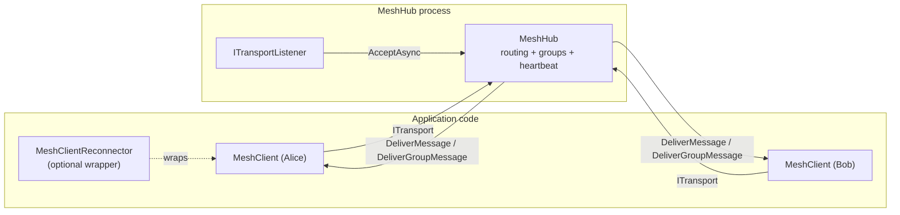

<!-- for-clanker:freshness
repo: Meshworx (github.com/adamsalisbury/Meshworx)
scope: full
reconciled-to-commit: 01b5765 (feature/topic-pub-sub — three commits ahead of the d218b69 the previous pass reconciled to: ec1eab9 "perf: return the trie's own subscriber set instead of copying it to an array", fb2f9a0 "fix: gate topic pub/sub behind a protocol version and validate client-side", 01b5765 "test: cover client-side topic pattern validation and the protocol version gate"; working tree clean throughout this pass)
reconciled-to-date: 2026-07-30
mode: update
-->

# Meshworx — coding agent field guide

This is the entry point. Read it in full before touching the code, then jump to the area file for
whatever you are changing. Every claim here is grounded in the source; where something is inferred
rather than read directly, it says so.

> **Documented tree, this pass:** three commits landed on `feature/topic-pub-sub` since the previous
> pass reconciled to `d218b69` — `ec1eab9` (a pure performance change, `TopicSubscriptionTrie.Match` now
> returns its own backing `IReadOnlySet<Guid>` instead of copying it to an array), `fb2f9a0` (the
> substantive one — **fixes KI-61**, plus two related, previously-undocumented gaps the same review
> found) and `01b5765` (adds `TopicPubSubClientTests.cs`, tests for exactly what `fb2f9a0` changed, no
> further behaviour). `git diff d218b69..HEAD --stat`: 9 files, 430 insertions, 39 deletions.
>
> **`fb2f9a0` fixes KI-61 outright.** `Protocol.MaxSupportedVersion` is now `8`, a new
> `Protocol.TopicPubSubMinVersion = 8` constant exists, `MeshClient.RequireTopicPubSubSupport` is now
> called from `SubscribeAsync`/`UnsubscribeAsync`/both `PublishAsync` overloads (throwing
> `NotSupportedException` below that version, mirroring `RequireHeaderEnvelopeSupport`), and `MeshHub`'s
> four topic dispatch branches each additionally require
> `connection.NegotiatedProtocolVersion >= Protocol.TopicPubSubMinVersion`. KI-61 is now marked **fixed**
> throughout this docs set, not left describing a live gap — see
> [known-issues.md](for-clanker/known-issues.md) KI-61 and every place that cross-referenced it
> ([protocol.md](for-clanker/protocol.md), [hub.md](for-clanker/hub.md#topic-based-publishsubscribe),
> [client.md](for-clanker/client.md#topic-based-publishsubscribe), §2/§6/§8 below).
>
> **The same commit fixes two further gaps the same correctness review found, neither previously
> documented anywhere in this set (they postdate the initial topic pub/sub reconciliation):**
> - **No client-side pattern/topic validation.** `SubscribeAsync`/`UnsubscribeAsync`/`PublishAsync` used
>   to accept a malformed pattern or topic and let the hub's trie reject it silently at `Debug`, leaving
>   `SubscribedTopics` reporting a subscription that matched nothing forever, with no exception — contrary
>   to the `ArgumentException` the interface already documented. `TopicSubscriptionTrie` now exposes
>   internal static `ValidatePattern`/`ValidateTopic`, called from all three `MeshClient` methods before
>   anything is recorded or sent.
> - **No distributed-trace propagation on `PublishAsync`'s headers overload.** It now starts a `Producer`
>   `Activity` and folds trace context in via `WithTraceContext`, mirroring `SendToGroupAsync` — previously
>   a topic message with headers always started an orphaned trace on the receiving end.
>
> Neither gets its own known-issues entry (both are fixed); every place in this docs set that could have
> been read as describing the old, broken behaviour as current has been checked and, where necessary,
> corrected — see [client.md](for-clanker/client.md#topic-based-publishsubscribe) and
> [known-issues.md](for-clanker/known-issues.md) KI-61 for both write-ups folded into the fixed entry.
>
> **One further correctness finding was deliberately deferred rather than fixed, and is disclosed as such:
> session resumption restores group membership but never topic subscriptions.** `MeshHub`'s
> `ResumableSession` has a `Groups` property and no `Topics` one; `MakeSessionDormant` captures
> `connection.Groups` only; `ResumeSessionAsync` calls `RestoreGroupMembershipAsync` with no topic-side
> counterpart. `MeshClient.RestoreJoinedGroupsFromResumedReply` has no topic equivalent either. This is
> distinct from KI-64 (which is about `MeshClientReconnector`, a different reconnection mechanism) — a
> client that undergoes a genuine `sessionResumptionWindow` resume silently loses any topic subscription
> it held. Recorded as new **[known-issues.md](for-clanker/known-issues.md) KI-65** (medium, correctness,
> open — deliberately deferred), cross-referenced from
> [hub.md](for-clanker/hub.md#session-resumption), [client.md](for-clanker/client.md#session-resumption)
> and [protocol.md](for-clanker/protocol.md#session-resumption).
>
> **Files touched this pass:** [for-clanker.md](../for-clanker.md) (this file — freshness stamp, this
> blockquote, §2 capabilities-table row, §8 pitfalls), [known-issues.md](for-clanker/known-issues.md)
> (summary table, KI-61 rewritten as fixed, KI-62/KI-63/KI-64 coordinate fixes, new KI-65),
> [protocol.md](for-clanker/protocol.md) (every KI-61 cross-reference, the version-history intro,
> Topic pub/sub frames, Additive opcodes, Versioning, session resumption cross-reference to KI-65),
> [hub.md](for-clanker/hub.md) (Topic-based publish/subscribe section, session resumption gotchas,
> Contracts & gotchas), [client.md](for-clanker/client.md) (Public surface table, Topic-based
> publish/subscribe section, Distributed tracing, session resumption blockquote), and
> [testing.md](for-clanker/testing.md) (new `TopicPubSubClientTests.cs` row, `TopicSubscriptionTrieTests.cs`
> row updated for the `ec1eab9`/`fb2f9a0` changes to `Match`'s return type). No file outside `./docs/` was
> modified.
>
> ---
>
> **Documented tree (prior pass): branch `feature/topic-pub-sub` (closing issue #37), two commits (`bdb5efb`,
> `d218b69`) on top of `main`/`origin/main` at `af5b030` (`git merge-base main HEAD` confirmed equal to
> `main`'s own tip — this branch sits directly on `main` with no divergence, and `af5b030` is exactly the
> `f277e60` commit the previous pass reconciled to, so nothing on `main` moved between passes). The second
> commit is a fix to the first, not a separate feature — "fix: bound topic segment count and use a
> reader/writer lock in the trie" hardens `TopicSubscriptionTrie` against a stack-overflow via an
> unbounded segment count and switches its lock from (by inference, since only the final shape is visible
> in this diff) a plain mutual-exclusion lock to a `ReaderWriterLockSlim`, so that concurrent publishes on
> the hot path do not serialise against one another. Diffed with `git diff main...HEAD --stat`: 8 files,
> 1402 insertions, 0 deletions — a new `TopicSubscriptionTrie.cs` (313 lines), `IMeshClient.cs` (+91),
> `MeshClient.cs` (+218), `MeshHub.cs` (+369, net +365 by `wc -l` — `MeshHub.cs` is now 4183 lines, up from
> 3818 on `main`; `MeshClient.cs` is now 2507, up from 2289; `IMeshClient.cs` is now 665, up from 574), a
> 6-line addition to `Messages/MessageType.cs`, a new `Messages/TopicMessageReceivedEventArgs.cs` (29
> lines), and growth in `MeshIntegrationTests.cs` (+161) plus a new `TopicSubscriptionTrieTests.cs` (217
> lines, new file).
>
> **This branch adds a third addressing mode alongside direct sends and groups: topic-based publish/
> subscribe with MQTT-style wildcard patterns.** A client calls `SubscribeAsync(pattern)` to register
> interest in a dot-separated topic hierarchy — `+` matches exactly one segment, `#` matches the
> remainder and only as a pattern's final segment — and `PublishAsync(topic, payload[, headers])` to send
> to every distinct subscriber whose pattern matches, delivered via the new `TopicMessageReceived` event.
> Six new opcodes (`0x19`–`0x1E`), a new hub-owned `TopicSubscriptionTrie` (`TopicSubscriptionTrie.cs`,
> `internal sealed`) doing the pattern matching in `O(topic depth × branching factor)` rather than a flat
> scan of every subscriber, guarded by a `ReaderWriterLockSlim` so publishes (read lock) never serialise
> against one another while subscribe/unsubscribe (write lock, far rarer) do. Full write-up in
> [hub.md](for-clanker/hub.md#topic-based-publishsubscribe),
> [client.md](for-clanker/client.md#topic-based-publishsubscribe) and
> [protocol.md](for-clanker/protocol.md#topic-pubsub-frames-issue-37).
>
> **A genuine gap was found while reconciling this branch, not fixed by this documentation pass (docs-only):
> four of the six new opcodes are client → hub and shipped with no protocol version bump, breaking this very
> docs set's own additive-opcode rule** (established from `GroupJoinRefused`, confirmed by `QueueSaturated`,
> and the exact rule `ResumeSession` — issue #43 — was built to satisfy: "a client → hub opcode... always
> [needs `Protocol.MaxSupportedVersion` bumped]", precisely because an older hub drops an unrecognised
> opcode silently rather than degrading visibly). `Protocol.MaxSupportedVersion` stays `7`; there is no
> `Protocol.TopicPubSubMinVersion`; and none of `SubscribeAsync`/`UnsubscribeAsync`/the headerless
> `PublishAsync` ever consult `NegotiatedProtocolVersion` — verified directly against `MeshClient.cs:1132-
> 1234` rather than inferred. The header-bearing `PublishAsync` overload's only version check
> (`RequireHeaderEnvelopeSupport`) guards the header block, a pre-existing and unrelated concern; it does
> nothing for a plain publish and nothing for subscribe/unsubscribe either way. **The practical
> consequence:** a client built from this codebase, talking to a hub built without this feature,
> gets `SubscribeAsync` returning success and the pattern appearing in `SubscribedTopics` — and no message
> ever arrives, forever, with no exception, no event and no log visible to the caller. Recorded as new
> **[known-issues.md](for-clanker/known-issues.md) KI-61** (medium, correctness/forward-compatibility, open
> — by omission — **this was fixed by commit `fb2f9a0` in the very next pass; see the top of this file and
> the KI-61 entry itself, now marked fixed**), and called out inline in
> [protocol.md](for-clanker/protocol.md#additive-opcodes-within-a-version) as the first addition to this
> file's own rule that breaks it rather than confirming it (`DeliverTopicMessage`/
> `DeliverTopicMessageWithHeaders`, the two hub → client opcodes, **are** a further confirming example —
> only the four client → hub ones are the gap).
>
> **Three further deliberate scope decisions, each substantiated directly against the code and each given
> its own known-issues entry, following this docs set's standing convention of lifting every non-trivial
> gotcha into the register rather than leaving it only in prose:**
> - **Publishing requires no subscription of the publisher's own, unlike a group send** — confirmed by
>   reading `PublishToTopic`/`PublishToTopicWithHeaders` (`MeshHub.cs:3786`, `:3839`), which match against
>   `TopicSubscriptionTrie` with no membership check anywhere, and by the type's own `<remarks>` on
>   `PublishAsync` stating it explicitly. Documented as fact, not flagged as an issue — this is a
>   deliberate design difference from groups, not a gap.
> - **No authorisation hook exists for topic subscribe or publish at all** — confirmed by reading the
>   `SubscribeTopic`/`UnsubscribeTopic`/`PublishTopicMessage`/`PublishTopicMessageWithHeaders` dispatch
>   branches (`MeshHub.cs:1483-1545`), none of which consult any callback, and by `IMeshClient.cs`'s own
>   XML docs stating "there is no authorisation hook and no refusal". Unlike groups' optional
>   `GroupAuthoriser`, there is not even an unused constructor parameter for this. Recorded as
>   **[known-issues.md](for-clanker/known-issues.md) KI-62** (medium, security, open — by design; extends
>   KI-2).
> - **Subscription count and pattern length are otherwise unbounded per client** — confirmed by reading
>   `SubscribeAsync` (`MeshClient.cs:1132-1166`, no cap on how many distinct patterns `_subscribedTopics`
>   may hold) and `TopicSubscriptionTrie.MaxSegmentCount` (`:245`, bounds only a single pattern's segment
>   count, not how many patterns a client may register). This mirrors a pre-existing, never-flagged gap in
>   `JoinGroupAsync` — confirmed by grepping `MeshHub.cs` for any `maxGroups`/count-cap constant and finding
>   none — but the two-way surface (a client can flood both subscriptions and publishes) made it worth a
>   standing entry now that a trie exists to hold the state. Recorded as
>   **[known-issues.md](for-clanker/known-issues.md) KI-63** (medium, availability, open — by design).
> - **`MeshClientReconnector` is NOT extended to restore topic subscriptions after a reconnect** — confirmed
>   by reading `MeshClientReconnector.cs` in full and finding no counterpart anywhere to
>   `RestoreGroupMembershipAsync`/`_pendingGroupRestore` for topics, and by confirming both
>   `MeshClient.CleanUpAsync` (`:1646-1652`) and `MeshHub.RemoveFromAllTopics` (`:3768-3776`) discard a
>   connection's subscriptions completely at disconnect, with no restore path anywhere including session
>   resumption (whose `SessionResumed` reply reports groups only). This is the same "new capability,
>   reconnection wiring not extended" shape KI-38 documents for the Unix-socket/named-pipe transport's
>   connection cap — a real gap, deliberately out of scope for this PR rather than an oversight found by
>   this pass. Recorded as **[known-issues.md](for-clanker/known-issues.md) KI-64** (medium, correctness,
>   open — deliberately out of scope for issue #37).
>
> **Files touched this pass:** [for-clanker.md](../for-clanker.md) (this file — §1 addressing-modes
> sentence, §2 capabilities table, §3 component map, §6 conventions worked example, §8 pitfalls, freshness
> stamp), [hub.md](for-clanker/hub.md) (new Topic-based publish/subscribe section, Routing helpers table,
> Rate limiting section, Metrics section, Contracts & gotchas), [client.md](for-clanker/client.md) (new
> Topic-based publish/subscribe section, Public surface table, MeshClientReconnector Contract & gotcha,
> coordinate-caveat blockquote), [protocol.md](for-clanker/protocol.md) (Opcodes table, new Topic pub/sub
> frames section, Additive opcodes within a version, Length-guard behaviour, Versioning),
> [testing.md](for-clanker/testing.md) (new `TopicSubscriptionTrieTests.cs` row, updated
> `MeshIntegrationTests.cs` row), and [known-issues.md](for-clanker/known-issues.md) (summary table plus
> four new detailed entries, KI-61 through KI-64). No file outside `./docs/` was modified.
>
> ---
>
> **Documented tree (prior pass):** `main` at `f277e60`, reconciling every commit between the previous
> documentation baseline (`d89891d`, PR #87) and here. The docs set was last touched by PR #90 (session
> resumption, commit `2a2377d`) — everything from `2a2377d` (exclusive) to `f277e60` was unreconciled
> before this pass, 19 commits: `b74c699` (per-client inbound rate limiting, issue #69), `6596726`
> (pluggable serialization codec, feat #91), `603d3c8` (distributed-tracing header propagation, feat #92),
> `7b93c7f` (large-message chunking, feat #93), `b09f719` (strongly-typed client contracts, feat #94),
> then `5b875ef`/`31880be`/`8a1b557`/`972dd83`/`b6ec5c6`/`58aefb4`/`fc66529`/`6c09297`/`d466535`/
> `573ccff`/`d9b3a76` (eleven correctness fixes, mostly to session resumption and connection lifecycle —
> see below), `144ab0b` (reserve and strip the chunk header keys, issue #107), `fbcd25c` (carry restored
> group memberships in the `SessionResumed` reply, PR #135/issue #109), and `f277e60` (serialize an
> interface-/abstract-declared payload by its runtime type, PR #136/issue #111). This is the largest
> reconciliation this docs set has done in one pass: five wholly new capabilities, none previously
> documented at all, plus a protocol version bump (6 → 7) and a correctness sweep across session
> resumption and the hub's send loop.
>
> **A sixth capability was found undocumented that predates this whole commit range and was never
> reconciled by any prior pass: message priority lanes.** `MessagePriority`, `PriorityOutboundQueue`,
> `DeliveryOptions.Priority`/`AtPriority`/`WithPriority`, the `SendToGroupAsync(name, payload, priority)`
> overload and the reserved `mesh.priority` header key all landed in commit `ab16567`, which is
> **chronologically before** `2a2377d` — so the PR #90 pass should have caught it and did not. Verified
> directly against the current code (`PriorityOutboundQueue.cs`, `MessagePriority.cs`,
> `DeliveryOptions.cs`, `MessagePriorityHeaderKeys.cs`) rather than trusted from the gap report: before
> this pass, the *only* trace of this capability anywhere in the docs tree was a single passing mention
> in [hub.md](for-clanker/hub.md#offline-delivery) — "the drain reuses `BuildDeliverMessage`/
> `BuildDeliverMessageWithHeaders` and `ReadPriority`, so a held message lands on the same lane" — with no
> section anywhere explaining what a lane is, what values priority takes, or how to set one. Given full
> first-class coverage this pass in [client.md](for-clanker/client.md#message-priority),
> [hub.md](for-clanker/hub.md#priority-lanes) and [protocol.md](for-clanker/protocol.md#priority-header).
>
> **Two open, unmerged PRs exist on this repo and are deliberately *not* documented as current behaviour
> anywhere in this pass: PR #120 (`fix/typed-contract-defects`) and PR #121
> (`fix/fan-out-frame-cap`).** Both were fetched and read (`gh pr diff 120`/`121`) specifically to confirm
> what they change, so that the *current* typed-contracts and fan-out-cap behaviour documented below is
> not accidentally contaminated with their unmerged fixes. Each has a clearly marked "pending" note where
> it is relevant — [contracts.md](for-clanker/contracts.md#pending-pr-120) for #120,
> [known-issues.md](for-clanker/known-issues.md) KI-33 for #121 — rather than being silently absent or
> silently assumed merged. Neither PR's changes appear anywhere else in this document set as fact.
>
> **New area files added this pass:** [serialization.md](for-clanker/serialization.md) (the pluggable
> `IMessageSerializer` codec layer, `AdamSalisbury.Meshworx.Serialization`) and
> [contracts.md](for-clanker/contracts.md) (the `[MeshContract]` source generator and its typed
> proxy/dispatcher pattern, `AdamSalisbury.Meshworx.Contracts` + `.Contracts.Generator`) — both are
> separate NuGet-shaped assemblies with public API surfaces substantial enough to warrant their own file,
> the same reasoning [dependency-injection.md](for-clanker/dependency-injection.md) already follows for
> the DI package. Both are new to the index in [§3](#3-architecture) below.
>
> **The eleven correctness-fix commits, summarised** (full detail in the relevant area file): three repair
> the hub's fan-out send loop and inbound processing under load or teardown (`972dd83` tolerates a
> recipient's outbound queue disposing mid-route rather than faulting the sender; `b6ec5c6` stops
> transport disposal from abandoning a queued `SendAsync` waiter; `fc66529` paces the accept loop's retry
> after a failed accept); three are WebSocket/TCP/host-startup hardening (`58aefb4` serialises WebSocket
> close-frame writes against concurrent sends; `6c09297` starts the listener negotiation pumps and hub
> lifecycle tasks on the thread pool; `d466535`/`573ccff`/`d9b3a76` fix `MeshHubOptions`/`MeshClientOptions`
> mirroring their constructors, bound/retry the initial connect in `MeshClientHostedService`, and make the
> hosted service stop what it actually started); and three repair session-resumption's identity-swap edge
> cases (`5b875ef` removes the resuming connection's own now-orphaned registration entry from the session
> table, issue #97; `31880be` tears down the client registry entry by the connection's *current* id rather
> than a possibly-stale local, closing a leak when the `SessionResumed` reply-send itself fails; `8a1b557`
> pairs `ClientConnected`/`ClientDisconnected` across the identity swap, issue #105, so a subscriber
> tracking connected ids doesn't leak the discarded fresh id forever). None of these needed a
> `known-issues.md` entry of their own — they are bug fixes with no remaining caveat, not standing
> limitations — but the session-resumption fixes are described in
> [hub.md](for-clanker/hub.md#session-resumption) since they change what the section asserted as fact.
>
> **Coordinate-sweep scope for this pass, stated plainly rather than silently left ambiguous: `MeshHub.cs`
> grew from roughly 2638 lines (PR #87 baseline) to 3745, `MeshClient.cs` from roughly 1676 to 2228,
> `IMeshClient.cs` from roughly 406 to 491, and `Messages/Protocol.cs` gained two new version-gated
> constants.** That is a near-doubling of the two largest files in the library, driven by six feature
> areas landing across 19 commits with no doc reconciliation in between. Given the "REQUIRED FIXES"
> priority for this pass explicitly ranks a full line-number sweep last and permits leaving pre-existing,
> untouched citations for a dedicated follow-up, **this pass re-derived coordinates fresh, from the
> current source, only for the sections it was actively writing or correcting** (the six new-capability
> sections, the known-wrong claims listed below, and the known-issues.md entries it touched) — it did
> **not** attempt a wholesale re-point of every pre-existing citation elsewhere in
> [client.md](for-clanker/client.md), [hub.md](for-clanker/hub.md), [protocol.md](for-clanker/protocol.md),
> [types.md](for-clanker/types.md) or [testing.md](for-clanker/testing.md) that this pass's own edits did
> not touch. Any citation in those files pointing at `MeshHub.cs`/`MeshClient.cs`/`IMeshClient.cs` that
> this pass did not visibly correct should be treated as **unverified against the current, doubled file
> lengths** until a dedicated coordinate-hygiene pass re-derives it — this is a materially larger gap than
> any prior pass has left, and worth budgeting for explicitly rather than assuming "mostly right".
>
> ---
>
> **Documented tree (prior pass):** branch `feat/backpressure-signalling` (**PR #87**, closing issue #30),
> three commits (`67d744c`, `752e14e`, `d89891d`) on top of `main` at `43362b4` (`git merge-base main
> feat/backpressure-signalling` confirmed equal to `main`'s own tip — `main` has advanced to `43362b4`,
> "feat: per-message time-to-live (TTL) and expiry", which **is** the previous pass's PR #85 merged),
> clean working tree throughout (`git status --porcelain` empty at both the start and end of this pass).
> The second and third commits are fixes to the first, not separate features: "fix: stop queue-saturation
> notifications disclosing unaddressed recipients" and "docs: state what awaiting capacity does and does
> not guarantee the caller" (an XML-doc-comment-only change, no coordinate impact). Diffed with
> `git diff main...HEAD --stat`: 17 files, 1054 insertions/24 deletions across library and test code —
> `MeshHub.cs` (+305/−9), `MeshClient.cs` (+50/−7), `DeliveryOptions.cs` (+63/−8), `IMeshClient.cs`
> (+30/−2), `IMeshHub.cs` (+14), two new files (`Messages/BackpressureHeaderKeys.cs`,
> `Messages/SendRejectedEventArgs.cs`) and a new `QueueSaturatedEventArgs.cs` (root namespace, **not**
> `.Messages`), plus `MeshHubOptions.cs`/`MeshHubServiceCollectionExtensions.cs` (+16 combined) and test
> growth across five files. **No transport file is touched at all.**
>
> **This branch adds backpressure signalling for the hub's full-outbound-queue drop, replacing
> silence with three independent, separately opt-in signals** — see
> [known-issues.md](for-clanker/known-issues.md) KI-1 for the full write-up, and
> [hub.md](for-clanker/hub.md#backpressure-signalling-and-awaiting-capacity) /
> [client.md](for-clanker/client.md#backpressure-signalling) for the mechanics. In short: (1)
> `MeshHub.QueueSaturated` — a new, always-raised in-process event, no opt-in, fired from all five
> queue-full drop sites (`RouteMessage`, `RouteMessageWithHeaders`, `BroadcastMessage`, `SendToGroup`,
> `SendToGroupWithHeaders`); (2) a new `0x15 QueueSaturated` wire opcode, opt-in via the new
> `notifyOnQueueSaturation` constructor parameter (default `false`), sent to the sender **only** from the
> two direct-send paths — deliberately never from the three fan-out paths, since their dropped
> recipient's id comes from the hub's own registries rather than the sender, and echoing it back would
> let a sender enumerate every connected client's id by broadcasting until somebody's queue filled;
> `MeshClient` surfaces it as the new `SendRejected` event; (3) `DeliveryOptions.AwaitCapacity` (factory
> `AwaitingCapacity()`, combinator `WithAwaitCapacity()`), opt-in per send, carried as a new reserved
> header key (`mesh.await-capacity`, `Messages/BackpressureHeaderKeys.cs`) that only
> `RouteMessageWithHeaders` (now `async`) honours — it awaits free capacity on the recipient's queue,
> bounded by the new `backpressureAwaitTimeout` constructor parameter (default 30 s), before falling back
> to the ordinary drop.
>
> **The capacity wait parks the sender's own receive loop, which forced a second, genuinely new
> mechanism: exempting a parked connection from idle eviction.** `ClientConnection` gained
> `IsAwaitingCapacity`/`BeginAwaitingCapacity()`/`CapacityWaitScope`; `MonitorHeartbeatAsync` now checks
> `IsAwaitingCapacity` before the silent-interval counter and treats a park as liveness. This is the same
> hazard class the constructor already warned about for a slow `GroupAuthoriser` (KI-28) — a client
> parked awaiting an integrator callback also looks idle to the heartbeat monitor — but here the hub knows
> precisely when and for how long the loop is parked, so it exempts it exactly rather than merely warning.
> Two new known issues were recorded for consequences of this parking: **KI-48** (the park blocks this
> sender's *other* traffic too, not just the one message — head-of-line blocking at the sender, bounded
> by `backpressureAwaitTimeout`) and **KI-49** (combined with `RequireAck`, the two timeouts are
> independent and enforced by different parties, so an ack timeout shorter than the hub's capacity wait
> can report a send as failed that the hub delivers anyway — a retrying caller would duplicate it).
>
> **KI-1 needed a full rewrite, not a coordinate shift, since PR #87's whole point is that its central
> claim ("silently drops") is no longer unconditionally true.** Corrected in place to "partly
> addressed" — the drop remains the default when nothing opts in, and broadcast/group drops remain silent
> to the sender by deliberate design — following the established "correct in place, note which pass got
> it wrong" convention used for KI-2/KI-5/KI-9/KI-10/KI-20 before it. Its `Where` column also needed
> updating regardless, since the routing methods it cites all moved in this diff.
>
> **This is the first PR to combine both the "numbered opcode" and "fourth route" additions in one
> change**, worth noting in [index §6](#6-cross-cutting-conventions-imitate-these) as a new worked
> example: `0x15 QueueSaturated` takes the numbered-opcode route (a genuine new opcode, additive within
> version 5 the same way `GroupJoinRefused` was within version 3), while `AwaitCapacity` takes the fourth
> route PR #83–#85 established (no opcode, no version bump, a narrow `HeaderEnvelope.TryReadValue` scan
> at the one hub-side call site that needs it — PR #85's own precedent). Every prior PR since #83 asking
> "which route" picked exactly one; this is the first to need both for one feature.
>
> **Coordinate shift, this pass: `MeshHub.cs` +285 net lines (2353 → 2638) across 20 separate insertion
> points spread through nearly the entire file (climbing 0→+7→+9→+30→+32→+44→+46→+62→+65→+66→+178→+189→
> +190→+197→+211→+231→+236→+239→+242→+243→+285), `MeshClient.cs` +38 net (1638 → 1676) across five, and
> `IMeshClient.cs` +28 net (378 → 406) across two.** Given the blast radius, every `MeshHub.cs`/
> `MeshClient.cs`/`IMeshClient.cs` coordinate in [hub.md](for-clanker/hub.md), [client.md](for-clanker/client.md),
> [protocol.md](for-clanker/protocol.md), [types.md](for-clanker/types.md) and
> [known-issues.md](for-clanker/known-issues.md) was re-derived this pass — not just the sections this
> branch's own diff touches — using the same hunk-derived-offset-plus-content-equality technique
> validated on every prior pass back to #64, with in-hunk coordinates resolved by hand against the
> current source. [testing.md](for-clanker/testing.md) had only its Layout table's line counts and
> descriptions updated for the files this branch touches, per the standing exemption from fully
> re-deriving individual-test citations.
>
> **Several pre-existing wrong citations — not caused by this branch — were found and corrected while
> re-pointing, all in [hub.md](for-clanker/hub.md)'s Metrics section**: a cluster of "recorded at every
> drop site" bare citations had been off by a consistent −122 lines for at least one prior pass (each
> resolved to real, plausible-looking code, so a range check could not have caught it), and several
> "created" citations for individual instruments were off by one line each (pointing at the meter's own
> creation rather than each counter's). [protocol.md](for-clanker/protocol.md) had two similar finds: a
> `BroadcastMessage`-builds-`0x03` citation that pointed at unrelated `MonitorHeartbeatAsync` code, and a
> registration-handshake citation range that was otherwise already correct. All ground-truthed directly
> from the current source rather than shifted, per the standing "touching the file makes fixing it free"
> rule — flagged inline where corrected rather than silently overwritten.
>
> ---
>
> **Documented tree (prior pass):** branch `feature/message-ttl-expiry` (**PR #85**, closing issue
> #29), three commits (`5ee8bf4`, `c7738f9`, `1457756`) plus a merge commit (`c942327`, merging
> `origin/main` — which carries one commit local `main` did not yet have, `aa955d7` "test: align harness
> timeouts", **PR #86**, entirely test-infrastructure, no library file touched) on top of `main` at
> `6bd05d4` (`git merge-base main feature/message-ttl-expiry` confirmed equal to local `main`'s own tip
> — `main` has advanced to `6bd05d4`, "feat: optional end-to-end delivery acknowledgements / receipts",
> which **is** the previous pass's PR #84 merged), clean working tree throughout
> (`git status --porcelain` empty at both the start and end of this pass). The second and third commits
> are fixes to the first, not separate features: "harden expiry parsing against out-of-range values" and
> "apply the expiry check to group messages on the client receive loop" — the latter closed a real gap
> the first commit left open (see below). Diffed with `git diff main...feature/message-ttl-expiry --stat
> -- src/AdamSalisbury.Meshworx/IMeshClient.cs src/AdamSalisbury.Meshworx/MeshClient.cs
> src/AdamSalisbury.Meshworx/MeshHub.cs src/AdamSalisbury.Meshworx/Messages/HeaderEnvelope.cs
> src/AdamSalisbury.Meshworx/Messages/MessageExpiryHeaderKeys.cs` (the library surface, deliberately
> excluding the PR #86 test-timeout churn that a blanket `git diff main...HEAD --stat` also shows for this
> branch): 5 files, 370 insertions/23 deletions — `IMeshClient.cs` (+33), `MeshClient.cs` (+107/−23 raw
> diff lines, **+63 net** by `wc -l`, since some of the 107 insertions replace rather than add to the 23
> deletions), a new method on `Messages/HeaderEnvelope.cs` (+72), and a new
> `Messages/MessageExpiryHeaderKeys.cs` (57 lines, new file). **No transport or DI-package file is
> touched at all** — confirmed directly from the diff, not assumed — so nothing in
> [transport.md](for-clanker/transport.md) or [dependency-injection.md](for-clanker/dependency-injection.md)
> needed correcting.
>
> **This branch adds an opt-in, per-message time-to-live** —
> `IMeshClient.SendAsync(Guid recipientId, ReadOnlyMemory<byte> message, TimeSpan timeToLive,
> CancellationToken cancellationToken = default)`. Built the same "fourth route" way as PR #83's
> request/response and PR #84's delivery acknowledgement — entirely inside the existing header envelope
> (PR #74), no new opcode, no protocol version bump — via one new well-known, `internal` header key,
> `Messages/MessageExpiryHeaderKeys.cs`: `ExpiresAtUnixMilliseconds` (wire string `"mesh.expires-at"`).
> **Unlike the first two "fourth route" capabilities, this one is not entirely hub-blind**: `MeshHub`
> gained a narrow, single-key `HeaderEnvelope.TryReadValue` scan (new method, `Messages/HeaderEnvelope.cs:175-233`)
> so `SendLoopAsync` can drop an already-expired queued frame before sending it — the first time the hub
> reads header *content* rather than only a header block's declared *length*. The reserved-header-key
> guard PR #83 introduced and PR #84 extended now covers **six** keys, not five, and was refactored from a
> chain of individual `ContainsKey` checks into a `foreach` over a new `ReservedHeaderKeys` array in the
> same commit. Full write-up in [client.md](for-clanker/client.md#message-expiry-time-to-live),
> [hub.md](for-clanker/hub.md#dropping-expired-frames) and
> [protocol.md](for-clanker/protocol.md#message-expiry-headers).
>
> **A real gap was found and fixed within this same PR, not by this documentation pass**: the first
> commit only added the expiry check to `MeshClient`'s `DeliverMessageWithHeaders` receive-loop branch
> (direct messages); an expired **group** message would still have reached `GroupMessageReceived` until
> the third commit added the identical `!IsExpired(...)` check to `DeliverGroupMessageWithHeaders` too
> (`MeshClient.cs:1150`).
>
> **This is the first "fourth route" capability whose clock semantics need calling out explicitly.** The
> expiry is computed from the *sending client's own clock*; the hub and the recipient each compare it
> against their *own* clock independently, with no synchronisation mechanism anywhere in the protocol.
> Recorded as new **KI-47** (open, medium severity, by design). A second new finding, from re-reading the
> metrics call sites while documenting the hub-side drop: a direct message that expires while queued is
> counted **both** `messages.routed` (at enqueue) **and** `messages.dropped(reason=expired)` (at dequeue)
> — the previously-reliable "routed − dropped = delivered, for `direct`" identity (part of KI-32) no
> longer holds unconditionally. KI-32 is corrected in place (extended, not replaced) to cover this, per
> the standing "correct in place, note which pass got it wrong" convention. See
> [known-issues.md](for-clanker/known-issues.md) KI-32 and KI-47.
>
> **Coordinate shift, this pass: `MeshClient.cs` +63 net lines (1575 → 1638) across four separate
> insertion points (a fifth hunk, the `DeliverGroupMessageWithHeaders` expiry check, is a net-zero
> in-place edit — one line replaced for one), `IMeshClient.cs` +33 in one place (the new
> `SendAsync(TimeSpan)` interface member,
> inserted after the `DeliveryOptions` overload), `MeshHub.cs` +122 net lines (2231 → 2353) across four
> insertion points, plus two new files.** Derived from `git diff main...feature/message-ttl-expiry --
> '*.cs' | grep '^@@'` and verified by comparing cited-line content before and after re-pointing at every
> insertion boundary, the same technique validated on every prior pass back to #64 — including a full
> `` `:NNN` `` bare-citation sweep (tracking the last *genuine* `File.cs:NNN` citation per paragraph, not
> merely the last filename mentioned in prose, which the PR #66/#72/#83 passes found is a distinct and
> real failure mode) across [client.md](for-clanker/client.md), [hub.md](for-clanker/hub.md),
> [protocol.md](for-clanker/protocol.md) and [known-issues.md](for-clanker/known-issues.md). A handful of
> in-hunk coordinates (citations landing inside the diff's own changed lines, where a pure arithmetic
> shift is ambiguous) were resolved by hand against the current source rather than shifted — see
> `SendCoreAsync` (`:468-521`), `ThrowIfReservedHeaderKeyPresent` (`:543-555`) and the receive loop's
> three-condition check (`:1096-1098`) in [client.md](for-clanker/client.md).
> [testing.md](for-clanker/testing.md) was **not** re-pointed, consistent with the standing instruction
> not to fully re-derive individual-test citations — and this branch's own diff does not touch any
> library-adjacent prose in that file anyway (its test-file changes are covered by PR #86, see below).
>
> **A separate, out-of-scope finding, noted here rather than acted on: local `main` lags `origin/main` by
> one commit, `aa955d7` ("test: align harness timeouts with the waits each test actually performs",
> PR #86).** This branch merged `origin/main` in directly (commit `c942327`), so PR #86's content is
> present in the working tree even though local `main` does not yet have it fast-forwarded. PR #86 is
> entirely test-infrastructure (a new `TestTimeouts` class, and per-test timeout adjustments across
> `MeshClientReconnectorTests.cs`, `MeshClientReconnectorMetricsTests.cs`, `MeshHubMetricsTests.cs`,
> `MeshHubTests.cs`, `MeshClientTests.cs`, `MeshIntegrationTests.cs`, the QUIC/Unix-socket/WebSocket
> integration test files) — no library source file is touched, confirmed by `git show aa955d7 --stat`.
> Since [testing.md](for-clanker/testing.md) is already the deliberately-deferred file in this docs set
> (per the standing instruction above), this does not change this pass's own scope, but a future pass
> that does open `testing.md` for its own reasons should budget for PR #86's timeout-convention changes
> as well as whatever coordinate drift that pass's own branch causes.
>
> ---
>
> **Documented tree (prior pass):** branch `feature/delivery-acknowledgements` (open **PR #84**, not tied
> to a numbered issue in this handover), two commits (`f2f514c`, `9de6b23`) on top of `main` at `78e0264`
> (`git merge-base main feature/delivery-acknowledgements` confirmed equal to `main`'s own tip — `main`
> has advanced to `78e0264`, "feat: request/response (RPC) helper with correlation and timeout", which
> **is** the previous pass's PR #83 merged, its content identical to branch tip `12b2785` that pass
> reconciled to), clean working tree throughout. The second commit, "fix: stop the delivery-acknowledgement
> send blocking the receive loop", is a fix to the first commit's own change, not a separate feature —
> both are covered together below. Diffed with
> `git diff main...feature/delivery-acknowledgements --stat`: 7 files, 823 insertions/11 deletions — a new
> `DeliveryOptions.cs` (90 lines), a new `Messages/DeliveryAcknowledgementHeaderKeys.cs` (33 lines),
> `IMeshClient.cs` (+32), `MeshClient.cs` (+234/−11), and growth in `DeliveryOptionsTests.cs` (61 lines,
> new), `MeshClientTests.cs` (+350) and `MeshIntegrationTests.cs` (+34). **No `MeshHub.cs`, `IMeshHub.cs`,
> transport, or DI-package file is touched at all** — confirmed directly from the diff stat — so nothing in
> [hub.md](for-clanker/hub.md), [transport.md](for-clanker/transport.md) or
> [dependency-injection.md](for-clanker/dependency-injection.md) needed correcting; this branch, like PR
> #83 before it, is entirely a `MeshClient`-side addition.
>
> **This branch adds an opt-in, end-to-end delivery acknowledgement for a single direct send** —
> `IMeshClient.SendAsync(Guid recipientId, ReadOnlyMemory<byte> message, DeliveryOptions options,
> CancellationToken)`. `DeliveryOptions.None` (the struct's default) is identical to the plain `SendAsync`
> overload; `DeliveryOptions.RequireAck(TimeSpan timeout)` makes the call await the recipient's
> acknowledgement, or fail with `TimeoutException`. **Built the same way PR #83's `RequestAsync`/
> `ReplyAsync` were**: entirely inside the existing header envelope (PR #74) — no new opcode, no protocol
> version bump. Three new well-known `MessageHeaders` keys
> (`Messages/DeliveryAcknowledgementHeaderKeys.cs`, `internal`): `"mesh.ack-id"` (correlation id, on both
> frames), `"mesh.ack-request"` (marks the original message), `"mesh.ack"` (marks the reply). The
> reserved-header-key guard PR #83 introduced now covers **five** keys, not two. The recipient's client
> sends the acknowledgement **automatically** from inside the receive loop once `MessageReceived` has been
> raised for the message — **fire-and-forget, not awaited**, so a slow write back to the sender cannot
> block the connection's own inbound processing (including its `Ping`/`Pong` keepalive). A reply/ack is
> only accepted from the client the message was actually addressed to (sender-id verification), the same
> defensive pattern PR #83 established for replies. Full write-up in
> [client.md](for-clanker/client.md#delivery-acknowledgement) and
> [protocol.md](for-clanker/protocol.md#delivery-acknowledgement-headers).
>
> **This is the second capability built via the "fourth route"** — a capability needing no opcode or
> version change at all, added entirely inside the existing header envelope, first used by PR #83. See
> [index §6](#6-cross-cutting-conventions-imitate-these) below.
>
> **Three new known issues, all low severity, all by design — KI-44, KI-45, KI-46.** "Acknowledged" means
> "handed to the application", not "the handler succeeded" — the acknowledgement fires regardless of
> whether the `MessageReceived` subscriber threw (KI-44). A `RequireAck` timeout does not prove
> non-delivery — the acknowledgement itself is an ordinary routed message subject to the same silent-drop
> paths as any other send (KI-45, interacts with KI-1 and KI-5). And, mirroring KI-43 exactly, the hub is
> completely blind to delivery acknowledgement, so any inbound frame carrying `mesh.ack=1` is intercepted
> by any receiving `MeshClient`, matched or not (KI-46). **KI-5 ("no delivery acknowledgement") is now
> only partly true** — it is corrected in place (status: partly addressed) rather than closed outright,
> since broadcast/group sends and cross-connection ordering remain exactly as unacknowledged as before.
> [known-issues.md](for-clanker/known-issues.md) carries the full entries.
>
> **Coordinate shift, this pass: `MeshClient.cs` +212 net lines (1363 → 1575) across eight separate
> insertion points, `IMeshClient.cs` +32 in one place (the new `SendAsync(DeliveryOptions)` interface
> member, inserted right after the headers overload — everything from `BroadcastAsync` onward shifts by
> +32).** Derived from `git diff main...feature/delivery-acknowledgements -- '*.cs' | grep '^@@'` and
> verified by comparing cited-line content before and after re-pointing at every insertion boundary, the
> same technique validated on every prior pass back to #64. Every `MeshClient.cs`/`IMeshClient.cs`
> coordinate in [client.md](for-clanker/client.md), [protocol.md](for-clanker/protocol.md),
> [known-issues.md](for-clanker/known-issues.md) and this file was re-pointed this pass — a larger sweep
> than usual, since `MeshClient.cs`'s shift touches citations throughout the whole of `client.md`, not
> just the sections this branch's own diff added.
>
> **Two pre-existing, wrong (not merely stale) citations were found and corrected while re-pointing**, per
> the standing "touching the file makes fixing it free" rule: [protocol.md](for-clanker/protocol.md)'s
> empty-frame citation (`MeshClient.cs:848` → true `:996`, wrong since at least the PR #74 reconciliation
> — it pointed at unrelated `CleanUpAsync` cleanup code) and
> [client.md](for-clanker/client.md)/[known-issues.md](for-clanker/known-issues.md)'s `Disconnected`
> contract citation (`IMeshClient.cs:249-259` → true `:334-344` — it pointed at `RequestAsync`'s own
> declaration, a mistake dating from the PR #83 pass that first inserted `RequestAsync` at that exact
> location). Both are flagged inline where corrected.
>
> **`testing.md` was deliberately not re-pointed this pass**, consistent with the standing instruction not
> to fully re-derive individual-test citations and because this branch's diff does not touch
> `MeshClientTests.cs`'s pre-existing content (append-only) or `MeshIntegrationTests.cs`'s (append-only).
> `testing.md`'s existing `MeshClient.cs` prose citations were already flagged stale by the PR #83 pass and
> remain so, now stale by a further +212 lines on top of whatever they were off by then; budget for a
> dedicated pass if these are ever load-bearing for a task.
>
> **Documented tree (prior pass):** branch `feature/rpc-request-response` (open **PR #83**, not tied to a
> numbered issue in this handover), two commits (`71ad727`, `12b2785`) on top of `main` at `4b11234`
> (`git merge-base main feature/rpc-request-response` confirmed equal to `main`'s own tip — `main` has
> advanced to `4b11234`, "feat: QUIC transport with multiplexed streams (System.Net.Quic)", which **is**
> the previous pass's PR #82 merged), clean working tree throughout (`git status --porcelain` empty at
> both the start and end of this pass). Diffed with `git diff main...feature/rpc-request-response --stat`:
> 6 files, 781 insertions/12 deletions — `IMeshClient.cs` (+53), `MeshClient.cs` (+249/−12), a new
> `Messages/RequestReplyHeaderKeys.cs` (26 lines), a 12-line addition to
> `Messages/MessageReceivedEventArgs.cs`, and growth in `MeshClientTests.cs` (+415) and
> `MeshIntegrationTests.cs` (+38). **No `MeshHub.cs`, `IMeshHub.cs`, transport, or DI-package file is
> touched at all** — confirmed directly from the diff stat — so nothing in [hub.md](for-clanker/hub.md),
> [transport.md](for-clanker/transport.md) or [dependency-injection.md](for-clanker/dependency-injection.md)
> needed correcting; this branch is entirely a `MeshClient`-side addition.
>
> **This branch adds a correlated request/response helper — `IMeshClient.RequestAsync`/`ReplyAsync`.**
> `RequestAsync(Guid recipientId, ReadOnlyMemory<byte> message, TimeSpan timeout, CancellationToken)`
> sends a direct message and awaits a correlated reply, or fails with `TimeoutException`;
> `ReplyAsync(MessageReceivedEventArgs request, ReadOnlyMemory<byte> message, CancellationToken)` answers
> one. **Deliberately built on the existing header envelope (PR #74) rather than as new wire protocol**:
> a request/reply pair are ordinary `SendMessageWithHeaders`/`DeliverMessageWithHeaders` (`0x11`/`0x12`)
> frames carrying two new well-known keys (`Messages/RequestReplyHeaderKeys.cs`, `internal`) —
> `"mesh.request-id"` (both frames) and `"mesh.reply"` (the reply only). **No new opcode, no protocol
> version bump** — `Protocol.MaxSupportedVersion` stays `5`. `MessageReceivedEventArgs` gains
> `long? CorrelationId` (`null` for an ordinary message, set for an incoming request), and the receive
> loop's `DeliverMessageWithHeaders` branch now checks `TryCompletePendingRequest` **before** raising
> `MessageReceived` at all, so a reply frame never surfaces through the event — this makes KI-9's
> "dispatch ladder gains a branch per opcode" pattern not quite universal any more: this is a *nested*
> check inside an existing branch, not a new one. A reply is accepted **only from the client the request
> was actually addressed to** (`PendingRequest.ExpectedResponderId` checked against the frame's real
> sender), so a third client on the same hub cannot forge a reply to someone else's request. Concurrent
> `RequestAsync` calls on the same client are fully independent (`ConcurrentDictionary`-backed
> `_pendingRequests`, no shared serialisation the way `GetClientIdByNameAsync`'s single-slot lookup has).
> Full write-up in [client.md](for-clanker/client.md#request-response) and
> [protocol.md](for-clanker/protocol.md#request-response-headers).
>
> **Two new known issues, both low severity, both by design — recorded as KI-42 and KI-43.** `SendAsync`'s
> pre-existing headers overload now throws `ArgumentException` if a caller's own `MessageHeaders` contains
> either reserved key (`ThrowIfReservedHeaderKeyPresent`, new) — a narrow but real breaking change for any
> application that already used one of those two exact strings as its own header key (KI-42). And because
> the hub never decodes header *content* (only header-block *length*, unchanged since PR #74), request/
> response correlation is enforced entirely by the two `MeshClient` instances involved — any inbound frame
> carrying `mesh.reply=1`, from **any** sender, real `RequestAsync` caller or not, is intercepted and
> dropped before `MessageReceived`, which only matters for a non-`MeshClient` peer or hand-built frame
> (KI-43). Neither is a defect in the shipped feature; both are documented so a future change does not
> "fix" either in a way that breaks the design. This section's own capability table (§2) and pitfalls
> (§8) below reflect the new capability; [known-issues.md](for-clanker/known-issues.md) carries the full
> entries.
>
> **Coordinate shift, this pass: `MeshClient.cs` +225 net lines (1138 → 1363) across nine separate
> insertion points, `IMeshClient.cs` +53 in one place (after `GetClientIdByNameAsync`, so nothing above it
> moved).** Derived from `git diff main...feature/rpc-request-response -- '*.cs' | grep '^@@'` and verified
> by comparing cited-line content before and after re-pointing, the same technique validated on every
> prior pass back to #64. Every `MeshClient.cs`/`IMeshClient.cs` coordinate in
> [client.md](for-clanker/client.md), [protocol.md](for-clanker/protocol.md),
> [known-issues.md](for-clanker/known-issues.md) and this file was re-pointed this pass. **Two pre-existing,
> off-by-a-few-lines citations were found and corrected while re-pointing** (not caused by this branch, but
> free to fix while the file was open anyway, per the standing "touching the file makes fixing it free"
> rule from earlier passes): [client.md](for-clanker/client.md)'s class-declaration citation
> (`MeshClient.cs:9` → true `:12`) and [protocol.md](for-clanker/protocol.md)'s `ClientLookupResponse`/
> `Ping`-reply citations (`:717-724`/`:726-737`, which had pointed at unrelated cleanup code for at least
> one prior pass → true `:1096-1103`/`:1105-1118`), both flagged inline where corrected.
> [testing.md](for-clanker/testing.md) was **not** re-pointed — its `MeshClient.cs:909`/`:640`/`:888-899`/
> `:911-930`/`:916`/`:922` citations (in the client-teardown-race parking section) are now stale by this
> branch's shift and are flagged here rather than silently left wrong: per the user's own standing
> instruction not to fully re-derive individual-test citations, and because this branch's own diff does
> not touch `MeshClientTests.cs`'s pre-existing content (only appends new tests after it), reconciling
> those six citations is deferred to a pass that opens `testing.md` for its own reasons.
>
> **Documented tree (prior pass):** branch `feat/issue-21-quic-transport` (open **PR #82**, closing
> issue #21), two commits on top of `main` at `84fd51f`
> (`git merge-base main feat/issue-21-quic-transport` confirmed equal to `main`'s own tip), clean
> working tree. Diffed with `git diff main...feat/issue-21-quic-transport --stat`: 9 files, 2016
> insertions — two new source files (`Transport/Quic/QuicTransport.cs`,
> `Transport/Quic/QuicTransportListener.cs`), five new test files (all under
> `src/Tests/AdamSalisbury.Meshworx.UnitTests/Transport/Quic/`), a `README.md` update, and a
> `.github/workflows/ci.yml` step installing `libmsquic` before build/test. **`MeshHub.cs`,
> `MeshClient.cs` and `IMeshClient.cs` are all untouched** — confirmed directly from the diff stat, not
> assumed from the branch's own description — so nothing in [hub.md](for-clanker/hub.md) or
> [client.md](for-clanker/client.md) needed correcting; this branch is transport-only, exactly as issue
> #21's own design scoped it.
>
> **This branch adds a seventh transport** (counting `InMemoryTransport`), `QuicTransport`/
> `QuicTransportListener` (namespace `AdamSalisbury.Meshworx.Transport.Quic`), backed by
> `System.Net.Quic` — one bidirectional `QuicStream` per connection, framed via the same shared
> `StreamFramer` helper `TcpTransport`/`UnixSocketTransport`/`NamedPipeTransport` already use (now four
> transports on one framing implementation, not three). **Two things distinguish it from every prior
> transport added by these last three passes:** TLS is **mandatory**, not optional — QUIC requires it at
> the protocol level, so there is no cleartext overload at all, unlike TCP/WebSocket's opt-in TLS and
> unlike Unix-socket/named-pipe's total absence of a TLS concept — and it **does** implement the public
> `IRemoteEndPointTransport`, reporting the connection's genuine remote address on both sides, so unlike
> the two local-IPC transports from PR #81 it **is** subject to `MeshHub`'s per-remote-endpoint
> connection cap. Both points were confirmed against the actual source, not assumed from the PR's own
> framing, and the latter is corrected explicitly in [known-issues.md](for-clanker/known-issues.md) KI-38
> so that entry does not read as though it now covers three transports instead of two. Full write-up in
> [transport.md](for-clanker/transport.md#quictransport--transportquicquictransportcs33).
>
> **The listener's negotiation pump is the one genuinely novel design problem this branch solves**, and
> is worth understanding before touching either it or a future transport with the same shape. QUIC's
> `AcceptConnectionAsync` completes the *entire* TLS 1.3 handshake internally before ever handing back a
> connection — unlike TCP/WebSocket, there is no cheap "has this peer sent anything yet" pre-check left
> to gate a negotiation slot on, so a connection that will never open its first stream is
> indistinguishable, cheaply, from one that eventually will. The **shipped** design (verified against the
> final commit, not an intermediate one) is two caps layered in front of each other: a global semaphore
> (`maxConcurrentNegotiations`, default 64) bounding how many connections may wait for their first stream
> at once, and — checked first, ahead of it — a per-source cap
> (`maxConcurrentNegotiationsPerSource`, default one eighth of the global figure) keyed on source address
> with the identical IPv6 `/64` masking `MeshHub`'s own per-remote-endpoint cap uses, duplicated locally
> rather than shared across the transport/hub assembly boundary. A connection failing either check is
> shed **off the accept loop**, not awaited inline, because disposing an established QUIC connection is
> measurably expensive. This is the *end state* of a two-stage hardening history (an earlier
> single-global-semaphore design, then a two-intermediate-semaphore design mirroring TCP's pump that a
> loopback test caught head-of-line-queueing on, before landing on the per-source-cap shape above) — the
> intermediate designs are gone from the shipped code and are not documented as current anywhere; only
> the final combination is. The per-source cap **mitigates, not eliminates**, a flood spread across many
> distinct sources — recorded as [known-issues.md](for-clanker/known-issues.md) **KI-40** (new, open, by
> design). Full write-up in
> [transport.md](for-clanker/transport.md#the-negotiation-pump--two-tier-admission-read-this-before-touching-it).
>
> **A genuine, QUIC-specific behavioural quirk affects anyone driving this transport directly, though
> never real Meshworx usage:** a QUIC stream is invisible to the receiving end until data actually
> arrives on it — opening one is a purely local operation — so `QuicTransportListener.AcceptAsync` cannot
> complete until the connecting client has called `SendAsync` at least once. Verified against
> `MeshClient.cs` directly that this is a non-issue for the real flow, since `MeshClient.ConnectAsync`
> sends the registration frame immediately once handed a transport. Every test in
> `Transport/Quic/QuicTransportLoopbackTests.cs`/`QuicMeshIntegrationTests.cs` sends before accepting —
> the reverse of every other transport's test shape — documented in
> [testing.md](for-clanker/testing.md).
>
> **A genuine bug was found and is *not* fixed by this pass (docs-only): `QuicTransportListener.StartAsync`
> is not safe under concurrent invocation**, unlike every other listener in this codebase. Because
> `QuicListener.ListenAsync` is itself the asynchronous bind step — there is no synchronous constructor
> phase to serialise under the lock the way every socket-backed listener's bind can be — the type
> correctly guards a `StartAsync`-vs-`DisposeAsync` race (tested, `QuicTransportListenerTests.cs:286`)
> and originally did **not** guard a `StartAsync`-vs-`StartAsync` race: two overlapping calls could both
> pass the "already running" check, both genuinely bind a `QuicListener`, and the second to publish its
> state would silently overwrite the first's, leaking a bound listener and an orphaned background task
> rather than throwing `InvalidOperationException` the way a properly serialised second call does. **Fixed
> in the same PR, immediately after this pass found it** (commit `d4de3b3`): a `_starting` flag now
> serialises concurrent `StartAsync` calls, mirroring `MeshHub.StartAsync`'s identical pattern, and
> `StartAsync_CalledConcurrently_OnlyOneSucceeds` covers the race directly. Recorded as
> **[known-issues.md](for-clanker/known-issues.md) KI-41 (fixed)**.
>
> **A separate, out-of-scope finding, noted here rather than acted on:** `main`'s tip has advanced since
> the previous documentation pass. That pass reconciled against an *open* PR #81 (Unix-socket/named-pipe
> transport) at `0ea35a8`; `main` now sits at `84fd51f`, which **is** PR #81 merged (confirmed: `git log
> --oneline main -3` shows `84fd51f feat: Unix domain socket / named-pipe transport for local IPC` as
> `main`'s own tip, and it is the exact commit this QUIC branch is built on). **Every "PR #81, open, not
> yet merged to `main`" callout elsewhere in this documentation set — in
> [transport.md](for-clanker/transport.md), [known-issues.md](for-clanker/known-issues.md) (KI-38, KI-39)
> and [testing.md](for-clanker/testing.md) — is therefore now stale**, and none of them were corrected in
> this pass: the task was explicitly scoped to reconciling the QUIC branch's own diff, and a full
> "PR #81 has merged" sweep would mean re-verifying every coordinate that pass wrote against `main`
> directly, which is a materially larger job than this one. **A future pass should do exactly that sweep**
> before trusting this document's PR #81 framing at face value; until then, treat every "not yet merged"
> claim about the Unix-socket/named-pipe transport as describing history rather than the present, while
> its actual technical content (the coordinates, the behaviour) is not known to be wrong — only its
> merge-status framing is.
>
> ---
>
> **Documented tree (prior pass):** branch `feat/issue-20-unix-socket-named-pipe-transport` (open **PR
> #81**, closing issue #20, **not yet merged to `main`, at the time of that pass**), two commits on top of `main` at `dbb6709`
> (merge-base confirmed equal to `main`'s own tip), clean working tree. Diffed with
> `git diff main...feat/issue-20-unix-socket-named-pipe-transport --stat`: 14 files — five new source
> files (`Transport/Framing/StreamFramer.cs`, `Transport/Unix/UnixSocketTransport.cs`,
> `Transport/Unix/UnixSocketTransportListener.cs`, `Transport/NamedPipes/NamedPipeTransport.cs`,
> `Transport/NamedPipes/NamedPipeTransportListener.cs`), one existing source file refactored
> (`Transport/Tcp/TcpTransport.cs` — its length-prefixed framing extracted into the new `StreamFramer`,
> confirmed a **pure, behaviour-preserving refactor**: all 48 pre-existing `Transport/Tcp/*Tests.cs` tests
> pass unmodified against the delegating implementation, verified by building and running them against
> this branch during this pass), seven new test files, and a README addition. **`MeshHub.cs`,
> `MeshClient.cs` and `IMeshClient.cs` are all untouched** — confirmed from the diff stat directly, not
> assumed from the PR's own description — so nothing in [hub.md](for-clanker/hub.md) or
> [client.md](for-clanker/client.md) needed correcting. This is **exactly why** the gap noted below
> (KI-38) is recorded as a known issue rather than fixed: closing it properly requires changing
> `MeshHub.cs`, which issue #20's own accepted design explicitly scoped out ("new transport only;
> hub/client untouched").
>
> This branch adds a **fifth and sixth transport**, `UnixSocketTransport`/`UnixSocketTransportListener`
> (namespace `AdamSalisbury.Meshworx.Transport.Unix`, Linux/macOS) and
> `NamedPipeTransport`/`NamedPipeTransportListener`
> (namespace `AdamSalisbury.Meshworx.Transport.NamedPipes`, Windows-only — throws
> `PlatformNotSupportedException` elsewhere) — both for fast, same-host inter-process communication with
> no open network port, and both framed identically to `TcpTransport` via the new shared
> `Transport.Framing.StreamFramer` helper (extracted from what was previously `TcpTransport`'s own
> private framing code). Neither implements `IBatchSendTransport`'s WebSocket-style narrower win — both
> get `TcpTransport`'s full single-rented-buffer coalescing, since both share its exact framing code.
> **Neither has a TLS option, and neither implements the public `IRemoteEndPointTransport`** — the first
> is deliberate (traffic never leaves the host), the second is the source of KI-38 below. Security
> hardening was added to both listeners during a review pass on this PR, not present in the PR's first
> commit: `UnixSocketTransportListener` now calls `File.SetUnixFileMode` immediately after `Bind` and
> before `Listen` to restrict the socket file to owner read/write only by default (an optional
> `socketFileMode` constructor parameter widens it), and `NamedPipeTransportListener` now creates its
> server stream via `NamedPipeServerStreamAcl.Create` with an explicit `PipeSecurity` restricted to the
> current user by default (an optional `pipeSecurity` constructor parameter overrides it) rather than
> Windows' own broader platform default, which additionally grants read access to the `Everyone` group
> and the anonymous account. Both suppressions of `CA1416` (the Windows-only-API analyser rule) around
> the named-pipe ACL calls were checked against the actual runtime guard during this pass — `StartAsync`
> really does check `OperatingSystem.IsWindows()` before `_acceptCts` is ever assigned, so the
> suppressions' stated justification holds. Full write-up in
> [transport.md](for-clanker/transport.md#unixsockettransport--unixsockettransportlistener--transportunix)
> and
> [transport.md](for-clanker/transport.md#namedpipetransport--namedpipetransportlistener--transportnamedpipes).
> Two new known issues are recorded: **KI-38** (high severity, open, deliberately deferred) — neither new
> transport implements `IRemoteEndPointTransport`, so `maxConnectionsPerRemoteEndpoint` cannot see
> connections over either one, and a single local peer can claim up to the hub's full `MaxClients` budget
> instead of the intended per-source ceiling — and **KI-39** (low severity, open) — the
> `deleteExistingSocketFile` constructor parameter on `UnixSocketTransportListener` doubles up as the
> switch for delete-on-dispose too, correctly documented but untested for the `false` case. Both are in
> [known-issues.md](for-clanker/known-issues.md). [testing.md](for-clanker/testing.md) gained seven new
> rows for the new test files and two new conventions paragraphs — one on the Unix socket transport's
> `MemoryStream`-driven framing tests (mirroring `TcpTransportTests.cs`'s malformed-frame coverage, since
> both transports now share the framing code being tested), one on the named-pipe tests being
> platform-guard-only on this repo's `ubuntu-latest`-only CI.
>
> **An unrelated, pre-existing documentation inconsistency was noticed but not corrected in this pass**
> (out of scope — it predates this branch and this branch does not touch the affected file): the summary
> table's KI-37 row in [known-issues.md](for-clanker/known-issues.md) states the pipelined-first-WebSocket-
> frame path now **has** a dedicated regression test and is **fixed**, while that entry's own body text
> still says the opposite (**no** dedicated test, gap still open). The test the table row names
> (`WebSocketTransportLoopbackTests.ConnectAndAccept_ClientPipelinesFirstFrameAheadOfUpgradeResponse_LeftoverBytesAreNotLost`)
> does genuinely exist on `main` — confirmed by this pass — so the table row is the accurate half and the
> body text is the stale one. A future pass touching `known-issues.md` for its own reasons should
> reconcile KI-37's body to match its table row.
>
> **A note on the PR #74 narrative immediately below: it has since merged to `main`.** `main`'s tip at the
> time this pass began (and the commit this branch is built on) is `dbb6709`, "feat: structured
> message-header envelope while keeping the body opaque" — a single squashed commit carrying the work the
> paragraph below still describes as living on an open branch at `535432a`. That framing is now stale, but
> re-deriving it was out of scope for this pass, which was scoped specifically to the WebSocket-transport
> diff above; the `MeshHub.cs`/`MeshClient.cs`/`IMeshClient.cs` coordinates and the rest of the paragraph
> below were **not** re-verified here and should be treated as carried forward unchanged from the prior
> pass, not re-confirmed against `main`. A future pass reconciling the library surface more generally
> should correct this framing while it re-verifies those coordinates.
>
> **Documented tree (prior pass):** branch `feat/issue-32-header-envelope` (then-open **PR #74**, closing issue #32),
> currently checked out on top of `main` at `3aed070` (clean working tree, two commits ahead: `62de94d`,
> `535432a`). **This branch adds a structured message-header envelope alongside the opaque message body.**
> `Messages/Protocol.cs` raises `MaxSupportedVersion` from `4` to `5` and adds
> `HeaderEnvelopeMinVersion = 5` (`Messages/Protocol.cs:21`); `Messages/MessageType.cs` appends four
> opcodes — `SendMessageWithHeaders` (`0x11`), `DeliverMessageWithHeaders` (`0x12`),
> `GroupMessageWithHeaders` (`0x13`), `DeliverGroupMessageWithHeaders` (`0x14`) — each the existing frame
> with one extra `[headerBlockLength(2, BE)][headerBlock]` pair spliced in before the body. A new public
> `MessageHeaders` (`Messages/MessageHeaders.cs`) is a small, immutable, string-keyed
> `IReadOnlyDictionary<string, string>`; a new internal `HeaderEnvelope` (`Messages/HeaderEnvelope.cs`)
> encodes/decodes the header-block wire format, bounds-checking every internal length and throwing
> `FormatException` on a malformed block rather than letting a span-slice exception escape.
> `IMeshClient`/`MeshClient` gain `SendAsync`/`SendToGroupAsync` overloads taking a `MessageHeaders`; an
> empty one produces a byte-identical frame to the existing overload (no wire overhead), while a
> non-empty one on a connection negotiated below version `5` throws `NotSupportedException`. **This is
> also the first thing to actually branch on `NegotiatedProtocolVersion`** — `MeshHub.ClientConnection`
> now records its own negotiated version at registration, and `RouteMessageWithHeaders`/
> `SendToGroupWithHeaders` (new hub-side methods) read it **per recipient** to forward a header-bearing
> frame unchanged or strip it to the plain equivalent, so a group with mixed negotiated versions gets
> mixed frame shapes for the same send. This resolves [known-issues.md](for-clanker/known-issues.md)
> KI-14 for the header envelope specifically (see its history there). A second commit on this branch
> (`535432a`) then bounded the wire format's own length (`GetEncodedLength` rejects an aggregate encoding
> over 65 535 bytes) and fixed a real, independent bug the header work exposed: an oversized *outbound*
> delivery frame (recipient/group name + header block + body exceeding a transport's cap) threw
> `ArgumentException` inside `SendLoopAsync`, uncaught, which faulted the task `HandleClientAsync`'s
> `finally` awaits and leaked that client's registration slot permanently — fixed by widening the catch
> to also treat `ArgumentException` as a transport fault. See
> [known-issues.md](for-clanker/known-issues.md) KI-33 (new, fixed) and KI-34 (new, open — a related,
> unrelated-to-the-fix foot-gun found while documenting this: `MessageHeaders`'s constructor throws on a
> duplicate key rather than last-wins). Full write-up in
> [protocol.md](for-clanker/protocol.md#message-headers), [hub.md](for-clanker/hub.md#routing-helpers) and
> [client.md](for-clanker/client.md#sending-headers).
>
> **Coordinate shift, this pass.** `MeshHub.cs` grew by 250 net lines (1981 → 2231) across eight separate
> insertion points climbing in discrete steps (+0 below old line 1019, +14, +41, +50, +120, +242, +243,
> +250 by old line 1950), each verified by comparing cited-line content before and after re-pointing, not
> computed from a single blanket offset. `MeshClient.cs` grew by 176 net lines (962 → 1138) across seven
> insertion points (+0, +2, +14, +32, +43, +78, +151, +176), and `IMeshClient.cs` by 51 (+0, +26, +51).
> Every `MeshHub.cs`/`MeshClient.cs`/`IMeshClient.cs` coordinate in [hub.md](for-clanker/hub.md),
> [client.md](for-clanker/client.md), [protocol.md](for-clanker/protocol.md),
> [types.md](for-clanker/types.md), [known-issues.md](for-clanker/known-issues.md) and one in
> [transport.md](for-clanker/transport.md) was re-pointed this pass. `testing.md` was **not** re-pointed —
> this branch added substantially to the test suite (two new files, `Messages/MessageHeadersTests.cs` and
> `Messages/HeaderEnvelopeTests.cs`, plus growth in `MeshClientTests.cs`, `MeshHubTests.cs`,
> `MeshIntegrationTests.cs` and both fixtures) but the doc pass was scoped to the library surface the PR
> actually changes; treat `testing.md`'s line counts and any coordinate inside the four files above as
> unconfirmed against this branch until a future pass opens that file for its own reasons. `README.md` was
> rewritten by this branch itself (wire-protocol section) and needed no doc-side correction beyond what is
> already reflected above.
>
> The protocol-version-negotiation work (PR #73, closing issue #47) has since merged as `3aed070`, which
> is the `main` commit this branch is built on. In summary: `Messages/Protocol.cs` replaced the single
> `Version = 3` equality check with `MinSupportedVersion`/`MaxSupportedVersion` range negotiation (both `4`
> at the time); `RegistrationRequest` gained a second version byte; `MeshHub.TryNegotiateProtocolVersion`
> picks the highest version common to both ranges; `RegistrationComplete` grew to 18 bytes to carry it;
> `MeshClient`/`IMeshClient` gained `NegotiatedProtocolVersion`. At the time **nothing downstream read
> it** — this pass's own PR #74 shift (above) is what first put that property to use. Every `MeshHub.cs`/
> `MeshClient.cs`/`IMeshClient.cs` coordinate PR #73 touched has since been re-pointed again by this pass's
> own shift, above, where affected.
>
> The metrics-instrumentation work (PR #72, closing issue #24) merged as `f6d7fd1`, which PR #73 was built
> on. In summary: `MeshHub` and `MeshClientReconnector` each own a `System.Diagnostics.Metrics.Meter`
> (name `"AdamSalisbury.Meshworx"`, `Diagnostics/MeshworxMeterName.cs`), publishing
> `meshworx.hub.clients.connected`, `meshworx.hub.messages.routed`/`bytes.routed` (tagged `direction`),
> `meshworx.hub.messages.dropped` (tagged `reason`), `meshworx.hub.outbound_queue.depth` (an aggregate
> gauge) and `meshworx.client.reconnects`. No protocol, payload, public constructor or DI-package change
> accompanied it. Full write-up in [hub.md](for-clanker/hub.md#metrics) and
> [client.md](for-clanker/client.md#metrics); KI-32 records the routed/dropped-counter nuance for
> `broadcast`/`group` sends, now extended by this pass to cover the header-bearing routing methods PR #74
> added. Every `MeshHub.cs` and `MeshClientReconnector.cs` coordinate it touched has since been re-pointed
> again by this pass's own shift, above, where affected.
>
> The `IsRunning`/`MaxClients`/`ClaimedClientSlots` and health-check work (PR #71, closing issue #23) — open
> at the time of the previous pass — **has since merged as `e2892c1`**, which is the `main` commit this
> branch is built on. `IMeshHub` gained `IsRunning` (`bool`), `MaxClients` (`int` — the constructor
> parameter was already stored in a private field; it is now also a public getter) and `ClaimedClientSlots`
> (`int` — the pre-existing `_reservedClientSlots` counter, now exposed: it is what admission is actually
> enforced against, not `ConnectedClientCount`), all implemented on `MeshHub`; the existing
> `AdamSalisbury.Meshworx.Extensions.DependencyInjection` package gained a health-check integration against
> `Microsoft.Extensions.Diagnostics.HealthChecks` (`AddMeshHub`/`MeshHubHealthCheck` and
> `AddMeshClient`/`MeshClientHealthCheck` extension methods on `IHealthChecksBuilder`). Full write-up in
> [dependency-injection.md](for-clanker/dependency-injection.md#health-checks); an
> HTTP-endpoint-exposure caveat for consumers who map these checks to a health endpoint is recorded as
> [known-issues.md](for-clanker/known-issues.md) KI-31. **At the time, `MeshHub.cs` shifted** because
> `private readonly int _maxClients` (removed) became the `MaxClients` auto-property (added, with
> `IsRunning` and `ClaimedClientSlots`, 18 net new lines) — a shift since superseded by PR #72's own,
> larger one described above; both are folded into the coordinates now in the document.
>
> The dependency-injection and generic-host integration work (PR #70, closing issue #22) — open at the
> time of the previous pass — **has since merged as `0d0c6ff`**, which is the `main` commit this branch is
> built on. It was purely additive as described below, and confirmed unchanged against the merged commit,
> so nothing in [dependency-injection.md](for-clanker/dependency-injection.md) needed correcting beyond
> updating its own "currently open" references to describe `main` directly.
>
> The unbounded-resource-consumption-defaults fix (PR #68, closing issue #16) merged as `76f9c89`, which is
> the `main` commit PR #70 was built on. In summary: `maxClients` defaults to **1000** (was
> `int.MaxValue`/unlimited); `heartbeatInterval` defaults to **30 s** (was `null`/disabled), with
> `Timeout.InfiniteTimeSpan` as the explicit opt-out sentinel; a new `maxConnectionsPerRemoteEndpoint`
> constructor parameter (default **100**) caps connections from a single remote address, backed by a new
> public `IRemoteEndPointTransport` capability that `TcpTransport` implements. See
> [§5](#5-configuration--environment), [hub.md](for-clanker/hub.md#per-remote-endpoint-connection-cap) and
> [known-issues.md](for-clanker/known-issues.md) KI-29 for the full write-up, including why this was a
> breaking behavioural change for any existing hub that relied on the old defaults.
>
> **Documented tree (PR #67):** branch `docs/reconnected-handler-async-void` (PR #67, closing issue #15),
> which is `main` plus a README **Event handlers** subsection and one guard test in
> `MeshClientReconnectorTests.cs`. **No library code changed on that branch** — no behaviour, no
> signature and no configuration differs from `main` there, so every contract documented below (outside
> the `MeshHub.cs` coordinates re-pointed above) describes `main` exactly as it describes PR #67.
>
> The group-authorisation work (PR #66, closing issue #14) has since merged as `975c10e`, so the
> [Group authorisation](for-clanker/hub.md#group-authorisation) and
> [Routing helpers](for-clanker/hub.md#routing-helpers) sections of [hub.md](for-clanker/hub.md) plus its
> constructor rows, the `0x10 GroupJoinRefused` opcode and the
> [Additive opcodes](for-clanker/protocol.md#additive-opcodes-within-a-version) section of
> [protocol.md](for-clanker/protocol.md), the
> [Authorisation types](for-clanker/types.md#authorisation-types) section of
> [types.md](for-clanker/types.md), the
> [Group membership](for-clanker/client.md#group-membership) section of
> [client.md](for-clanker/client.md), KI-2/KI-4/KI-8/KI-9/KI-10 and KI-27/KI-28 in
> [known-issues.md](for-clanker/known-issues.md), the group-authorisation test rows in
> [testing.md](for-clanker/testing.md), and the group bullets in §4 and §8 below now describe `main`
> directly.
>
> The atomic capacity-admission fix (PR #65, closing issue #13) has since merged as `40e7731`, so the
> [Registration handshake](for-clanker/hub.md#registration-handshake-hub-side) section of
> [hub.md](for-clanker/hub.md) and its `ConnectedClientCount` row, the hub-side validation order in
> [protocol.md](for-clanker/protocol.md#registration-handshake), the `ClientAuthenticator` contract in
> [types.md](for-clanker/types.md#authentication-types), KI-26, the authenticator parking seam in
> [testing.md](for-clanker/testing.md#parking-a-caller-mid-lifecycle) and the admission bullet in §4
> below now describe `main` directly.
>
> The hub lifecycle-concurrency fix (PR #64, closing issue #12) merged as `c90d515`, so the
> [Lifecycle & concurrency](for-clanker/hub.md#lifecycle) section of [hub.md](for-clanker/hub.md), its
> `StartAsync` / `StopAsync` / `DisposeAsync` rows, KI-23/KI-24/KI-25, the hub-lifecycle parking seams in
> [testing.md](for-clanker/testing.md#parking-a-caller-mid-lifecycle) and the lifecycle bullet in §4
> describe `main` too. The listener disposal-contract fix (PR #63, closing issue #11) merged as
> `a8b05d2`, so the `ITransportListener` disposal contract and the `TcpTransportListener` /
> `InMemoryTransportListener` sections of [transport.md](for-clanker/transport.md), the accept-loop note
> in [hub.md](for-clanker/hub.md#the-accept-loop), KI-22 and the two listener test rows in
> [testing.md](for-clanker/testing.md) describe `main` too.
>
> Everything else documented here is on `main`. The disconnect-race fix (PR #62, closing issue #10) has
> since merged as `28672a0`, so the claim protocol in
> [client.md](for-clanker/client.md#the-claim-protocol-load-bearing), the `DisconnectAsync` row in §2
> below, KI-21 and the `MeshClientTests.cs` row in [testing.md](for-clanker/testing.md) now describe
> `main` directly. The heartbeat eviction fix (PR #61, closing issue #9) merged as `a005af2`, so the
> heartbeat schedule in [hub.md](for-clanker/hub.md#heartbeat-schedule), the `maxMissedHeartbeats` row in
> §5 below, KI-11 and every `MeshHub.cs` coordinate describe `main` too. The reconnector race fix
> (PR #60, closing issue #8) is documented in the `MeshClientReconnector` sections of
> [client.md](for-clanker/client.md) and KI-19/KI-20. The TLS transport work (PR #59, closing issue #7)
> is documented in [transport.md](for-clanker/transport.md); the registration-authentication work of
> PR #56 and protocol version 3 are on `main`.
>
> **Known documentation gap — closed for `client.md` and `known-issues.md` by the PR #73 pass, and
> re-verified/re-pointed again by this (PR #74) pass; the rest of the tree remains unverified beyond what
> this pass's own edits touched.** For several passes, `MeshClient.cs` coordinates outside the
> registration and group-membership paths were written against an older tree and had drifted — PR #55
> (client send timeout and retry) landed on `main` after this documentation set was first written and
> went unreconciled through PRs #59–#72, each of which was scoped to its own branch and so only corrected
> the coordinates its own diff moved. **PR #73 forced `client.md` open for its own registration-path
> shift, and rather than reconcile only that narrow slice, that pass re-derived every
> `MeshClient.cs`/`IMeshClient.cs` citation in `client.md` and `known-issues.md` from the current source**
> — the Surface Table in full, the claim protocol, the receive-loop dispatch ladder and termination
> gates, the correlated lookup, and the group-membership section — rather than trust old numbers or
> apply a blanket arithmetic shift. That pass also corrected several citations that were wrong *before*
> PR #73 too (not just shifted): KI-3's clientName-length check, KI-8's group-name-length check, KI-12's
> `_pendingLookup`/`GetClientIdByNameAsync`, and KI-13's `Data`-view sites all cited unrelated lines for
> several passes and now cite the actual checks. The one citation still resolving to the wrong line by
> design is [types.md](for-clanker/types.md)'s `AdamSalisbury.Meshworx.csproj:726` (see the note further
> down) — untouched because `.csproj` files were out of scope for that pass's re-derivation. **This
> pass (PR #74) re-verified and re-pointed every one of those same `MeshClient.cs`/`IMeshClient.cs`
> citations again** for its own coordinate shift (see the top of this document) rather than trusting the
> PR #73 pass's numbers to still be correct after re-deriving the offset — a `MeshClient.cs` mention in
> [protocol.md](for-clanker/protocol.md), [hub.md](for-clanker/hub.md) or [types.md](for-clanker/types.md)
> was touched wherever this pass's own edits required it; `testing.md` was not, and remains unconfirmed
> against this branch's shift.
>
> **The matching gap in `MeshClientReconnector.cs` — open since PR #52 and reported by every pass from
> PR #63 through PR #72 — was fixed by the PR #73 pass and is untouched by this one**, because this
> branch does not modify `MeshClientReconnector.cs` at all. The **Surface** table's `Client`, `StartAsync`,
> `Reconnected` and `DisposeAsync` rows and the **How it works** bullets for `OnDisconnected` and
> `ReconnectLoopAsync` cite the current source directly. See
> [client.md](for-clanker/client.md#meshclientreconnector) for the values.
>
> `MeshClientReconnector.cs`, `MeshHubTests.cs`'s coordinates outside this pass's own edits,
> `TcpTransport.cs`, `ITransportListener.cs`, `TcpTransportListener.cs` and `InMemoryTransportListener.cs`
> are untouched by PR #74 and remain exactly as the PR #73 pass below left them (PR #73, in turn, touched
> only `MeshHub.cs`, `MeshClient.cs` and `IMeshClient.cs` among this set). `MeshHub.cs`/`MeshClient.cs`/
> `IMeshClient.cs` were most recently re-pointed in full for **this pass, PR #74** (issue #32 — see the
> top of this document for the shift map). Before that, they were re-pointed for **PR #73** (issue #47):
> 38 net lines gained in one place (`TryNegotiateProtocolVersion`) plus one more at the
> `RegistrationComplete` payload in `MeshHub.cs`, and `MeshClient.cs`/`IMeshClient.cs` shifted for the
> new version-range fields — both since superseded by this pass's own, larger shift.
> Before PR #73, `MeshHub.cs` and `MeshClientReconnector.cs` were most recently re-pointed in full for
> **PR #72** (issue #24): `MeshHub.cs` gained 152 net lines
> across many separate insertion points and `MeshClientReconnector.cs` gained 31, so every coordinate in
> either file had moved by an amount that climbs in discrete steps depending on position — derived
> from the diff's hunk boundaries and verified by comparing cited-line content before and after, not
> computed from a single offset. `MeshHubTests.cs` is **untouched by PR #72** (no test file besides two new
> ones — `MeshHubMetricsTests.cs`, `MeshClientReconnectorMetricsTests.cs` — and a new `MetricsCapture.cs`
> fixture were added by that branch; see [testing.md](for-clanker/testing.md)), so its coordinates remain
> exactly as the PR #71 pass below left them. Before PR #72, the `MeshHub.cs` and `MeshHubTests.cs` sets
> were most recently re-pointed in full for **PR #71** (issue #23): `MeshHub.cs` lost one field
> (`_maxClients`, folded into the new `MaxClients` auto-property) and gained 18 net new lines (`IsRunning`,
> `MaxClients`, `ClaimedClientSlots`) right after `ConnectedClientCount`, which shifted every coordinate
> between the removed field and that insertion point by **−1** and every coordinate from the insertion
> point onward by **+17** — both since superseded by PR #72's own shift, folded into the coordinates now in
> the document. `MeshHubTests.cs` gained 46 lines of new tests (`IsRunning`/`MaxClients` coverage) inserted
> after its existing `ConnectedClientCount` tests, shifting every coordinate below that point by the same
> amount; coordinates above it (mostly the lifecycle-concurrency tests near the top of the file) are
> unchanged. Both were re-pointed line by line against the source, not by a single computed offset, exactly
> as the PR #68 pass below describes doing for its own, differently-shaped change. Before PR #71, the
> `MeshHub.cs` and `MeshHubTests.cs` sets were most recently re-pointed in full for **PR #68** (issue #16,
> merged as
> `76f9c89`): `MeshHub.cs` gained ~270 lines across new constructor
> defaults, validation, an `internal` testing accessor and the whole per-remote-endpoint cap (new
> constants, a new field, `AcceptLoopAsync`'s cap check, and five new private helpers inserted before
> `HandleClientAsync`), which shifted every coordinate below the new `DefaultMaxClients` constant by
> different amounts depending on position (from +2 near the top of the file to +236 from
> `TryReserveClientSlot` onward) — each was individually verified against the source rather than
> computed from a single offset. `MeshHubTests.cs` gained ~230 lines of new tests inserted mid-file
> (before the "unsupported protocol version" region), shifting everything after that insertion point by
> the same amount. `TcpTransport.cs` was re-pointed for the same PR, which added the
> `IRemoteEndPointTransport` implementation (+1 line from a new `using`, +9 more from the `RemoteEndPoint`
> property and its XML doc, from `IsEncrypted` onward) and **remains untouched by PR #71**. Before PR #68,
> the `MeshHub.cs` set was re-pointed in full for PR #66, which moved everything below its new
> `_groupAuthoriser` field and rewrote the group helpers wholesale, the `MeshHubTests.cs` set likewise
> (PR #66 appended its tests but also added a `using`, shifting every pre-existing coordinate by one), and
> the listener sets were re-pointed in full for PR #63 and remain untouched by PR #68, PR #71 or PR #72.
>
> **`MeshHub.cs`, `MeshClient.cs` and `IMeshClient.cs` were most recently re-pointed in full for PR #87**
> (see the shift map at the top of this document), superseding every prior full re-pointing described
> above — the gap this note has tracked since PR #73 remains closed. `MeshClientReconnector.cs` is
> untouched by PR #87 and remains exactly as the PR #73 pass left it.

---

## 1. What Meshworx is

Meshworx is a **.NET class library** (`AdamSalisbury.Meshworx`, target `net10.0`, package version
`0.1.0`) that provides **named message routing through a central hub**. It is not an application or a
service — it is a library you embed. Two test/console apps ship alongside it purely to exercise it.

A second, optional library — `AdamSalisbury.Meshworx.Extensions.DependencyInjection` (PR #70) — wraps the
core types for `Microsoft.Extensions.DependencyInjection` and the generic host: `AddMeshHub` and
`AddMeshClient` register a hub or client and run its start/stop alongside the host's own lifecycle, in
place of the constructor-and-`StartAsync` calls shown directly below. It is a thin composition layer —
nothing in the core library changed to support it. See [dependency-injection.md](for-clanker/dependency-injection.md).

The model in one paragraph: a **hub** (`MeshHub`) listens on a pluggable transport and accepts
**clients** (`MeshClient`). Each client registers under a **unique name** and is assigned a `Guid` id.
Clients then exchange **opaque byte payloads** — addressed directly by recipient id, broadcast to
everyone, sent to a named **group**, or — since issue #37 — published to a **topic**, matched against
every client's subscribed wildcard patterns (`+`/`#`, MQTT-style) without requiring the publisher to hold
a subscription of its own. The hub never interprets payloads; it reads a one-byte routing opcode and
forwards the body. Delivery is **best-effort, fire-and-forget by default** — no ordering guarantees
beyond a single connection's stream, and no persistence. Each of those defaults now has an opt-in escape
hatch bolted alongside it rather than replacing it: acknowledgements (PR #84), retries (PR #83's
request/response, `MeshClient`'s send retry policy), and — since issue #28 — an optional `IOfflineStore`
that holds a direct message for a **disconnected** recipient instead of dropping it. None of them is on
unless configured.

Since protocol version 3 the hub has an **authentication seam**: an optional `ClientAuthenticator`
callback decides whether a registering client may join, given its name and an opaque credential it
supplied. **It is opt-in — a hub constructed without one admits any peer that can reach the listener**,
under any unused name.

There is also an **authorisation seam, but it covers groups only**. An optional `GroupAuthoriser`
callback gates every group join, and — with or without it — **sending to a group requires membership of
that group**. Nothing else is gated: an admitted client can still resolve names, broadcast, and
direct-send to any id it holds. **Topics (issue #37) have no authorisation seam at all** — not even an
unused constructor parameter — and no membership requirement either; any admitted client may subscribe to
any pattern and publish to any topic. Treat the transport boundary as the trust boundary, and see
[known-issues.md](for-clanker/known-issues.md) KI-2, KI-62.

### Headline facts

| Fact | Value | Source |
|---|---|---|
| Kind | Library, + an optional DI/hosting library, + two console test apps | `src/AdamSalisbury.Meshworx/AdamSalisbury.Meshworx.csproj`, `src/AdamSalisbury.Meshworx.Extensions.DependencyInjection/…csproj` |
| Target framework | `net10.0` | `AdamSalisbury.Meshworx.csproj:4` |
| Language level | C# with `ImplicitUsings` + `Nullable` enabled | `AdamSalisbury.Meshworx.csproj:5-6` |
| Only runtime dependency | `Microsoft.Extensions.Logging` | `AdamSalisbury.Meshworx.csproj:734` |
| Wire protocol version | Negotiated range, currently `4`–`8` (was a fixed `3`, then a `4`–`4` range from PR #73; widened to `5` by PR #74 for the header envelope, to `6` by issue #43 for session resumption, to `7` by PR #135/issue #109 so a `SessionResumed` reply can report the group memberships the hub actually restored, and to `8` by commit `fb2f9a0` gating topic pub/sub). **Issue #37 (topic pub/sub) adds six opcodes (`0x19`–`0x1E`)** — four of them are client → hub and, for one commit, shipped within version `7` with no gate of their own, breaking this docs set's own additive-opcode rule; the next commit, `fb2f9a0`, added `Protocol.TopicPubSubMinVersion = 8` and closed it, see KI-61 (fixed) | `Messages/Protocol.cs:8`, `:14`, `:21`, `:29`, `:38`, `:48`; `Messages/MessageType.cs:29-32` |
| Max frame payload | 1 MiB (`1024*1024`). `TcpTransport`/`UnixSocketTransport`/`NamedPipeTransport`/`QuicTransport` share **one** constant (`StreamFramer.MaxPayloadSize`, PR #81, extended to `QuicTransport` by PR #82); `WebSocketTransport` keeps its own independent constant of the same value | `Transport/Framing/StreamFramer.cs:28`, `Transport/WebSocket/WebSocketTransport.cs:25` |
| Transport encryption | TCP/WebSocket: optional TLS, **off by default**. `UnixSocketTransport`/`NamedPipeTransport` (PR #81): **no TLS option at all** — local-only, access controlled by filesystem/ACL permissions instead. `QuicTransport` (PR #82): TLS **mandatory** — QUIC requires it at the protocol level, so there is no cleartext mode | `Transport/Tcp/TcpTransport.cs:142`, `TcpTransportListener.cs:110`, `Transport/WebSocket/WebSocketTransportListener.cs:112`, `Transport/Quic/QuicTransport.cs:126-141` |
| Max client-name length | 256 (chars, see gotcha) | `Messages/Protocol.cs:23` |
| Warnings as errors | Yes (`Directory.Build.props`) | `src/Directory.Build.props:3` |

---

## 2. How it is meant to be used

The public surface is small and deliberate. Everything an application touches lives in namespace
`AdamSalisbury.Meshworx` (plus `.Messages` for event args/enums and `.Transport[.Tcp|.InMemory]` for
transports). `MessageType` and `Protocol` are **`internal`** — you cannot see the opcodes from outside
the assembly, and you should not need to.

**Host a hub:**

```csharp
using var loggerFactory = LoggerFactory.Create(b => b.AddConsole());
var listener = new TcpTransportListener(port: 22001);   // binds LOOPBACK only — see transport.md
await using var hub = new MeshHub(loggerFactory.CreateLogger<MeshHub>(), listener);
await hub.StartAsync();
// ... hub now accepts clients; StopAsync() / DisposeAsync() to shut down ...
```

`StopAsync` and `DisposeAsync` are safe to call concurrently and are idempotent — overlapping callers
share one shutdown and each returns only once the hub has actually stopped. Note that `await using`
passes no cancellation token, and the shutdown's client notification has no send timeout (KI-24); a
stopped hub is not restartable (KI-25).

Add authentication by passing a callback — without one the hub admits anyone who can reach it:

```csharp
ClientAuthenticator authenticator = (context, _) =>
    ValueTask.FromResult(CredentialStore.IsValid(context.ClientName, context.Credential.Span));

await using var hub = new MeshHub(logger, listener, authenticator: authenticator);
```

Add **group authorisation** by passing a second callback. This is the other half of the security seam:
the authenticator decides *who a peer is*, the authoriser decides *what it may do*. Without one, any
admitted client may join any group:

```csharp
GroupAuthoriser groupAuthoriser = (context, _) =>
    ValueTask.FromResult(TenantDirectory.MayJoin(context.ClientName, context.GroupName));

await using var hub = new MeshHub(
    logger, listener, authenticator: authenticator, groupAuthoriser: groupAuthoriser);
```

**Sending to a group requires membership of it whether or not you configure an authoriser** — the hub
drops a group message from a client that has not joined. There is no send-only capability.

Add transport encryption by giving the listener TLS options — separate from, and composable with, the
authenticator above. Framing is unchanged, so nothing else in the stack cares:

```csharp
var listener = new TcpTransportListener(
    new IPEndPoint(IPAddress.Any, 22001),
    new SslServerAuthenticationOptions { ServerCertificate = hubCertificate });
```

**Connect a client:**

```csharp
await using var client = new MeshClient(loggerFactory.CreateLogger<MeshClient>());
var transport = await TcpTransport.ConnectAsync("localhost", 22001);   // CLEARTEXT — see transport.md
// ... or, against a TLS listener:
// var transport = await TcpTransport.ConnectAsync("hub.example.com", 22001, new SslClientAuthenticationOptions());
await client.ConnectAsync(transport, clientName: "Alice");   // client TAKES OWNERSHIP of transport
// ... or, against a hub with an authenticator:
// await client.ConnectAsync(transport, "Alice", credential: Encoding.UTF8.GetBytes(apiKey));

client.MessageReceived += (_, e) => Handle(e.SenderId, e.Data.Span);

Guid? bobId = await client.GetClientIdByNameAsync("Bob");
if (bobId is not null)
{
    await client.SendAsync(bobId.Value, Encoding.UTF8.GetBytes("hello"));
}
```

The canonical call sequence is always: **construct → `ConnectAsync` → (send / lookup / group ops +
handle events) → `DisconnectAsync` / dispose**. Runnable examples live in
`src/AdamSalisbury.Meshworx.TestApps/{HubApp,ClientApp}/Program.cs` — read `ClientApp/Program.cs` for a
complete, idiomatic client that uses every capability.

**In a generic host or ASP.NET Core app, `AddMeshHub`/`AddMeshClient` replace this construct-and-start
sequence** with `IServiceCollection` registration plus a hosted service that calls
`StartAsync`/`ConnectAsync` and `StopAsync`/`DisconnectAsync` for you — see
[dependency-injection.md](for-clanker/dependency-injection.md). The two console test apps above still
use the manual sequence directly; they do not go through the DI package.

**Capabilities at a glance** (all on `IMeshClient`, `src/AdamSalisbury.Meshworx/IMeshClient.cs`):

| Task | Call | Notes |
|---|---|---|
| Direct message | `SendAsync(recipientId, payload)` | Dropped silently if recipient unknown |
| Direct message with headers | `SendAsync(recipientId, payload, headers)` | PR #74; `headers` is a `MessageHeaders` — throws `NotSupportedException` unless negotiated at protocol version 5+; throws `ArgumentException` if `headers` contains a reserved request/reply/acknowledgement/expiry key (PR #83, extended by PR #84 and PR #85) |
| Direct message with delivery acknowledgement | `SendAsync(recipientId, payload, DeliveryOptions.RequireAck(timeout))` | PR #84; awaits an end-to-end acknowledgement from the recipient's client, same version requirement as headers above — throws `TimeoutException` if none arrives (not proof of non-delivery, see KI-45), `InvalidOperationException` if the connection drops first; `DeliveryOptions.None` is identical to the plain overload; see [client.md](for-clanker/client.md#delivery-acknowledgement) |
| Direct message with a time-to-live | `SendAsync(recipientId, payload, timeToLive)` | PR #85 (issue #29); throws `ArgumentOutOfRangeException` for a non-positive `timeToLive`; discarded by the hub or the recipient if not delivered within `timeToLive` — the sender is not notified either way; expiry is measured against the **sender's own clock**, no hub clock authority, see KI-47; see [client.md](for-clanker/client.md#message-expiry-time-to-live) |
| Direct message that awaits capacity instead of dropping | `SendAsync(recipientId, payload, DeliveryOptions.AwaitingCapacity())` | PR #87 (issue #30); asks the hub to park and wait for room on a full recipient queue rather than drop immediately — does **not** itself make this call wait, only combined with `.WithAwaitCapacity()` on a `RequireAck` options value does; parks this sender's whole connection while waiting, see KI-48; combined with `RequireAck` the two timeouts are independent, see KI-49; see [client.md](for-clanker/client.md#backpressure-signalling) |
| Request and await a reply | `RequestAsync(recipientId, payload, timeout)` | PR #83; correlated request/response over a direct message, same version requirement as headers above — throws `TimeoutException` on no reply, `InvalidOperationException` if the connection drops first; see [client.md](for-clanker/client.md#request-response) |
| Answer a request | `ReplyAsync(request, payload)` | PR #83; `request` is the `MessageReceivedEventArgs` a `CorrelationId is not null` message arrived on |
| Broadcast | `BroadcastAsync(payload)` | Every other client; never echoed to sender |
| Resolve name → id | `GetClientIdByNameAsync(name)` | `null` if not found; serialised, one in flight |
| Join / leave group | `JoinGroupAsync(name)` / `LeaveGroupAsync(name)` | Groups created on first join, removed when empty. The join is **optimistic** — a hub with a `GroupAuthoriser` may refuse it |
| Group message | `SendToGroupAsync(name, payload)` | Every other member. **The sender must be a member** — the hub silently drops a group message from a non-member |
| Group message with headers | `SendToGroupAsync(name, payload, headers)` | PR #74; same version requirement as the direct overload — see [client.md](for-clanker/client.md#sending-headers). **Cannot** be a request/reply — `RequestAsync` only ever addresses a single `recipientId` |
| Graceful disconnect | `DisconnectAsync()` | Does **not** raise `Disconnected`, even when it races a remote drop — see KI-21 for the one residual window |
| Auto-reconnect | wrap in `MeshClientReconnector` | Re-establishes on drop; you restore app state |
| Present a credential | `ConnectAsync(transport, name, credential)` | Opaque bytes; only meaningful if the hub has an `authenticator` |
| Learn a join was refused | `GroupJoinRefused` event | Group already removed from `JoinedGroups` when it fires; not retried |
| Learn a direct send was dropped for a full queue | `SendRejected` event | PR #87; only raised when the hub was constructed with `notifyOnQueueSaturation`, and only for a **direct** send — a broadcast/group drop never raises it, see KI-1; see [client.md](for-clanker/client.md#backpressure-signalling) |
| Group message at a priority | `SendToGroupAsync(name, payload, priority)` | `MessagePriority`; only honoured for a **header-bearing** group send — a plain group send or a broadcast is always `Normal`, see KI-54; see [client.md](for-clanker/client.md#message-priority) |
| Direct message at a priority | `SendAsync(recipientId, payload, DeliveryOptions.AtPriority(priority))` | Combine with `.WithPriority(priority)` on a `RequireAck`/`AwaitingCapacity` options value; only honoured for a header-bearing direct send, same caveat as above; see [client.md](for-clanker/client.md#message-priority) |
| Send a payload larger than the 1 MiB frame cap | `SendLargeAsync(recipientId, payload, headers)` | Chunking, issue #93; splits into ≤4096 chunks reassembled at the recipient, bounded by `maxReassemblyBytes`/`chunkTransferTimeout`; silent to the sender on any reassembly failure, no priority/ack support; see [client.md](for-clanker/client.md#large-message-chunking) |
| Send/receive a typed payload | `client.SendAsync<T>(recipientId, value, serializer)` etc. | Extension methods, `AdamSalisbury.Meshworx.Serialization`; see [serialization.md](for-clanker/serialization.md) |
| Call/handle a typed contract method | generated `{Contract}Proxy` / `{Contract}Dispatcher` | `[MeshContract]` source generator, `AdamSalisbury.Meshworx.Contracts`; see [contracts.md](for-clanker/contracts.md) |
| Subscribe / unsubscribe to a topic pattern | `SubscribeAsync(pattern)` / `UnsubscribeAsync(pattern)` | Issue #37; MQTT-style `+`/`#` wildcards; **no authorisation seam and no refusal** — a successful call is final; validates the pattern's shape (`ArgumentException`) and requires protocol version 8+ (`NotSupportedException` below it, commit `fb2f9a0`), see KI-61 (fixed)/KI-62; see [client.md](for-clanker/client.md#topic-based-publishsubscribe) |
| Publish to a topic | `PublishAsync(topic, payload[, headers])` | Issue #37; every matching subscriber receives it via `TopicMessageReceived`; **no subscription of the publisher's own required**, unlike `SendToGroupAsync`; requires protocol version 8+ regardless of headers, and the headers overload additionally has the same `Protocol.HeaderEnvelopeMinVersion` requirement as the direct/group headers overloads, plus distributed-trace propagation since commit `fb2f9a0`; see [client.md](for-clanker/client.md#topic-based-publishsubscribe) |
| Learn a topic message arrived | `TopicMessageReceived` event | Issue #37; carries the concrete topic published to (never the subscriber's own pattern), sender id, payload and headers |

---

## 3. Architecture



**Dependency direction (respect this):** `MeshHub` and `MeshClient` depend on the transport
**abstractions** (`ITransport` / `ITransportListener`), never on `Tcp*`, `WebSocket*` or `InMemory*`
concretes. The
concrete transports depend only on the abstractions. Keep it that way — the whole point of the design is
that the transport is swappable. Message opcodes and framing knowledge live in `MeshHub`/`MeshClient`;
transports are dumb pipes that only know framing, not opcodes.

**Data flow for a direct send:** client `SendAsync` frames `[SendMessage][recipientId(16)][body]` and
writes it to its transport → hub receive loop reads it, looks up the recipient's `ClientConnection`,
builds `[DeliverMessage][senderId(16)][body]`, and `TryWrite`s it to the recipient's **bounded outbound
queue** → the recipient connection's **send loop** drains the queue (coalescing bursts) and writes to
its transport → recipient's client receive loop reads it and raises `MessageReceived`.

The **outbound queue + send loop per connection** is the core of the hub's concurrency design: inbound
receive loops never block on a slow recipient's socket; they just enqueue. See
[hub.md](for-clanker/hub.md) for the full model.

**Data flow for a topic publish (issue #37):** client `PublishAsync` frames `[PublishTopicMessage][topicLen
(2)][topic][body]` → the hub's receive loop matches the topic against the hub-owned
`TopicSubscriptionTrie` (no membership check, unlike a group send) → for each match except the publisher
itself, builds a shared `[DeliverTopicMessage][senderId(16)][topicLen(2)][topic][body]` frame and
`TryWrite`s it to that recipient's outbound queue, exactly like a broadcast/group fan-out. See
[hub.md](for-clanker/hub.md#topic-based-publishsubscribe).

### Component map → where to read

| Area | Types | File |
|---|---|---|
| Hub: routing, groups, heartbeat, lifecycle, metrics | `MeshHub`, `IMeshHub` | [hub.md](for-clanker/hub.md#metrics) |
| Client + reconnection + metrics | `MeshClient`, `IMeshClient`, `MeshClientReconnector` | [client.md](for-clanker/client.md#metrics) |
| Transports (incl. TLS) | `ITransport`, `ITransportListener`, `IBatchSendTransport`, `IRemoteEndPointTransport`, `StreamFramer` (PR #81), `TcpTransport(Listener)`, `WebSocketTransport(Listener)` (PR #78), `UnixSocketTransport(Listener)` (PR #81), `NamedPipeTransport(Listener)` (PR #81), `QuicTransport(Listener)` (PR #82), `InMemoryTransport(Listener)` | [transport.md](for-clanker/transport.md) |
| Wire protocol & framing | `MessageType`, `Protocol`, handshake, opcode payloads | [protocol.md](for-clanker/protocol.md) |
| Public value types | event args, `MessageHeaders`, `DisconnectReason`, `RegistrationErrorCode`, `ClientAuthenticator`, `RegistrationContext`, `GroupAuthoriser`, `GroupJoinContext`, `RegistrationRefusedException` | [types.md](for-clanker/types.md) |
| Offline delivery (store and forward) | `IOfflineStore`, `OfflineMessage`, `InMemoryOfflineStore` (issue #28) | [hub.md](for-clanker/hub.md#offline-delivery), [types.md](for-clanker/types.md#offline-delivery-types) |
| Session resumption (incl. restored-group reporting) | `sessionResumptionWindow`, `IMeshClient.SessionResumed`, opcodes `0x16`–`0x18` (issue #43, extended by PR #135/issue #109) | [hub.md](for-clanker/hub.md#session-resumption), [client.md](for-clanker/client.md#session-resumption), [protocol.md](for-clanker/protocol.md#session-resumption) |
| Topic-based publish/subscribe (wildcard) | `TopicSubscriptionTrie`, `IMeshClient.SubscribeAsync`/`UnsubscribeAsync`/`PublishAsync`/`TopicMessageReceived`, opcodes `0x19`–`0x1E` (issue #37) | [client.md](for-clanker/client.md#topic-based-publishsubscribe), [hub.md](for-clanker/hub.md#topic-based-publishsubscribe), [protocol.md](for-clanker/protocol.md#topic-pubsub-frames-issue-37) |
| Message priority lanes | `MessagePriority`, `PriorityOutboundQueue`, `DeliveryOptions.AtPriority`/`.WithPriority` (`ab16567`) | [client.md](for-clanker/client.md#message-priority), [hub.md](for-clanker/hub.md#priority-lanes), [protocol.md](for-clanker/protocol.md#priority-header) |
| Per-client inbound rate limiting | `ClientRateLimiter`, `TokenBucket` (issue #69) | [hub.md](for-clanker/hub.md#rate-limiting) |
| Distributed tracing propagation | `MeshworxActivitySource`, `TraceContextHeaderKeys` (feat #92) | [client.md](for-clanker/client.md#distributed-tracing), [protocol.md](for-clanker/protocol.md#trace-context-headers) |
| Large-message chunking | `SendLargeAsync`, `ChunkReassembler`, `ChunkHeaderKeys` (feat #93) | [client.md](for-clanker/client.md#large-message-chunking), [protocol.md](for-clanker/protocol.md#chunk-headers) |
| Pluggable serialization codec | `IMessageSerializer`, `JsonMessageSerializer` (feat #91, `AdamSalisbury.Meshworx.Serialization`) | [serialization.md](for-clanker/serialization.md) |
| Typed client contracts | `[MeshContract]` generator, generated proxy/dispatcher (feat #94, `AdamSalisbury.Meshworx.Contracts`) | [contracts.md](for-clanker/contracts.md) |
| DI & generic-host integration | `AddMeshHub`, `AddMeshClient`, `MeshHubOptions`, `MeshClientOptions` | [dependency-injection.md](for-clanker/dependency-injection.md) |
| Tests, fixtures, build/CI | xUnit + Moq suite, `MeshHubFixture`, `MeshClientFixture`, `MetricsCapture` | [testing.md](for-clanker/testing.md) |
| **Known issues register** | consolidated foot-guns and limitations | [known-issues.md](for-clanker/known-issues.md) |

---

## 4. Threading & async model (read before changing any loop)

This is a concurrency-heavy library. The invariants below are load-bearing; breaking them causes
deadlocks or dropped messages that tests may not catch.

- **Async all the way, `ConfigureAwait(false)` everywhere.** This is library code; `CA2007` is a
  **warning = build error** (`.editorconfig` `dotnet_diagnostic.CA2007.severity = warning`,
  `Directory.Build.props` `TreatWarningsAsErrors=true`). Every `await` in the library uses it. Never
  block on async (`.Result` / `.Wait()`).
- **`ITransport` contract:** `SendAsync` must be safe to call **concurrently**; `ReceiveAsync` is
  **single-reader** (never called concurrently). Both hub and client rely on this. `TcpTransport`
  enforces send-concurrency with an internal `SemaphoreSlim` write lock (`TcpTransport.cs:29`), now via
  the shared `StreamFramer` helper (PR #81) — see [transport.md](for-clanker/transport.md#shared-framing-streamframer-internal--transportframingstreamframercs18).
- **`ITransportListener` contract:** a listener disposed with an accept still pending must end that
  accept with **`ObjectDisposedException`**, must throw the same for every later accept, and its
  `DisposeAsync` must be idempotent, safe to call concurrently, and return only once teardown is
  complete (`Transport/ITransportListener.cs:6-22`). The type matters:
  `MeshHub.AcceptLoopAsync` stops on `ObjectDisposedException` but logs-and-retries **without delay**
  on anything else (`MeshHub.cs:691-699`), so a finished listener that reports itself any other way
  spins the hub hot. See [known-issues.md](for-clanker/known-issues.md) KI-22.
- **Hub lifecycle is serialised behind one lock.** `MeshHub.StartAsync`, `StopAsync` and `DisposeAsync`
  may all be called concurrently. Every lifecycle field (`_cts`, `_acceptLoopTask`, `_stopTask`,
  `_disposeTask`, `_starting`, `_disposed`) is guarded by `Lock _stateLock` (`MeshHub.cs:113`), and each
  entry point **captures what it needs once into locals and never awaits while holding the lock**.
  `StopAsync` is deliberately **not `async`** (`MeshHub.cs:454`): it decides synchronously under the
  lock, so overlapping callers provably share one shutdown — clients are notified once, and every caller
  returns only when the hub has actually stopped. Do not re-read a lifecycle field outside the lock and
  do not make `StopAsync` `async` again. See [hub.md](for-clanker/hub.md#lifecycle) and
  [known-issues.md](for-clanker/known-issues.md) KI-23.
- **Client admission is an atomic claim, not a count check.** `maxClients` is enforced against
  `_reservedClientSlots` (`MeshHub.cs:99`), which a registration takes with a single compare-and-swap
  (`TryReserveClientSlot`, `MeshHub.cs:1229`) and gives back in its handler's `finally`
  (`MeshHub.cs:1191-1194`). The claim sits **after** the authenticator so an unauthenticated peer cannot
  hold capacity, with a cheap at-capacity early-out **before** it so a full hub still never runs the
  callback. Consequence for any code you write here: `ConnectedClientCount` can transiently read *below*
  the number of claimed slots, so never gate admission on it. See
  [hub.md](for-clanker/hub.md#registration-handshake-hub-side) and
  [known-issues.md](for-clanker/known-issues.md) KI-26.
- **A second, independent cap bounds connections per remote address, checked in the accept loop before
  any handler exists.** `maxConnectionsPerRemoteEndpoint` guards the pre-registration window
  `maxClients` cannot see — a connection flood that never completes a handshake — via a CAS claim
  (`TryReserveEndpointSlot`, `MeshHub.cs:809`) against a `ConcurrentDictionary<IPAddress, int>`
  (`MeshHub.cs:57`) keyed on the transport's `IRemoteEndPointTransport.RemoteEndPoint` (only checked when
  the transport reports one). Refused connections are disposed immediately, before any registration
  frame is read (`AcceptLoopAsync`, `MeshHub.cs:706-716`). Added by PR #68 (issue #16). See
  [hub.md](for-clanker/hub.md#per-remote-endpoint-connection-cap) and
  [known-issues.md](for-clanker/known-issues.md) KI-29.
- **Group membership is the hub's only enforceable boundary, and the join gate is an awaited callback.**
  A group send is dropped unless the sender is in the group — tested **inside** the group's lock
  (`MeshHub.cs:1983`) so a sender removed concurrently cannot slip through. A join, when a
  `GroupAuthoriser` is configured, awaits that callback **from the calling client's own receive loop**
  (`MeshHub.cs:1046-1047`), which therefore reads nothing else from that client until it returns. Two
  consequences: a slow authoriser stalls only its own client, and a client parked on a decision looks
  idle to the heartbeat monitor and can be evicted mid-decision. Keep integrator awaits out of
  `Group.Lock`. See [hub.md](for-clanker/hub.md#group-authorisation) and
  [known-issues.md](for-clanker/known-issues.md) KI-28.
- **Hub per-connection tasks:** each accepted connection runs a **receive loop** (`HandleClientAsync`),
  a **send loop** (`SendLoopAsync`, drains the bounded outbound `Channel`), and — only when heartbeats
  are configured — a **heartbeat monitor** (`MonitorHeartbeatAsync`, one `PeriodicTimer`). All share one
  linked `CancellationTokenSource` per client. The monitor **checks the miss counter before it probes**,
  so a silent client is evicted on the `maxMissedHeartbeats`th consecutive silent interval and receives
  one fewer ping than that; see [hub.md](for-clanker/hub.md#heartbeat-schedule).
- **Client single receive loop** (`ReceiveLoopAsync`) plus an optional **idle monitor** on a
  `PeriodicTimer`. The client uses an `AsyncLocal<bool> _inReceiveLoop` flag so that calling
  `DisconnectAsync` **from inside a `MessageReceived`/`Disconnected` handler does not deadlock** by
  awaiting its own loop (`MeshClient.cs:17-20`, `:249`). Preserve this if you refactor disconnect.
- **Liveness is detected by an activity counter, not a per-frame timer.** Both sides bump a
  monotonically increasing counter on every received frame; the monitor compares it between timer ticks.
  This avoids arming a `CancellationTokenSource`/timer per frame. Don't reintroduce per-frame timers.
- **Bounded outbound queue (capacity 1024), `TryWrite` delivery.** If a recipient's queue is full,
  the hub **drops the message and logs a warning**, by default — it never blocks the router. This is
  intentional back-pressure-by-dropping. Since PR #87 (issue #30), a drop always raises
  `QueueSaturated` in-process, optionally notifies a direct sender over the wire, and a direct sender may
  opt into awaiting capacity instead via `DeliveryOptions.AwaitCapacity` — but that wait parks the
  **sender's own connection**, not the router; the router itself still never blocks. See
  [known-issues.md](for-clanker/known-issues.md) KI-1, KI-48.
- **`SendLoopAsync`'s catch is load-bearing for cleanup ordering, not just logging.** It treats
  `IOException`/`ObjectDisposedException`/`ArgumentException` alike, cancelling the client rather than
  letting any of them propagate — an uncaught exception there would fault the task
  `HandleClientAsync`'s `finally` awaits, aborting that `finally` partway through and permanently leaking
  the client's registration slot (fixed for `ArgumentException` — an oversized outbound frame — by
  PR #74; see [known-issues.md](for-clanker/known-issues.md) KI-33). Do not narrow this `when` clause.
- **Event handlers are invoked on the loop's thread inside `try/catch`.** A throwing subscriber is
  logged and swallowed at every callback boundary so it cannot fault a loop. Handlers must be
  thread-safe (hub events fire concurrently for different clients — `IMeshHub.cs:44-46`).
  **That containment reaches only as far as the handler's first suspension.** Every event is a plain
  `EventHandler`/`EventHandler<T>` with no completion for the raiser to await, so an `async void`
  handler returns to the raiser when it first suspends and everything after runs outside the `try` —
  a later throw is rethrown on the thread pool, where nothing observes it. Keep handlers synchronous, or
  start the work from the handler and catch inside the task you start; the README's **Event handlers**
  section carries the idiom, and
  `Reconnected_HandlerIdiomFromDocumentation_ContainsPostSuspensionFailure`
  (`MeshClientReconnectorTests.cs:124`) is the guard on it.

---

## 5. Configuration & environment

There is **no config file, no environment variables, no external services**. Everything is configured
through constructor parameters. The only ambient dependency is an `ILogger<T>` you supply.

**`MeshHub` options** (`MeshHub.cs:187-421`, all optional):

| Param | Default | Effect |
|---|---|---|
| `registrationTimeout` | 10 s | Drop a connection that accepts but never registers |
| `maxClients` | **1000** (was unlimited before PR #68) | Refuse beyond this with `HubAtCapacity`. A **hard** cap — admission is one atomic claim, so concurrent registrations cannot overshoot it. Pass `int.MaxValue` for the old unlimited behaviour |
| `heartbeatInterval` | **30 s** (was `null`/disabled before PR #68) | Ping idle clients; evict on the `maxMissedHeartbeats`th consecutive silent interval. Idle eviction now runs unless you opt out: pass `Timeout.InfiniteTimeSpan` explicitly to disable it — simply omitting the parameter no longer disables it, it takes the 30 s default |
| `maxMissedHeartbeats` | 2 | **Silent intervals until eviction, counted inclusively:** a client that sends nothing is evicted on the Nth silent interval and probed N − 1 times first. At 1 it is never probed at all and the constructor logs a warning. Schedule table in [hub.md](for-clanker/hub.md#heartbeat-schedule) |
| `authenticator` | `null` (**open admission**) | Decides whether each registering client may join; `false` → `AuthenticationFailed` |
| `maxConcurrentAuthentications` | 64 | Caps concurrent authenticator callbacks; ignored when `authenticator` is `null` |
| `groupAuthoriser` | `null` (**any client may join any group**) | Decides whether each registered client may join a group; `false` → `GroupJoinRefused` to that client. Fails closed on throw, self-cancellation or timeout. Group **sends** require membership with or without this |
| `groupAuthorisationTimeout` | 10 s | How long the hub waits for a decision before refusing. Bounds the **wait**, not the callback — see [known-issues.md](for-clanker/known-issues.md) KI-28. Ignored when `groupAuthoriser` is `null`; keep it below `heartbeatInterval × maxMissedHeartbeats` — now always relevant, since `heartbeatInterval` defaults to a real value |
| `maxConnectionsPerRemoteEndpoint` | **100** (new in PR #68) | Caps connections accepted from one remote address at once, checked in the accept loop before any handshake — covers the pre-registration window `maxClients` does not. Only enforced for a transport reporting `IRemoteEndPointTransport.RemoteEndPoint`; an IPv6 address is masked to its `/64` first. Pass `int.MaxValue` to opt out. See [hub.md](for-clanker/hub.md#per-remote-endpoint-connection-cap) |
| `notifyOnQueueSaturation` | `false` (new in PR #87) | Whether a direct-send sender is also told over the wire (`0x15 QueueSaturated`) when its recipient's queue was full. The in-process `QueueSaturated` event fires regardless of this flag; broadcast/group drops never produce the wire frame whatever this is set to. See [hub.md](for-clanker/hub.md#backpressure-signalling-and-awaiting-capacity) |
| `backpressureAwaitTimeout` | 30 s (new in PR #87) | How long `RouteMessageWithHeaders` awaits free capacity for a sender that opted into `DeliveryOptions.AwaitCapacity`, before falling back to dropping. Pass `Timeout.InfiniteTimeSpan` to wait forever — logs a constructor warning, since a parked sender is exempt from idle eviction and this removes the only other bound. See KI-48 |
| `maxInboundMessagesPerSecond` | 200 (issue #69) | Per-client token-bucket cap on every inbound frame, any opcode. Pass `int.MaxValue` to opt out. See [hub.md](for-clanker/hub.md#rate-limiting) |
| `maxInboundBytesPerSecond` | 4 MiB (issue #69) | Per-client token-bucket cap on inbound bytes, independent of the message-count budget above |
| `maxFanOutMessagesPerSecond` | 20 (issue #69) | Per-client token-bucket cap on how *often* a broadcast/group send may be attempted |
| `maxFanOutDeliveriesPerSecond` | 20,000 (issue #69) | Per-client token-bucket cap on the *volume* a fan-out amplifies to — charged once, up front, against the full recipient count. All four rate-limit drops are silent and **not** counted on `meshworx.hub.messages.dropped` — see KI-55 |

> **Every `MeshHub` default is now finite (PR #68, issue #16).** A hub constructed with no arguments at
> all — `new MeshHub(logger, listener)` — used to admit an unlimited number of clients and never evict an
> idle one; it now caps at 1000 clients, 100 concurrent connections per remote address, and evicts idle
> clients after 60 s (30 s interval × 2 missed). This is a **behavioural change for any hub already
> relying on the old unlimited/disabled defaults** — pass `int.MaxValue` / `Timeout.InfiniteTimeSpan`
> explicitly to keep the old behaviour. See [known-issues.md](for-clanker/known-issues.md) KI-29.

**`MeshClient` options** (`MeshClient.cs:139-147`): `idleTimeout` (default `null`), `sendTimeout`
(default `null`), `maxSendAttempts` (default `1` — the first attempt counts, so `1` disables retrying;
only transient I/O errors are retried), `sendRetryDelay` (default `100 ms`, linear back-off),
`maxReassemblyBytes` (default 64 MiB, feat #93 — the cap on an in-flight chunked reassembly), and
`chunkTransferTimeout` (default 1 minute, feat #93 — how long an idle chunked transfer is held before
being reclaimed). Set `idleTimeout` **above** the hub's `heartbeatInterval` so the hub's pings reset it; a
genuinely silent hub then trips it and raises `Disconnected(ConnectionLost)`. See
[client.md](for-clanker/client.md#large-message-chunking) for the chunking parameters.

**`MeshClientReconnector` options** (`MeshClientReconnector.cs:86`): `retryDelay` (1 s), `connectTimeout`
(10 s), `restoreGroupMembership`, optional `ILogger`, and `credential` (empty; replayed on every
reconnect — it cannot be changed afterwards, see [known-issues.md](for-clanker/known-issues.md) KI-16).

**`TcpTransportListener` options** (`TcpTransportListener.cs:110`, all optional):

| Param | Default | Effect |
|---|---|---|
| `tlsOptions` | `null` (**cleartext**) | `SslServerAuthenticationOptions` used to authenticate every accepted connection as the server; set `ClientCertificateRequired` for mutual TLS |
| `tlsHandshakeTimeout` | 10 s | Bounds a single negotiation; ignored without `tlsOptions` |
| `maxConcurrentTlsHandshakes` | 64 | Caps concurrent handshakes (CPU bound, **not** an admission limit); 16× that many may be pending. Ignored without `tlsOptions` |

Client-side TLS is configured per connection, not per client: pass `SslClientAuthenticationOptions` to
`TcpTransport.ConnectAsync`. Both option objects are **copied** on the way in (shallow), so reassigning
a property afterwards does not affect a live listener or connection — but mutating a shared object you
handed over still does. Details in [transport.md](for-clanker/transport.md).

**`WebSocketTransportListener` options** (`Transport/WebSocket/WebSocketTransportListener.cs:109`, all
optional, added by PR #78 / issue #18):

| Param | Default | Effect |
|---|---|---|
| `path` | `"/"` | The HTTP request path a client must upgrade on; anything else is refused (see [known-issues.md](for-clanker/known-issues.md) KI-36 for the exact status code the doc comment gets wrong) |
| `tlsOptions` | `null` (**cleartext**, `ws://`) | Same shape as `TcpTransportListener`'s — `SslServerAuthenticationOptions`, copied via the same `CloneServerOptions`; `wss://` when set |
| `handshakeTimeout` | 10 s | Bounds one connection's whole negotiation — the TLS handshake where configured, **plus** the HTTP upgrade parse |
| `maxConcurrentHandshakes` | 64 | Caps concurrent negotiations; unlike its TCP namesake this also bounds plain HTTP header parsing for a cleartext listener, since the pump always runs here — see [known-issues.md](for-clanker/known-issues.md) KI-35. 16× that many may be pending |

Client-side: `WebSocketTransport.ConnectAsync(uri, configureOptions, ct)` takes a `ws://`/`wss://` `Uri`
plus a callback onto `ClientWebSocketOptions` for certificates/validation. All constructors validate
ranges the same way the TCP pair does, throwing `ArgumentOutOfRangeException` for non-positive
timeouts/counts and `ArgumentException` if `tlsOptions` carries no certificate, certificate context, or
certificate-selection callback.

**`UnixSocketTransportListener` options** (`Transport/Unix/UnixSocketTransportListener.cs:59-67`, all
optional, added by PR #81 / issue #20):

| Param | Default | Effect |
|---|---|---|
| `deleteExistingSocketFile` | `true` | Deletes a stale socket file at `path` before binding (recovers from a crashed previous instance), **and** deletes this instance's own socket file on `DisposeAsync` — one flag controls both; see [known-issues.md](for-clanker/known-issues.md) KI-39 |
| `socketFileMode` | Owner read/write only (`UserRead \| UserWrite`) | POSIX mode applied to the socket file immediately after bind, before `Listen()`; ignored on Windows (NTFS ACLs apply there instead). Widen only for a local account you already trust with full mesh access |

No TLS parameter — this transport never leaves the host, so there is nothing to secure at that layer.
Client-side: `UnixSocketTransport.ConnectAsync(path, ct)`. **Does not implement
`IRemoteEndPointTransport`**, so `maxConnectionsPerRemoteEndpoint` (above) cannot see connections over
this transport — see [known-issues.md](for-clanker/known-issues.md) KI-38.

**`NamedPipeTransportListener` options** (`Transport/NamedPipes/NamedPipeTransportListener.cs:53-67`,
all optional, added by PR #81 / issue #20):

| Param | Default | Effect |
|---|---|---|
| `maxServerInstances` | `NamedPipeServerStream.MaxAllowedServerInstances` | The operating system's own cap on simultaneous instances of this pipe — not a Meshworx admission control, and unrelated to `maxClients`/`maxConnectionsPerRemoteEndpoint` |
| `pipeSecurity` | Current user only, full control (`PipeAccessRights.FullControl`) | Windows' own unset-`PipeSecurity` default is considerably broader — it also grants read access to `Everyone` and the anonymous account — so this listener always builds an explicit, narrower one unless you override it |

No TLS parameter, same reasoning as the Unix socket listener. **Windows-only**: both
`NamedPipeTransport.ConnectAsync` and `NamedPipeTransportListener.StartAsync` throw
`PlatformNotSupportedException` on every other operating system, checked before any platform-specific
API runs. Also does **not** implement `IRemoteEndPointTransport` — see
[known-issues.md](for-clanker/known-issues.md) KI-38.

**`QuicTransportListener` options** (`Transport/Quic/QuicTransportListener.cs:129-134`, all but the
first two optional, added by PR #82 / issue #21):

| Param | Default | Effect |
|---|---|---|
| `tlsOptions` | **required** — no default | `SslServerAuthenticationOptions`; QUIC mandates TLS, so unlike `TcpTransportListener`/`WebSocketTransportListener` there is no cleartext mode to fall back to |
| `streamOpenTimeout` | 10 s | How long a connected peer has to open its first stream before the connection is abandoned; bounds how long a negotiation slot can be held |
| `maxConcurrentNegotiations` | 64 | Connections waiting for their first stream at once; a connection beyond this is refused immediately (shed), not queued — there is no cheap pre-check to gate admission on the way TCP/WebSocket's pumps have, so this genuinely bounds how many connect-and-never-send peers can occupy the pool |
| `maxConcurrentNegotiationsPerSource` | one eighth of `maxConcurrentNegotiations` (min 1) | Caps how much of that pool a single source address may hold at once, checked **before** the global cap; IPv6 masked to `/64` first, identically to `maxConnectionsPerRemoteEndpoint`. Mitigates, does not eliminate, a many-source flood — see [known-issues.md](for-clanker/known-issues.md) KI-40 |

Client-side TLS is required, not optional: `QuicTransport.ConnectAsync(host, port,
SslClientAuthenticationOptions, ct)` has no cleartext overload. Both ends default `ApplicationProtocols`
to a shared internal `"meshworx"` ALPN constant if left unset — set it explicitly on both ends if you
override it, so they still agree. **Reports a real `RemoteEndPoint` on both sides** (unlike
`WebSocketTransport`'s client-side gap), so `QuicTransport` **is** subject to
`maxConnectionsPerRemoteEndpoint` above — unlike `UnixSocketTransport`/`NamedPipeTransport`. Details in
[transport.md](for-clanker/transport.md#quictransport--transportquicquictransportcs33).

> **Concurrent `StartAsync` calls on `QuicTransportListener` are now guarded** — see
> [known-issues.md](for-clanker/known-issues.md) KI-41 (fixed). Every other listener above binds
> synchronously under its lock and so never had this problem; `QuicTransportListener`'s bind
> (`QuicListener.ListenAsync`) is itself asynchronous, so it additionally claims a `_starting` flag
> before that await and re-checks it, alongside disposal, once the await completes.

---

## 6. Cross-cutting conventions (imitate these)

Derived from the code, `.editorconfig`, and `Directory.Build.props`. See the root `CLAUDE.md` for the
full house style; the points below are the ones the code actually enforces and demonstrates.

- **Sealed by default.** Every concrete public class is `sealed`. Seal anything new unless it is
  explicitly an extension point.
- **File-scoped namespaces, Allman braces, four-space indent, always-braced blocks** — enforced as
  build warnings (`IDE0011`, `IDE0161`, `IDE0055`).
- **Interfaces carry the XML docs; implementations use `<inheritdoc/>`.** `GenerateDocumentationFile`
  is on and `CS1591` is suppressed, so public members without an obvious inherited doc are fine but the
  contract lives on the interface. Follow this: document new behaviour on the interface.
- **Guard clauses first:** `ArgumentNullException.ThrowIfNull`, `ArgumentException.ThrowIfNullOrEmpty`,
  explicit range checks. Every public entry point does this.
- **Catch specific exceptions.** Broad `catch (Exception)` appears **only** at loop/callback boundaries
  and is always logged with a comment explaining why it is intentional (e.g. `MeshHub.cs:691-699`,
  `:1433`, and the three catches in `AuthenticateAsync` `:1378-1402`). Even a narrowed multi-type `when`
  clause gets the same treatment — `SendLoopAsync`'s `catch (Exception ex) when (ex is IOException or
  ObjectDisposedException or ArgumentException)` (`MeshHub.cs:1491`) has a comment explaining exactly why
  `ArgumentException` belongs there (PR #74, issue #32; see [known-issues.md](for-clanker/known-issues.md)
  KI-33). `CA1031` is a suggestion, not an error, but the convention is strict — match it.
- **No blocking, no `.Result`.** `CA2007` (ConfigureAwait) is a build error in the library.
- **Binary wire work uses `System.Buffers.Binary.BinaryPrimitives`** (big-endian) and
  `Guid.TryWriteBytes` / `new Guid(span)` for the 16-byte ids. Frame buffers on hot paths are rented
  from `ArrayPool<byte>.Shared` in `TcpTransport`; delivery frames are built once and shared read-only
  across recipients in the hub.

**Adding a new message type / capability** (the shape to follow):
1. Add the opcode to `internal enum MessageType` (`Messages/MessageType.cs`) — pick the next free byte.
2. Raise `Protocol.MaxSupportedVersion` (`Messages/Protocol.cs`) if the change is not backward-compatible
   — the hub negotiates the highest version common to its range and the connecting client's, and refuses
   with `UnsupportedProtocolVersion` only if the ranges don't overlap. **A version bump alone does not
   make a change safe**: add a `Protocol.XyzMinVersion` constant marking where your capability becomes
   available, and have both hub and client explicitly check `NegotiatedProtocolVersion` before using it —
   PR #74 (issue #32) is the worked example (`Protocol.HeaderEnvelopeMinVersion`,
   `MeshClient.RequireHeaderEnvelopeSupport`, `MeshHub.ClientConnection.NegotiatedProtocolVersion`); see
   [known-issues.md](for-clanker/known-issues.md) KI-14. A **hub → client** opcode that an older client
   can safely ignore does **not** need a bump — that is the `GroupJoinRefused` precedent, and the exact
   conditions are in [protocol.md](for-clanker/protocol.md#additive-opcodes-within-a-version). A
   client → hub opcode, or any change to an existing frame's layout, always does — this is why PR #74's
   `SendMessageWithHeaders`/`GroupMessageWithHeaders` (client → hub) needed the version bump even though
   `GroupJoinRefused` did not.
3. Client: add the framing/send method to `MeshClient` and the interface method + XML doc to
   `IMeshClient`; add the inbound branch to `ReceiveLoopAsync`.
4. Hub: add the inbound branch to `HandleClientAsync`'s dispatch chain and any routing helper.
5. Update the protocol table in [protocol.md](for-clanker/protocol.md) and the README.
6. Add tests mirroring the existing per-opcode tests; use the fixtures. See [testing.md](for-clanker/testing.md).

**A fourth route needs none of the above: a capability built entirely inside the existing header
envelope.** PR #83's `RequestAsync`/`ReplyAsync` is the worked example — no new opcode, no version bump,
no hub-side change at all. It reuses the existing header-bearing opcodes (`0x11`/`0x12`) and adds two new
well-known `MessageHeaders` keys (`Messages/RequestReplyHeaderKeys.cs`) that only the two `MeshClient`
instances involved interpret; the hub still never decodes header content. **PR #84's delivery
acknowledgement (`SendAsync(..., DeliveryOptions.RequireAck(...), ...)`) is a second worked example of the
identical route** — three more well-known keys (`Messages/DeliveryAcknowledgementHeaderKeys.cs`), again
interpreted only by the two `MeshClient` instances, again no opcode or version change. This route is only
available when the capability is client-to-client and already fits inside "a direct message with
metadata" — it does not extend to anything the hub itself needs to act on (routing, admission, groups),
which still needs the numbered-route treatment above. See
[client.md](for-clanker/client.md#request-response), [client.md](for-clanker/client.md#delivery-acknowledgement),
[protocol.md](for-clanker/protocol.md#request-response-headers) and
[protocol.md](for-clanker/protocol.md#delivery-acknowledgement-headers). If you add reserved header keys
of your own this way, guard them the same way `SendAsync` guards these seven
(`ThrowIfReservedHeaderKeyPresent`) — see [known-issues.md](for-clanker/known-issues.md) KI-42/KI-43/KI-46
for what happens if you don't.

**PR #85's per-message time-to-live is a third example of the fourth route, and the first to break the
"the hub still never decodes header content" half of that claim.** `SendAsync(..., TimeSpan, ...)` needed
no opcode and no version bump either, but it is not entirely hub-blind the way the first two examples are:
`MeshHub.SendLoopAsync` now scans a queued frame's header block for one specific well-known key
(`mesh.expires-at`) via a new, narrowly-scoped `HeaderEnvelope.TryReadValue` — see
[hub.md](for-clanker/hub.md#dropping-expired-frames) — so it can drop an already-expired frame before
sending it. This is still not the numbered-route treatment above (no opcode, no `MessageType` change, no
`Protocol.MaxSupportedVersion` bump), but it establishes that "fourth route" and "hub does not need to
change" are not quite the same claim: a future header-only capability that needs the hub to *act* on a
value (not just forward or strip the whole block) can follow this shape — add a narrow, single-key
`HeaderEnvelope.TryReadValue` scan at the specific hub-side call site that needs it, rather than a general
decode. See [client.md](for-clanker/client.md#message-expiry-time-to-live),
[protocol.md](for-clanker/protocol.md#message-expiry-headers) and
[known-issues.md](for-clanker/known-issues.md) KI-47 for the clock-skew consequence this enables.

**PR #87's backpressure signalling (issue #30) is split across both routes — worth understanding as the
clearest illustration yet of where the line falls.** `DeliveryOptions.AwaitCapacity` is a fourth example
of the fourth route, following PR #85's shape exactly: one new reserved header key
(`mesh.await-capacity`, `Messages/BackpressureHeaderKeys.cs`), no opcode, no version bump, and the hub
acts on it via its own narrow `HeaderEnvelope.TryReadValue` scan (`WantsAwaitCapacity`) rather than a
general decode — see [hub.md](for-clanker/hub.md#backpressure-signalling-and-awaiting-capacity). But the
**wire notification** the same PR adds, `0x15 QueueSaturated`, is **not** a fourth-route capability at
all — it is a genuine new opcode, taking the numbered-route treatment at the top of this checklist (step
1 onward), because it is hub → client only and needed no version bump for the reason
[protocol.md's additive-opcodes rule](for-clanker/protocol.md#additive-opcodes-within-a-version)
describes, the same route `GroupJoinRefused` took. **A single PR combining both routes is new**: prior
PRs each committed to one route or the other; this is the worked example for a capability whose
notification needs a real opcode while its request-side flag does not.

**Message priority lanes (`ab16567`) are a fifth fourth-route example, following the "hub acts on a
narrow scan" shape PR #85/#87 established.** One new reserved header key (`mesh.priority`,
`Messages/MessagePriorityHeaderKeys.cs`), no opcode, no version bump; the hub's `ReadPriority` is the same
single-key `HeaderEnvelope.TryReadValue` shape as `IsExpiredFrame`/`WantsAwaitCapacity`, deciding which of
three lanes a `PriorityOutboundQueue` enqueues to. See [hub.md](for-clanker/hub.md#priority-lanes).

**Distributed tracing (feat #92) is the fourth route at its purest — the hub genuinely never touches
either header.** Two reserved keys (`traceparent`/`tracestate`), no opcode, no version bump, and no hub
scan of any kind — they pass through exactly like an application's own header. Deliberately **not**
`mesh.`-prefixed, so a bridge into HTTP/gRPC/a broker sees the standard W3C names. See
[client.md](for-clanker/client.md#distributed-tracing).

**Large-message chunking (feat #93) is a variant of the fourth route where the hub is blind but the
*client* gains new stateful machinery.** Each chunk travels as an ordinary header-bearing frame with three
reserved keys (`mesh.chunk.id`/`.index`/`.count`); the hub has zero chunk awareness, but the
**sending and receiving `MeshClient`** now carry real state (`ChunkReassembler`) across multiple frames for
what the application sees as one logical send — the first fourth-route capability where "no opcode, no
version bump" does not also mean "no new moving parts". See
[client.md](for-clanker/client.md#large-message-chunking).

**Per-client inbound rate limiting (issue #69) is not a message-header capability at all — a different,
sixth shape: hub-side admission control on the receive loop, orthogonal to the opcode/header-envelope
distinction above.** It gates *whether an already-decoded frame is processed further*, not what the frame
carries — worth knowing if you are adding a similar per-connection budget: it does not need a header key,
an opcode, or a version bump, only a check early in `HandleClientAsync`'s dispatch. See
[hub.md](for-clanker/hub.md#rate-limiting).

**Topic-based publish/subscribe (issue #37) is a worked example of the numbered route at the top of this
checklist — and, at the same time, a cautionary tale about step 2.** Six new opcodes (`0x19`–`0x1E`),
following steps 1/3/4/5/6 correctly: added to `MessageType`, client framing/interface members and hub
dispatch branches added, protocol table and README updated, tests added (`TopicSubscriptionTrieTests.cs`,
`TopicPubSubClientTests.cs`; `MeshIntegrationTests.cs` end-to-end coverage). **Step 2 — raise
`Protocol.MaxSupportedVersion` and add a `Protocol.XyzMinVersion` gate — was skipped for the four opcodes
that needed it, for exactly one commit.** `DeliverTopicMessage`/`DeliverTopicMessageWithHeaders` are hub →
client only and correctly took the
[additive-opcode exception](for-clanker/protocol.md#additive-opcodes-within-a-version) this checklist's
step 2 carves out (no bump needed, same as `GroupJoinRefused`/`QueueSaturated`) — but
`SubscribeTopic`/`UnsubscribeTopic`/`PublishTopicMessage`/`PublishTopicMessageWithHeaders` are client →
hub, exactly the case step 2 says "always" needs the bump, and did not get it when the feature landed. The
next commit, `fb2f9a0`, fixed it: `MaxSupportedVersion` is now `8`, `Protocol.TopicPubSubMinVersion = 8`
exists, and both `SubscribeAsync`/`UnsubscribeAsync`/`PublishAsync` and the hub's four dispatch branches
now read `NegotiatedProtocolVersion`. **Use the one-commit gap as the negative example the next time you
add a client → hub opcode**: get step 2 right in the same commit as the opcodes, the way `ResumeSession`
(issue #43) did, rather than relying on a follow-up commit to catch it. See
[known-issues.md](for-clanker/known-issues.md) KI-61 (fixed) for the full history and
[client.md](for-clanker/client.md#topic-based-publishsubscribe)/
[hub.md](for-clanker/hub.md#topic-based-publishsubscribe) for the feature itself.

**Two open, unmerged PRs touch this checklist's own subject matter and are deliberately not reflected
above as shipped:** PR #120 changes the typed-contracts generator's dispatch identity and adds headers
overloads to `RequestAsync`/`ReplyAsync` (see [contracts.md](for-clanker/contracts.md#pending-pr-120));
PR #121 adds a pre-build frame-size check to the three fan-out routing methods, closing the root cause
[known-issues.md](for-clanker/known-issues.md) KI-33 still describes as open. Neither is current on
`main` — check their status before assuming either shipped.

**"Done" means:** `dotnet build Meshworx.slnx -c Release` clean (warnings are errors) **and**
`dotnet test Meshworx.slnx` green. CI runs exactly this on push/PR to `main`
(`.github/workflows/ci.yml`).

---

## 7. Build, test, run

```sh
# from repo root
dotnet restore Meshworx.slnx
dotnet build   Meshworx.slnx -c Release --no-restore
dotnet test    Meshworx.slnx -c Release --no-build

# run the demo hub, then a client (separate terminals)
dotnet run --project src/AdamSalisbury.Meshworx.TestApps/HubApp
dotnet run --project src/AdamSalisbury.Meshworx.TestApps/ClientApp
```

> **Two solution files exist:** root `Meshworx.slnx` (both libraries + test apps + both test projects —
> this is what CI uses) and `src/Meshworx.slnx`. Use the **root** one. The README's per-project
> `dotnet build/test` commands also work but only cover one project each.

Package metadata (NuGet) is configured in the library `.csproj` (`Version 0.1.0`, MIT, symbols on) but
there is no publish step in CI — CI only builds and tests.

---

## 8. System-wide pitfalls (full detail in known-issues.md)

- **Delivery is lossy by default.** Full outbound queue → dropped frame (logged and, since PR #87,
  raised as `MeshHub.QueueSaturated` — see the backpressure bullet below). Unknown recipient → dropped
  silently. No acks **for broadcast, group, or the plain/headers `SendAsync` overloads**. Do not
  assume a message sent is a message received — except for the two opt-in exceptions below.
- **A single direct send can opt into an end-to-end acknowledgement (PR #84), but it is a narrower
  guarantee than it sounds.** `SendAsync(recipientId, payload, DeliveryOptions.RequireAck(timeout))` waits
  for the recipient's client to raise `MessageReceived` and send back an acknowledgement. "Acknowledged"
  means "handed to the application", not "the handler succeeded" — a throwing `MessageReceived` subscriber
  still results in the sender's call completing (KI-44). A `TimeoutException` does not prove
  non-delivery — the acknowledgement is itself an ordinary routed message, subject to the same silent-drop
  paths as any other send (KI-45). Broadcast, group sends, and every other `SendAsync` overload remain as
  unacked as ever. See [client.md](for-clanker/client.md#delivery-acknowledgement).
- **Authentication is opt-in; authorisation covers groups only.** Without a `ClientAuthenticator` any
  reachable peer can register under any unused name and lookup/broadcast to everyone. Groups *can* be
  made a boundary — pass a `GroupAuthoriser` — but without one any admitted client may join any group,
  and nothing outside groups is gated at all. KI-2.
- **Group sends require membership, unconditionally, and this is a silent behavioural break.** The hub
  drops a group message from a non-member with a `Debug` log and no error frame, with or without an
  authoriser, and it shipped **without** a protocol version bump. A client that used to publish to a
  group without joining it still connects and still sends — it is simply never delivered. There is no
  send-only capability: joining to publish also means receiving. KI-2, KI-4.
- **Topic subscribe/publish (issue #37) has no authorisation seam at all, no membership requirement, and
  no per-client cap on subscription count.** Any admitted client may subscribe to any pattern (including
  `#`, matching every topic on the hub) and publish to any topic with no subscription of its own. KI-62,
  KI-63.
- **Four of the six new topic opcodes shipped, for one commit, with no protocol version gate — fixed the
  next commit.** Commit `fb2f9a0` added `Protocol.TopicPubSubMinVersion = 8`; `SubscribeAsync`/
  `UnsubscribeAsync`/`PublishAsync` now throw `NotSupportedException` below it, and the hub's four
  dispatch branches check `NegotiatedProtocolVersion` before acting. A hub or client built before that
  commit cannot interoperate correctly on this feature regardless of which side is older. KI-61 (fixed).
- **`MeshClientReconnector` does not restore topic subscriptions after a reconnect**, unlike group
  membership, which it re-joins automatically. An application combining reconnection with topic
  subscriptions must re-`SubscribeAsync` itself from a `Reconnected` handler. KI-64. **The hub's own
  native session resumption has the identical gap, for a different reason** — a resumed client's topic
  subscriptions are lost too, with nothing in the `SessionResumed` reply to say so. KI-65.
- **Version negotiation is now actually used, but only for one capability.** The hub picks the highest
  wire-protocol version common to its own range and the connecting client's, so a range mismatch fails
  gracefully instead of the old hard refuse-on-mismatch. PR #74's message-header envelope is the first
  thing to branch on `NegotiatedProtocolVersion` — both hub and client check it explicitly. A *future*
  version bump does not get this for free: whoever adds one must add their own explicit check, the same
  way. KI-14.
- **`SendAsync`/`SendToGroupAsync`'s `MessageHeaders` overload requires protocol version 5+.** A
  non-empty `MessageHeaders` on an older negotiated connection throws `NotSupportedException` rather than
  silently sending without headers. An empty `MessageHeaders` (or the plain overload) costs nothing extra
  on the wire and works at any version. See [client.md](for-clanker/client.md#sending-headers).
- **`MessageHeaders`'s constructor throws on a duplicate key** rather than keeping the last value like a
  plain `Dictionary` initializer would. De-duplicate your source before constructing one. KI-34.
- **Thirteen `MessageHeaders` keys are reserved, not seven — two for `RequestAsync`/`ReplyAsync` (PR #83),
  three more for delivery acknowledgement (PR #84), one more for time-to-live (PR #85), one more for
  backpressure (PR #87), one more for priority (`ab16567`), two more for trace context (feat #92) and
  three more for chunking (feat #93/PR #134) — and none of them can be set through `SendAsync`.**
  `"mesh.request-id"`/`"mesh.reply"` (`RequestReplyHeaderKeys`),
  `"mesh.ack-id"`/`"mesh.ack-request"`/`"mesh.ack"` (`DeliveryAcknowledgementHeaderKeys`),
  `"mesh.expires-at"` (`MessageExpiryHeaderKeys`), `"mesh.await-capacity"` (`BackpressureHeaderKeys`),
  `"mesh.priority"` (`MessagePriorityHeaderKeys`), `"traceparent"`/`"tracestate"`
  (`TraceContextHeaderKeys`) and `"mesh.chunk.id"`/`".index"`/`".count"` (`ChunkHeaderKeys`) now make
  `SendAsync`'s headers overload throw `ArgumentException` if your own headers happen to use any of the
  13 — a narrow but real breaking change for any caller that already did; recount from
  `MeshClient.cs`'s `ReservedHeaderKeys` array before trusting any older figure, including this one, since
  it has grown with every capability built on the header envelope so far. Request/response and delivery
  acknowledgement are pure client-to-client conventions the hub cannot see or protect at all, and any
  inbound frame carrying `mesh.reply=1` or `mesh.ack=1` is intercepted before `MessageReceived` whether or
  not it came from a real `RequestAsync`/`RequireAck` call. **Time-to-live, backpressure and priority are
  the exceptions to "the hub never decodes header content"** — since PR #85 the hub scans (without fully
  decoding) for `mesh.expires-at` to drop an already-expired frame before sending it, since PR #87 it
  scans for `mesh.await-capacity` at enqueue time to decide whether to park a sender awaiting room instead
  of dropping, and since priority lanes it scans for `mesh.priority` to pick an outbound lane — see the
  time-to-live, backpressure and priority-lanes bullets below. Trace context and the chunk headers are
  **not** exceptions — the hub passes both through completely opaque, same as an application's own
  header. See [client.md](for-clanker/client.md#request-response),
  [client.md](for-clanker/client.md#delivery-acknowledgement), KI-42, KI-43, KI-44, KI-45, KI-46.
- **Message priority is honoured only for a header-bearing direct send and a header-bearing group send —
  a broadcast or a plain group send is always `Normal`, regardless of anything the sender does.**
  `SendAsync(recipientId, payload, DeliveryOptions.AtPriority(priority))` and
  `SendToGroupAsync(name, payload, priority)` reach the hub's three-lane `PriorityOutboundQueue`;
  `BroadcastAsync` has no priority parameter or overload at all. The low lane cannot be starved
  indefinitely (guaranteed a turn every drain cycle); a high-priority frame arriving mid-burst can be
  delayed by up to 4 frames, never more. See [client.md](for-clanker/client.md#message-priority),
  [hub.md](for-clanker/hub.md#priority-lanes), KI-54.
- **Per-client inbound rate limiting (issue #69) drops silently, and the drop is invisible to metrics.**
  Four independent token buckets per connection bound inbound message rate, inbound byte rate, fan-out
  attempt frequency, and fan-out delivery volume (charged once, up front, against the full recipient
  count). Exceeding any of them drops the frame with no error frame, no disconnect, and — unlike every
  other drop reason on `meshworx.hub.messages.dropped` — no metrics tag at all; the only signal is a
  hub-wide, throttled (~1/s) warning log. See [hub.md](for-clanker/hub.md#rate-limiting), KI-55.
- **`SendLargeAsync` (chunking, feat #93) fails silently to the sender on every failure mode**, and cannot
  be combined with `DeliveryOptions` at all. A byte-budget breach, a duplicate/inconsistent chunk index,
  or an idle-transfer timeout each discard the whole in-flight transfer with nothing reported back to the
  sender. Pair it with an application-level acknowledgement if delivery confidence matters. See
  [client.md](for-clanker/client.md#large-message-chunking), KI-56.
- **`JsonMessageSerializer` (feat #91) now resolves an interface-/abstract-declared value's runtime type,
  but only at the top level, and can throw `NotSupportedException` under an incomplete AOT
  `JsonSerializerContext` where it previously would not have needed one.** A source-generated context used
  for trimming/AOT must register every concrete type that can appear behind such a value, not just the
  declared interface/abstract type. See [serialization.md](for-clanker/serialization.md), KI-57.
- **Typed contracts (`[MeshContract]`, feat #94): a result-returning contract method does not reach a
  dispatcher end to end on `main` today, and two differently-named contracts sharing a method name are
  ambiguous on the wire.** Both are fixed by the still-open, unmerged PR #120 — do not assume either is
  fixed until it merges. See [contracts.md](for-clanker/contracts.md#pending-pr-120), KI-58.
- **A direct send can opt into a time-to-live (PR #85, issue #29), and the expiry clock is the sender's,
  not the hub's.** `SendAsync(recipientId, payload, timeToLive)` computes an absolute expiry from the
  *sending client's own clock* and attaches it as a header; both the hub (at send-loop dequeue) and the
  recipient (at receive) independently drop an already-expired message before it is delivered or handed
  to the application — the sender is never told either way. **There is no hub clock authority**: under
  material clock skew between sender, hub and recipient, a message can expire earlier or later than the
  sender intended, and the hub and recipient can even disagree with each other about whether a specific
  message has expired. Meaningful use of a short time-to-live assumes NTP-class clock synchronisation
  across the fleet. A side effect worth knowing if you monitor metrics: `messages.routed` and
  `messages.dropped(reason=expired)` can **both** fire for the same direct message (the hub counts
  `routed` when it queues the frame, then `dropped(reason=expired)` later if it is still queued when it
  expires) — the previously-reliable "routed − dropped = delivered, for direct sends" identity no longer
  holds unconditionally. See [client.md](for-clanker/client.md#message-expiry-time-to-live),
  [hub.md](for-clanker/hub.md#dropping-expired-frames), KI-32, KI-47.
- **A full outbound queue is now signalled, not just dropped-and-logged (PR #87, issue #30) — but all
  three signals are opt-in.** `MeshHub.QueueSaturated` (in-process) is the only one that is free: it fires
  for every drop, every send shape, with no configuration. A direct send's sender additionally gets a
  wire notification (`MeshClient.SendRejected`) only if the hub was built with `notifyOnQueueSaturation`
  — **broadcast and group drops never produce this frame, by deliberate security design**: the dropped
  recipient's id there comes from the hub's own registries, not the sender, and echoing it back would let
  a sender enumerate every connected client's id by broadcasting until somebody's queue filled. Separately,
  `DeliveryOptions.AwaitCapacity` on a direct send asks the hub to park and wait for room instead of
  dropping — but this parks the **sender's whole connection**, so its other traffic queues up behind the
  wait for up to `backpressureAwaitTimeout` (KI-48), and combined with `RequireAck` the two timeouts are
  independent, so a caller can see a `TimeoutException` for a message the hub delivers anyway (KI-49). See
  [client.md](for-clanker/client.md#backpressure-signalling),
  [hub.md](for-clanker/hub.md#backpressure-signalling-and-awaiting-capacity), KI-1, KI-48, KI-49.
- **`new TcpTransportListener(port)` / `new WebSocketTransportListener(port)` both bind loopback**, not
  every interface. Remote clients cannot reach a hub created that way; pass an explicit `IPEndPoint` to
  expose it deliberately.
- **The TCP transport is cleartext unless you pass TLS options** to both the listener and
  `TcpTransport.ConnectAsync`. Nothing warns you; assert `TcpTransport.IsEncrypted` at start-up if it
  matters. Even with TLS, security is **hop-by-hop**: a delivered message's sender id is asserted by the
  hub, not signed by the sender, so a compromised hub can forge one. KI-2, KI-17. The WebSocket transport
  is the same shape (`ws://` cleartext by default, `wss://` opt-in via `tlsOptions`), and reuses the
  identical trust model.
- **`WebSocketTransportListener`'s negotiation pump runs unconditionally, cleartext or not** — the
  opposite of `TcpTransportListener`, whose pump exists only for TLS. `maxConcurrentHandshakes` therefore
  bounds plain HTTP header parsing too, not just TLS handshakes. See
  [transport.md](for-clanker/transport.md#the-negotiation-pump--read-this-before-touching-it) and
  [known-issues.md](for-clanker/known-issues.md) KI-35.
- **A failed TLS handshake is silent on the listener side** — no log, no exception, the hub simply never
  sees the connection. Diagnose from the client. KI-18.
- **`UnixSocketTransport`/`NamedPipeTransport` (PR #81, issue #20) are invisible to
  `maxConnectionsPerRemoteEndpoint`.** Neither implements `IRemoteEndPointTransport`, so a hub reached
  only over a Unix domain socket or a named pipe has no per-source connection cap short of `maxClients`
  itself — a single local peer with access to the path can claim the whole budget. Deliberately deferred,
  not a bug to silently "fix" by changing `MeshHub.cs` — see KI-38 before touching this. **`QuicTransport`
  (PR #82, issue #21) is deliberately *not* in this bucket** — it implements
  `IRemoteEndPointTransport` and reports a real address, so it **is** capped the same way TCP/WebSocket
  are.
- **QUIC has no cleartext mode, and its negotiation pool's per-source cap mitigates rather than
  eliminates a many-source flood.** `QuicTransport`/`QuicTransportListener` (PR #82, issue #21)
  always require TLS — there is no cleartext overload to reach for the way there is on TCP/WebSocket.
  Because QUIC's handshake completes fully before a connection is ever handed back, there is no cheap
  pre-check to gate a negotiation slot on the way TCP/WebSocket's pumps do; the per-source cap
  (`maxConcurrentNegotiationsPerSource`) bounds how much of the pool one source can hold, not how much a
  flood spread across many distinct sources can hold between them. See
  [known-issues.md](for-clanker/known-issues.md) KI-40, and KI-41 for a separate
  `StartAsync`-concurrency bug found in the listener by this documentation pass and fixed in the same PR.
- **Client-name length is checked in `char`s (UTF-16 units), not UTF-8 bytes**, on both sides — a name
  can encode to more bytes than you expect. Names are also case-sensitive and `Ordinal`-compared.
- **Group membership is fire-and-forget and optimistic on the client.** `JoinGroupAsync` returning means
  the request was *sent*, not that you are a member — subscribe to `GroupJoinRefused` if it matters.
  Reconnects **do** auto-rejoin (since PR #52), by re-joining over the wire, so every restored membership
  is authorised afresh and may be refused. A refusal carries no correlation id, so it can clear a
  membership a later join obtained; the divergence is fail-safe (the client under-reports, the hub keeps
  the member). KI-10, KI-27.
- **`DisconnectAsync` suppresses `Disconnected` even when it races a remote drop — but not absolutely.**
  A claim protocol makes the outcome independent of which side tears the connection down, *except* in a
  few-instruction window after the receive loop has already published the disconnected state, where the
  event still fires with `ConnectionLost`. Treat the suppression as overwhelmingly reliable rather than
  guaranteed, and make `Disconnected` handlers idempotent. KI-21.
- **Hub shutdown is unbounded unless you pass a token.** The `Disconnect` notification is sent to each
  client **sequentially with no send timeout**, so one registered peer that has stopped reading can hold
  `StopAsync(default)` — and therefore `await using` — open indefinitely, leaving the peers behind it
  unnotified. Pass a cancellable token if shutdown latency matters. KI-24.
- **`ConnectedClientCount` is not the capacity gauge.** `maxClients` is enforced against an atomic slot
  claim, not the client registry, so the count can transiently read *below* the number of claimed slots —
  during a registration and during shutdown. The invariant is `reserved >= registered`, so it only errs
  conservative, but never write an admission check against `ConnectedClientCount`. KI-26.
- **A stopped hub is spent.** `StopAsync` releases the hub's state, but `ITransportListener` has no stop:
  the endpoint stays bound and both shipped listeners refuse a second `StartAsync`. Dispose it and build
  a new one rather than restarting. KI-25.
- **`ReadOnlyMemory<byte>` in event args is a view over the received frame.** It is currently backed by
  a per-frame allocation so retaining it is safe today, but the idiom is to copy if you keep it past the
  handler. A custom pooling transport could invalidate that assumption.
- **Malformed/short frames are silently ignored** by both dispatch loops (length-guarded branches with
  no `else`). A bug in your framing will manifest as "nothing happens", not an exception.
- **`AddMeshClient` guards against being called twice with the same name with a keyed marker type,
  because its hosted-service registration otherwise cannot deduplicate itself the way `AddMeshHub`'s
  does.** The hub's hosted-service registration is deduplicated for free by the framework
  (`AddHostedService<T>()`); the client's uses a factory overload that is not, so `AddMeshClient` adds
  its own guard rather than relying on one. Do not remove it. See
  [dependency-injection.md](for-clanker/dependency-injection.md) and
  [known-issues.md](for-clanker/known-issues.md) KI-30.
- **Every `MeshHub` default is now finite (PR #68), which is a behavioural change, not just a value
  change.** A hub built with no arguments used to admit unlimited clients and never evict an idle one;
  it now caps at 1000 clients and 100 connections per remote address, and evicts a silent client after
  60 s by default. Code that relied on the old unlimited/disabled defaults — including tests that open
  many connections from one address, e.g. from `localhost`, without configuring the caps — needs
  `int.MaxValue` / `Timeout.InfiniteTimeSpan` passed explicitly. KI-29.

Full register with severities, locations and workarounds: **[known-issues.md](for-clanker/known-issues.md)**.
