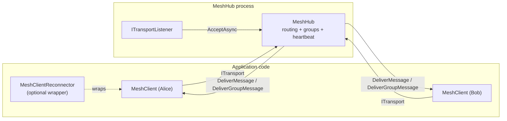

<!-- for-clanker:freshness
repo: Meshworx (github.com/adamsalisbury/Meshworx)
scope: full
reconciled-to-commit: 36cfb63 (branch feat/group-authorisation-boundary, PR #66)
reconciled-to-date: 2026-07-25
mode: update
-->

# Meshworx — coding agent field guide

This is the entry point. Read it in full before touching the code, then jump to the area file for
whatever you are changing. Every claim here is grounded in the source; where something is inferred
rather than read directly, it says so.

> **Documented tree:** branch `feat/group-authorisation-boundary` (PR #66), which is `main` plus the
> group-authorisation work (PR #66, closing issue #14). The
> [Group authorisation](for-clanker/hub.md#group-authorisation) and
> [Routing helpers](for-clanker/hub.md#routing-helpers) sections of [hub.md](for-clanker/hub.md) plus its
> constructor rows, the `0x10 GroupJoinRefused` opcode and the
> [Additive opcodes](for-clanker/protocol.md#additive-opcodes-within-a-version) section of
> [protocol.md](for-clanker/protocol.md), the
> [Authorisation types](for-clanker/types.md#authorisation-types) section of
> [types.md](for-clanker/types.md), the
> [Group membership](for-clanker/client.md#group-membership) section of
> [client.md](for-clanker/client.md), KI-2/KI-4/KI-8/KI-9/KI-10 and the new KI-27/KI-28 in
> [known-issues.md](for-clanker/known-issues.md), the group-authorisation test rows in
> [testing.md](for-clanker/testing.md), and the group bullets in §4 and §8 below describe **that branch**.
> On `main` there is no `GroupAuthoriser`, `GroupJoinContext`, `GroupJoinRefusedEventArgs` or
> `MessageType.GroupJoinRefused`; `MeshHub` has a synchronous `JoinGroup` and a `SendToGroup` that fans
> out to every member **without checking that the sender is one**; and `MeshClient.JoinGroupAsync`
> records membership *after* sending. Every `MeshHub.cs` coordinate past line 10 is 1–243 lines lower on
> `main`, every `MeshClient.cs` coordinate past line 147 is 3–61 lower, and every `MeshHubTests.cs`
> coordinate is 1 lower (416 tests' worth were appended at line 2049).
>
> The atomic capacity-admission fix (PR #65, closing issue #13) has since merged as `40e7731`, so the
> [Registration handshake](for-clanker/hub.md#registration-handshake-hub-side) section of
> [hub.md](for-clanker/hub.md) and its `ConnectedClientCount` row, the hub-side validation order in
> [protocol.md](for-clanker/protocol.md#registration-handshake), the `ClientAuthenticator` contract in
> [types.md](for-clanker/types.md#authentication-types), KI-26, the authenticator parking seam in
> [testing.md](for-clanker/testing.md#parking-a-caller-mid-lifecycle) and the admission bullet in §4
> below now describe `main` directly.
>
> The hub lifecycle-concurrency fix (PR #64, closing issue #12) merged as `c90d515`, so the
> [Lifecycle & concurrency](for-clanker/hub.md#lifecycle) section of [hub.md](for-clanker/hub.md), its
> `StartAsync` / `StopAsync` / `DisposeAsync` rows, KI-23/KI-24/KI-25, the hub-lifecycle parking seams in
> [testing.md](for-clanker/testing.md#parking-a-caller-mid-lifecycle) and the lifecycle bullet in §4
> describe `main` too. The listener disposal-contract fix (PR #63, closing issue #11) merged as
> `a8b05d2`, so the `ITransportListener` disposal contract and the `TcpTransportListener` /
> `InMemoryTransportListener` sections of [transport.md](for-clanker/transport.md), the accept-loop note
> in [hub.md](for-clanker/hub.md#the-accept-loop), KI-22 and the two listener test rows in
> [testing.md](for-clanker/testing.md) describe `main` too.
>
> Everything else documented here is on `main`. The disconnect-race fix (PR #62, closing issue #10) has
> since merged as `28672a0`, so the claim protocol in
> [client.md](for-clanker/client.md#the-claim-protocol-load-bearing), the `DisconnectAsync` row in §2
> below, KI-21 and the `MeshClientTests.cs` row in [testing.md](for-clanker/testing.md) now describe
> `main` directly. The heartbeat eviction fix (PR #61, closing issue #9) merged as `a005af2`, so the
> heartbeat schedule in [hub.md](for-clanker/hub.md#heartbeat-schedule), the `maxMissedHeartbeats` row in
> §5 below, KI-11 and every `MeshHub.cs` coordinate describe `main` too. The reconnector race fix
> (PR #60, closing issue #8) is documented in the `MeshClientReconnector` sections of
> [client.md](for-clanker/client.md) and KI-19/KI-20. The TLS transport work (PR #59, closing issue #7)
> is documented in [transport.md](for-clanker/transport.md); the registration-authentication work of
> PR #56 and protocol version 3 are on `main`.
>
> **Known documentation gap:** the coordinates (`path:line`) for `MeshClient.cs` and
> `MeshClientReconnector.cs` outside the registration and group-membership paths were written against an
> older tree and have since drifted — PRs #52 (reconnector group-membership restore) and #55 (client send
> timeout and retry) landed on `main` after this documentation set was first written and have **still**
> not been reconciled. None of PRs #59 through #66 touched that backlog: each reconciliation is scoped to
> its own branch, so PR #66 corrected only the coordinates its own diff moved and the sections its own
> diff invalidated. **[client.md](for-clanker/client.md) was knowingly left alone in the PR #63, #64 and
> #65 passes**, and in the PR #66 pass only the three members that change touched were corrected
> (`JoinGroupAsync` `:392`, `LeaveGroupAsync` `:433`, `GroupJoinRefused` `:152`) along with the class
> declaration (`MeshClientReconnector.cs:31`) and the reconnector's group-restore behaviour, which PR #52
> had made factually wrong. Treat the rest as the next pass's job, not as verified.
>
> Concretely, still stale in [client.md](for-clanker/client.md): the `MeshClientReconnector` **Surface**
> table carries pre-#52 line numbers (`Client` `:92`, `StartAsync` `:105`, `Reconnected` `:98`,
> `DisposeAsync` `:196`; the true values are `:116`, `:138`, `:131`, `:328` — the ctor row `:79` **is**
> correct), the two **How it works** bullets PR #60 did not rewrite are likewise stale (`OnDisconnected`
> `:132` and `ReconnectLoopAsync` `:138`; the true values are `:182` and `:202`), and the
> `MeshClientReconnectorTests.cs` line count in the closing sentence reads 302 against an actual 853.
> Several `MeshClient.cs` coordinates cited from
> [known-issues.md](for-clanker/known-issues.md) (e.g. `:102`, `:345`, `:551`) and the receive-loop
> coordinates in [client.md](for-clanker/client.md) and
> [protocol.md](for-clanker/protocol.md) (e.g. the empty-frame guard at `:546`, true value `:714`) also
> resolve to unrelated lines. Names and behaviour are accurate throughout; jump by symbol, not by line.
>
> Every `MeshHub.cs`, `MeshHubTests.cs`, `TcpTransport.cs`, `ITransportListener.cs`,
> `TcpTransportListener.cs` and `InMemoryTransportListener.cs` coordinate is current — the `MeshHub.cs`
> set was re-pointed in full for PR #66, which moved everything below its new `_groupAuthoriser` field
> and rewrote the group helpers wholesale, the `MeshHubTests.cs` set likewise (PR #66 appended its tests
> but also added a `using`, shifting every pre-existing coordinate by one), and the listener sets were
> re-pointed in full for PR #63.

---

## 1. What Meshworx is

Meshworx is a **.NET class library** (`AdamSalisbury.Meshworx`, target `net10.0`, package version
`0.1.0`) that provides **named message routing through a central hub**. It is not an application or a
service — it is a library you embed. Two test/console apps ship alongside it purely to exercise it.

The model in one paragraph: a **hub** (`MeshHub`) listens on a pluggable transport and accepts
**clients** (`MeshClient`). Each client registers under a **unique name** and is assigned a `Guid` id.
Clients then exchange **opaque byte payloads** — addressed directly by recipient id, broadcast to
everyone, or sent to a named **group**. The hub never interprets payloads; it reads a one-byte routing
opcode and forwards the body. Delivery is **best-effort, fire-and-forget** — there are no acks, no
retries, no ordering guarantees beyond a single connection's stream, and no persistence.

Since protocol version 3 the hub has an **authentication seam**: an optional `ClientAuthenticator`
callback decides whether a registering client may join, given its name and an opaque credential it
supplied. **It is opt-in — a hub constructed without one admits any peer that can reach the listener**,
under any unused name.

There is also an **authorisation seam, but it covers groups only**. An optional `GroupAuthoriser`
callback gates every group join, and — with or without it — **sending to a group requires membership of
that group**. Nothing else is gated: an admitted client can still resolve names, broadcast, and
direct-send to any id it holds. Treat the transport boundary as the trust boundary, and see
[known-issues.md](for-clanker/known-issues.md) KI-2.

### Headline facts

| Fact | Value | Source |
|---|---|---|
| Kind | Library (+ two console test apps) | `src/AdamSalisbury.Meshworx/AdamSalisbury.Meshworx.csproj` |
| Target framework | `net10.0` | `AdamSalisbury.Meshworx.csproj:4` |
| Language level | C# with `ImplicitUsings` + `Nullable` enabled | `AdamSalisbury.Meshworx.csproj:5-6` |
| Only runtime dependency | `Microsoft.Extensions.Logging` | `AdamSalisbury.Meshworx.csproj:734` |
| Wire protocol version | `3` | `Messages/Protocol.cs:5` |
| Max frame payload (TCP) | 1 MiB (`1024*1024`) | `Transport/Tcp/TcpTransport.cs:28` |
| TCP transport encryption | Optional TLS, **off by default** | `Transport/Tcp/TcpTransport.cs:137`, `TcpTransportListener.cs:110` |
| Max client-name length | 256 (chars, see gotcha) | `Messages/Protocol.cs:6` |
| Warnings as errors | Yes (`Directory.Build.props`) | `src/Directory.Build.props:3` |

---

## 2. How it is meant to be used

The public surface is small and deliberate. Everything an application touches lives in namespace
`AdamSalisbury.Meshworx` (plus `.Messages` for event args/enums and `.Transport[.Tcp|.InMemory]` for
transports). `MessageType` and `Protocol` are **`internal`** — you cannot see the opcodes from outside
the assembly, and you should not need to.

**Host a hub:**

```csharp
using var loggerFactory = LoggerFactory.Create(b => b.AddConsole());
var listener = new TcpTransportListener(port: 22001);   // binds LOOPBACK only — see transport.md
await using var hub = new MeshHub(loggerFactory.CreateLogger<MeshHub>(), listener);
await hub.StartAsync();
// ... hub now accepts clients; StopAsync() / DisposeAsync() to shut down ...
```

`StopAsync` and `DisposeAsync` are safe to call concurrently and are idempotent — overlapping callers
share one shutdown and each returns only once the hub has actually stopped. Note that `await using`
passes no cancellation token, and the shutdown's client notification has no send timeout (KI-24); a
stopped hub is not restartable (KI-25).

Add authentication by passing a callback — without one the hub admits anyone who can reach it:

```csharp
ClientAuthenticator authenticator = (context, _) =>
    ValueTask.FromResult(CredentialStore.IsValid(context.ClientName, context.Credential.Span));

await using var hub = new MeshHub(logger, listener, authenticator: authenticator);
```

Add **group authorisation** by passing a second callback. This is the other half of the security seam:
the authenticator decides *who a peer is*, the authoriser decides *what it may do*. Without one, any
admitted client may join any group:

```csharp
GroupAuthoriser groupAuthoriser = (context, _) =>
    ValueTask.FromResult(TenantDirectory.MayJoin(context.ClientName, context.GroupName));

await using var hub = new MeshHub(
    logger, listener, authenticator: authenticator, groupAuthoriser: groupAuthoriser);
```

**Sending to a group requires membership of it whether or not you configure an authoriser** — the hub
drops a group message from a client that has not joined. There is no send-only capability.

Add transport encryption by giving the listener TLS options — separate from, and composable with, the
authenticator above. Framing is unchanged, so nothing else in the stack cares:

```csharp
var listener = new TcpTransportListener(
    new IPEndPoint(IPAddress.Any, 22001),
    new SslServerAuthenticationOptions { ServerCertificate = hubCertificate });
```

**Connect a client:**

```csharp
await using var client = new MeshClient(loggerFactory.CreateLogger<MeshClient>());
var transport = await TcpTransport.ConnectAsync("localhost", 22001);   // CLEARTEXT — see transport.md
// ... or, against a TLS listener:
// var transport = await TcpTransport.ConnectAsync("hub.example.com", 22001, new SslClientAuthenticationOptions());
await client.ConnectAsync(transport, clientName: "Alice");   // client TAKES OWNERSHIP of transport
// ... or, against a hub with an authenticator:
// await client.ConnectAsync(transport, "Alice", credential: Encoding.UTF8.GetBytes(apiKey));

client.MessageReceived += (_, e) => Handle(e.SenderId, e.Data.Span);

Guid? bobId = await client.GetClientIdByNameAsync("Bob");
if (bobId is not null)
{
    await client.SendAsync(bobId.Value, Encoding.UTF8.GetBytes("hello"));
}
```

The canonical call sequence is always: **construct → `ConnectAsync` → (send / lookup / group ops +
handle events) → `DisconnectAsync` / dispose**. Runnable examples live in
`src/AdamSalisbury.Meshworx.TestApps/{HubApp,ClientApp}/Program.cs` — read `ClientApp/Program.cs` for a
complete, idiomatic client that uses every capability.

**Capabilities at a glance** (all on `IMeshClient`, `src/AdamSalisbury.Meshworx/IMeshClient.cs`):

| Task | Call | Notes |
|---|---|---|
| Direct message | `SendAsync(recipientId, payload)` | Dropped silently if recipient unknown |
| Broadcast | `BroadcastAsync(payload)` | Every other client; never echoed to sender |
| Resolve name → id | `GetClientIdByNameAsync(name)` | `null` if not found; serialised, one in flight |
| Join / leave group | `JoinGroupAsync(name)` / `LeaveGroupAsync(name)` | Groups created on first join, removed when empty. The join is **optimistic** — a hub with a `GroupAuthoriser` may refuse it |
| Group message | `SendToGroupAsync(name, payload)` | Every other member. **The sender must be a member** — the hub silently drops a group message from a non-member |
| Graceful disconnect | `DisconnectAsync()` | Does **not** raise `Disconnected`, even when it races a remote drop — see KI-21 for the one residual window |
| Auto-reconnect | wrap in `MeshClientReconnector` | Re-establishes on drop; you restore app state |
| Present a credential | `ConnectAsync(transport, name, credential)` | Opaque bytes; only meaningful if the hub has an `authenticator` |
| Learn a join was refused | `GroupJoinRefused` event | Group already removed from `JoinedGroups` when it fires; not retried |

---

## 3. Architecture



**Dependency direction (respect this):** `MeshHub` and `MeshClient` depend on the transport
**abstractions** (`ITransport` / `ITransportListener`), never on `Tcp*` or `InMemory*` concretes. The
concrete transports depend only on the abstractions. Keep it that way — the whole point of the design is
that the transport is swappable. Message opcodes and framing knowledge live in `MeshHub`/`MeshClient`;
transports are dumb pipes that only know framing, not opcodes.

**Data flow for a direct send:** client `SendAsync` frames `[SendMessage][recipientId(16)][body]` and
writes it to its transport → hub receive loop reads it, looks up the recipient's `ClientConnection`,
builds `[DeliverMessage][senderId(16)][body]`, and `TryWrite`s it to the recipient's **bounded outbound
queue** → the recipient connection's **send loop** drains the queue (coalescing bursts) and writes to
its transport → recipient's client receive loop reads it and raises `MessageReceived`.

The **outbound queue + send loop per connection** is the core of the hub's concurrency design: inbound
receive loops never block on a slow recipient's socket; they just enqueue. See
[hub.md](for-clanker/hub.md) for the full model.

### Component map → where to read

| Area | Types | File |
|---|---|---|
| Hub: routing, groups, heartbeat, lifecycle | `MeshHub`, `IMeshHub` | [hub.md](for-clanker/hub.md) |
| Client + reconnection | `MeshClient`, `IMeshClient`, `MeshClientReconnector` | [client.md](for-clanker/client.md) |
| Transports (incl. TLS) | `ITransport`, `ITransportListener`, `IBatchSendTransport`, `TcpTransport(Listener)`, `InMemoryTransport(Listener)` | [transport.md](for-clanker/transport.md) |
| Wire protocol & framing | `MessageType`, `Protocol`, handshake, opcode payloads | [protocol.md](for-clanker/protocol.md) |
| Public value types | event args, `DisconnectReason`, `RegistrationErrorCode`, `ClientAuthenticator`, `RegistrationContext`, `GroupAuthoriser`, `GroupJoinContext`, `RegistrationRefusedException` | [types.md](for-clanker/types.md) |
| Tests, fixtures, build/CI | xUnit + Moq suite, `MeshHubFixture`, `MeshClientFixture` | [testing.md](for-clanker/testing.md) |
| **Known issues register** | consolidated foot-guns and limitations | [known-issues.md](for-clanker/known-issues.md) |

---

## 4. Threading & async model (read before changing any loop)

This is a concurrency-heavy library. The invariants below are load-bearing; breaking them causes
deadlocks or dropped messages that tests may not catch.

- **Async all the way, `ConfigureAwait(false)` everywhere.** This is library code; `CA2007` is a
  **warning = build error** (`.editorconfig` `dotnet_diagnostic.CA2007.severity = warning`,
  `Directory.Build.props` `TreatWarningsAsErrors=true`). Every `await` in the library uses it. Never
  block on async (`.Result` / `.Wait()`).
- **`ITransport` contract:** `SendAsync` must be safe to call **concurrently**; `ReceiveAsync` is
  **single-reader** (never called concurrently). Both hub and client rely on this. `TcpTransport`
  enforces send-concurrency with an internal `SemaphoreSlim` write lock (`TcpTransport.cs:32`).
- **`ITransportListener` contract:** a listener disposed with an accept still pending must end that
  accept with **`ObjectDisposedException`**, must throw the same for every later accept, and its
  `DisposeAsync` must be idempotent, safe to call concurrently, and return only once teardown is
  complete (`Transport/ITransportListener.cs:6-22`). The type matters:
  `MeshHub.AcceptLoopAsync` stops on `ObjectDisposedException` but logs-and-retries **without delay**
  on anything else (`MeshHub.cs:502-510`), so a finished listener that reports itself any other way
  spins the hub hot. See [known-issues.md](for-clanker/known-issues.md) KI-22.
- **Hub lifecycle is serialised behind one lock.** `MeshHub.StartAsync`, `StopAsync` and `DisposeAsync`
  may all be called concurrently. Every lifecycle field (`_cts`, `_acceptLoopTask`, `_stopTask`,
  `_disposeTask`, `_starting`, `_disposed`) is guarded by `Lock _stateLock` (`MeshHub.cs:58`), and each
  entry point **captures what it needs once into locals and never awaits while holding the lock**.
  `StopAsync` is deliberately **not `async`** (`MeshHub.cs:312`): it decides synchronously under the
  lock, so overlapping callers provably share one shutdown — clients are notified once, and every caller
  returns only when the hub has actually stopped. Do not re-read a lifecycle field outside the lock and
  do not make `StopAsync` `async` again. See [hub.md](for-clanker/hub.md#lifecycle) and
  [known-issues.md](for-clanker/known-issues.md) KI-23.
- **Client admission is an atomic claim, not a count check.** `maxClients` is enforced against
  `_reservedClientSlots` (`MeshHub.cs:44`), which a registration takes with a single compare-and-swap
  (`TryReserveClientSlot`, `MeshHub.cs:845`) and gives back in its handler's `finally`
  (`MeshHub.cs:815-818`). The claim sits **after** the authenticator so an unauthenticated peer cannot
  hold capacity, with a cheap at-capacity early-out **before** it so a full hub still never runs the
  callback. Consequence for any code you write here: `ConnectedClientCount` can transiently read *below*
  the number of claimed slots, so never gate admission on it. See
  [hub.md](for-clanker/hub.md#registration-handshake-hub-side) and
  [known-issues.md](for-clanker/known-issues.md) KI-26.
- **Group membership is the hub's only enforceable boundary, and the join gate is an awaited callback.**
  A group send is dropped unless the sender is in the group — tested **inside** the group's lock
  (`MeshHub.cs:1430`) so a sender removed concurrently cannot slip through. A join, when a
  `GroupAuthoriser` is configured, awaits that callback **from the calling client's own receive loop**
  (`MeshHub.cs:698-699`), which therefore reads nothing else from that client until it returns. Two
  consequences: a slow authoriser stalls only its own client, and a client parked on a decision looks
  idle to the heartbeat monitor and can be evicted mid-decision. Keep integrator awaits out of
  `Group.Lock`. See [hub.md](for-clanker/hub.md#group-authorisation) and
  [known-issues.md](for-clanker/known-issues.md) KI-28.
- **Hub per-connection tasks:** each accepted connection runs a **receive loop** (`HandleClientAsync`),
  a **send loop** (`SendLoopAsync`, drains the bounded outbound `Channel`), and — only when heartbeats
  are configured — a **heartbeat monitor** (`MonitorHeartbeatAsync`, one `PeriodicTimer`). All share one
  linked `CancellationTokenSource` per client. The monitor **checks the miss counter before it probes**,
  so a silent client is evicted on the `maxMissedHeartbeats`th consecutive silent interval and receives
  one fewer ping than that; see [hub.md](for-clanker/hub.md#heartbeat-schedule).
- **Client single receive loop** (`ReceiveLoopAsync`) plus an optional **idle monitor** on a
  `PeriodicTimer`. The client uses an `AsyncLocal<bool> _inReceiveLoop` flag so that calling
  `DisconnectAsync` **from inside a `MessageReceived`/`Disconnected` handler does not deadlock** by
  awaiting its own loop (`MeshClient.cs:15-18`, `:239`). Preserve this if you refactor disconnect.
- **Liveness is detected by an activity counter, not a per-frame timer.** Both sides bump a
  monotonically increasing counter on every received frame; the monitor compares it between timer ticks.
  This avoids arming a `CancellationTokenSource`/timer per frame. Don't reintroduce per-frame timers.
- **Bounded outbound queue (capacity 1024), `TryWrite` delivery.** If a recipient's queue is full,
  the hub **drops the message and logs a warning** — it never blocks the router. This is intentional
  back-pressure-by-dropping. See [known-issues.md](for-clanker/known-issues.md) KI-1.
- **Event handlers are invoked on the loop's thread inside `try/catch`.** A throwing subscriber is
  logged and swallowed at every callback boundary so it cannot fault a loop. Handlers must be
  thread-safe (hub events fire concurrently for different clients — `IMeshHub.cs:44-46`).

---

## 5. Configuration & environment

There is **no config file, no environment variables, no external services**. Everything is configured
through constructor parameters. The only ambient dependency is an `ILogger<T>` you supply.

**`MeshHub` options** (`MeshHub.cs:119-189`, all optional):

| Param | Default | Effect |
|---|---|---|
| `registrationTimeout` | 10 s | Drop a connection that accepts but never registers |
| `maxClients` | unlimited (`int.MaxValue`) | Refuse beyond this with `HubAtCapacity`. A **hard** cap — admission is one atomic claim, so concurrent registrations cannot overshoot it |
| `heartbeatInterval` | `null` (disabled) | Ping idle clients; evict on the `maxMissedHeartbeats`th consecutive silent interval |
| `maxMissedHeartbeats` | 2 | **Silent intervals until eviction, counted inclusively:** a client that sends nothing is evicted on the Nth silent interval and probed N − 1 times first. At 1 it is never probed at all and the constructor logs a warning. Schedule table in [hub.md](for-clanker/hub.md#heartbeat-schedule) |
| `authenticator` | `null` (**open admission**) | Decides whether each registering client may join; `false` → `AuthenticationFailed` |
| `maxConcurrentAuthentications` | 64 | Caps concurrent authenticator callbacks; ignored when `authenticator` is `null` |
| `groupAuthoriser` | `null` (**any client may join any group**) | Decides whether each registered client may join a group; `false` → `GroupJoinRefused` to that client. Fails closed on throw, self-cancellation or timeout. Group **sends** require membership with or without this |
| `groupAuthorisationTimeout` | 10 s | How long the hub waits for a decision before refusing. Bounds the **wait**, not the callback — see [known-issues.md](for-clanker/known-issues.md) KI-28. Ignored when `groupAuthoriser` is `null`; keep it below `heartbeatInterval × maxMissedHeartbeats` |

**`MeshClient` options** (`MeshClient.cs:67`): `idleTimeout` (default `null`), `sendTimeout`
(default `null`), `maxSendAttempts` (default `1` — the first attempt counts, so `1` disables retrying;
only transient I/O errors are retried) and `sendRetryDelay` (default `100 ms`, linear back-off). Set
`idleTimeout` **above** the hub's `heartbeatInterval` so the hub's pings reset it; a genuinely silent
hub then trips it and raises `Disconnected(ConnectionLost)`.

**`MeshClientReconnector` options** (`MeshClientReconnector.cs:79`): `retryDelay` (1 s), `connectTimeout`
(10 s), `restoreGroupMembership`, optional `ILogger`, and `credential` (empty; replayed on every
reconnect — it cannot be changed afterwards, see [known-issues.md](for-clanker/known-issues.md) KI-16).

**`TcpTransportListener` options** (`TcpTransportListener.cs:110`, all optional):

| Param | Default | Effect |
|---|---|---|
| `tlsOptions` | `null` (**cleartext**) | `SslServerAuthenticationOptions` used to authenticate every accepted connection as the server; set `ClientCertificateRequired` for mutual TLS |
| `tlsHandshakeTimeout` | 10 s | Bounds a single negotiation; ignored without `tlsOptions` |
| `maxConcurrentTlsHandshakes` | 64 | Caps concurrent handshakes (CPU bound, **not** an admission limit); 16× that many may be pending. Ignored without `tlsOptions` |

Client-side TLS is configured per connection, not per client: pass `SslClientAuthenticationOptions` to
`TcpTransport.ConnectAsync`. Both option objects are **copied** on the way in (shallow), so reassigning
a property afterwards does not affect a live listener or connection — but mutating a shared object you
handed over still does. Details in [transport.md](for-clanker/transport.md).

All constructors validate ranges and throw `ArgumentOutOfRangeException` for non-positive timeouts/counts.
`TcpTransportListener` additionally throws `ArgumentException` if `tlsOptions` carries no certificate,
certificate context, or certificate-selection callback.

---

## 6. Cross-cutting conventions (imitate these)

Derived from the code, `.editorconfig`, and `Directory.Build.props`. See the root `CLAUDE.md` for the
full house style; the points below are the ones the code actually enforces and demonstrates.

- **Sealed by default.** Every concrete public class is `sealed`. Seal anything new unless it is
  explicitly an extension point.
- **File-scoped namespaces, Allman braces, four-space indent, always-braced blocks** — enforced as
  build warnings (`IDE0011`, `IDE0161`, `IDE0055`).
- **Interfaces carry the XML docs; implementations use `<inheritdoc/>`.** `GenerateDocumentationFile`
  is on and `CS1591` is suppressed, so public members without an obvious inherited doc are fine but the
  contract lives on the interface. Follow this: document new behaviour on the interface.
- **Guard clauses first:** `ArgumentNullException.ThrowIfNull`, `ArgumentException.ThrowIfNullOrEmpty`,
  explicit range checks. Every public entry point does this.
- **Catch specific exceptions.** Broad `catch (Exception)` appears **only** at loop/callback boundaries
  and is always logged with a comment explaining why it is intentional (e.g. `MeshHub.cs:502-510`,
  `:986`, and the three catches in `AuthenticateAsync` `:931-955`). `CA1031` is a suggestion, not an error, but the convention is strict — match it.
- **No blocking, no `.Result`.** `CA2007` (ConfigureAwait) is a build error in the library.
- **Binary wire work uses `System.Buffers.Binary.BinaryPrimitives`** (big-endian) and
  `Guid.TryWriteBytes` / `new Guid(span)` for the 16-byte ids. Frame buffers on hot paths are rented
  from `ArrayPool<byte>.Shared` in `TcpTransport`; delivery frames are built once and shared read-only
  across recipients in the hub.

**Adding a new message type / capability** (the shape to follow):
1. Add the opcode to `internal enum MessageType` (`Messages/MessageType.cs`) — pick the next free byte.
2. Bump `Protocol.Version` (`Messages/Protocol.cs`) if the change is not backward-compatible; the hub
   rejects mismatched versions at registration. A **hub → client** opcode that an older client can safely
   ignore does **not** need a bump — that is the `GroupJoinRefused` precedent, and the exact conditions
   are in [protocol.md](for-clanker/protocol.md#additive-opcodes-within-a-version). A client → hub
   opcode, or any change to an existing frame's layout, always does.
3. Client: add the framing/send method to `MeshClient` and the interface method + XML doc to
   `IMeshClient`; add the inbound branch to `ReceiveLoopAsync`.
4. Hub: add the inbound branch to `HandleClientAsync`'s dispatch chain and any routing helper.
5. Update the protocol table in [protocol.md](for-clanker/protocol.md) and the README.
6. Add tests mirroring the existing per-opcode tests; use the fixtures. See [testing.md](for-clanker/testing.md).

**"Done" means:** `dotnet build Meshworx.slnx -c Release` clean (warnings are errors) **and**
`dotnet test Meshworx.slnx` green. CI runs exactly this on push/PR to `main`
(`.github/workflows/ci.yml`).

---

## 7. Build, test, run

```sh
# from repo root
dotnet restore Meshworx.slnx
dotnet build   Meshworx.slnx -c Release --no-restore
dotnet test    Meshworx.slnx -c Release --no-build

# run the demo hub, then a client (separate terminals)
dotnet run --project src/AdamSalisbury.Meshworx.TestApps/HubApp
dotnet run --project src/AdamSalisbury.Meshworx.TestApps/ClientApp
```

> **Two solution files exist:** root `Meshworx.slnx` (library + test apps + tests — this is what CI
> uses) and `src/Meshworx.slnx`. Use the **root** one. The README's per-project `dotnet build/test`
> commands also work but only cover one project each.

Package metadata (NuGet) is configured in the library `.csproj` (`Version 0.1.0`, MIT, symbols on) but
there is no publish step in CI — CI only builds and tests.

---

## 8. System-wide pitfalls (full detail in known-issues.md)

- **Delivery is lossy by design.** Full outbound queue → dropped frame (logged). Unknown recipient →
  dropped silently. No acks. Do not assume a message sent is a message received.
- **Authentication is opt-in; authorisation covers groups only.** Without a `ClientAuthenticator` any
  reachable peer can register under any unused name and lookup/broadcast to everyone. Groups *can* be
  made a boundary — pass a `GroupAuthoriser` — but without one any admitted client may join any group,
  and nothing outside groups is gated at all. KI-2.
- **Group sends require membership, unconditionally, and this is a silent behavioural break.** The hub
  drops a group message from a non-member with a `Debug` log and no error frame, with or without an
  authoriser, and it shipped **without** a protocol version bump. A client that used to publish to a
  group without joining it still connects and still sends — it is simply never delivered. There is no
  send-only capability: joining to publish also means receiving. KI-2, KI-4.
- **Protocol v3 broke both wire and source compatibility.** v2 and v3 peers cannot interoperate — there
  is no negotiation — and `ConnectAsync` gained a `credential` parameter **before** the
  `CancellationToken`, so positional call sites no longer compile. KI-14.
- **`new TcpTransportListener(port)` binds loopback**, not every interface. Remote clients cannot reach
  a hub created that way; pass an explicit `IPEndPoint` to expose it deliberately.
- **The TCP transport is cleartext unless you pass TLS options** to both the listener and
  `TcpTransport.ConnectAsync`. Nothing warns you; assert `TcpTransport.IsEncrypted` at start-up if it
  matters. Even with TLS, security is **hop-by-hop**: a delivered message's sender id is asserted by the
  hub, not signed by the sender, so a compromised hub can forge one. KI-2, KI-17.
- **A failed TLS handshake is silent on the listener side** — no log, no exception, the hub simply never
  sees the connection. Diagnose from the client. KI-18.
- **Client-name length is checked in `char`s (UTF-16 units), not UTF-8 bytes**, on both sides — a name
  can encode to more bytes than you expect. Names are also case-sensitive and `Ordinal`-compared.
- **Group membership is fire-and-forget and optimistic on the client.** `JoinGroupAsync` returning means
  the request was *sent*, not that you are a member — subscribe to `GroupJoinRefused` if it matters.
  Reconnects **do** auto-rejoin (since PR #52), by re-joining over the wire, so every restored membership
  is authorised afresh and may be refused. A refusal carries no correlation id, so it can clear a
  membership a later join obtained; the divergence is fail-safe (the client under-reports, the hub keeps
  the member). KI-10, KI-27.
- **`DisconnectAsync` suppresses `Disconnected` even when it races a remote drop — but not absolutely.**
  A claim protocol makes the outcome independent of which side tears the connection down, *except* in a
  few-instruction window after the receive loop has already published the disconnected state, where the
  event still fires with `ConnectionLost`. Treat the suppression as overwhelmingly reliable rather than
  guaranteed, and make `Disconnected` handlers idempotent. KI-21.
- **Hub shutdown is unbounded unless you pass a token.** The `Disconnect` notification is sent to each
  client **sequentially with no send timeout**, so one registered peer that has stopped reading can hold
  `StopAsync(default)` — and therefore `await using` — open indefinitely, leaving the peers behind it
  unnotified. Pass a cancellable token if shutdown latency matters. KI-24.
- **`ConnectedClientCount` is not the capacity gauge.** `maxClients` is enforced against an atomic slot
  claim, not the client registry, so the count can transiently read *below* the number of claimed slots —
  during a registration and during shutdown. The invariant is `reserved >= registered`, so it only errs
  conservative, but never write an admission check against `ConnectedClientCount`. KI-26.
- **A stopped hub is spent.** `StopAsync` releases the hub's state, but `ITransportListener` has no stop:
  the endpoint stays bound and both shipped listeners refuse a second `StartAsync`. Dispose it and build
  a new one rather than restarting. KI-25.
- **`ReadOnlyMemory<byte>` in event args is a view over the received frame.** It is currently backed by
  a per-frame allocation so retaining it is safe today, but the idiom is to copy if you keep it past the
  handler. A custom pooling transport could invalidate that assumption.
- **Malformed/short frames are silently ignored** by both dispatch loops (length-guarded branches with
  no `else`). A bug in your framing will manifest as "nothing happens", not an exception.

Full register with severities, locations and workarounds: **[known-issues.md](for-clanker/known-issues.md)**.
