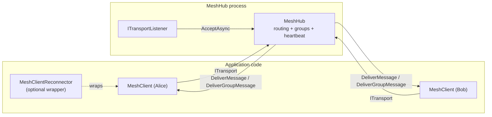

<!-- for-clanker:freshness
repo: Meshworx (github.com/adamsalisbury/Meshworx)
scope: full
reconciled-to-commit: 4b352ef (branch fix/heartbeat-eviction-off-by-one, PR #61)
reconciled-to-date: 2026-07-25
mode: update
-->

# Meshworx — coding agent field guide

This is the entry point. Read it in full before touching the code, then jump to the area file for
whatever you are changing. Every claim here is grounded in the source; where something is inferred
rather than read directly, it says so.

> **Documented tree:** branch `fix/heartbeat-eviction-off-by-one` (PR #61), which is `main` plus the
> heartbeat eviction fix (PR #61, closing issue #9). The heartbeat schedule in
> [hub.md](for-clanker/hub.md#heartbeat-schedule), the `maxMissedHeartbeats` row in §5 below,
> [known-issues.md](for-clanker/known-issues.md) KI-11 and the `MeshHubTests.cs` row in
> [testing.md](for-clanker/testing.md) describe **that branch**; on `main` eviction fires one interval
> later (`missedHeartbeats > _maxMissedHeartbeats`), there is no constructor warning for
> `maxMissedHeartbeats: 1`, and every `MeshHub.cs` coordinate past line 61 is 6–22 lines lower.
>
> The reconnector race fix (PR #60, closing issue #8) is on `main` and is documented in the
> `MeshClientReconnector` sections of [client.md](for-clanker/client.md) and KI-19/KI-20.
> The TLS transport work (PR #59, closing issue #7) is documented in
> [transport.md](for-clanker/transport.md); the registration-authentication work of PR #56 and protocol
> version 3 are on `main`.
>
> **Known documentation gap:** the coordinates (`path:line`) for `MeshClient.cs` and
> `MeshClientReconnector.cs` outside the registration path were written against an older tree and have
> since drifted — PRs #52 (reconnector group-membership restore) and #55 (client send timeout and
> retry) landed on `main` after this documentation set was first written and have **still** not been
> reconciled. None of PRs #59, #60 or #61 touched that backlog: each reconciliation is scoped to its own
> branch, so PR #61 corrected only the coordinates its own diff moved and the sections its own diff
> invalidated. Concretely, in [client.md](for-clanker/client.md) the `MeshClientReconnector` **Surface**
> table still carries pre-#52 line numbers (`Client` `:86`, `StartAsync` `:99`, `Reconnected` `:92`,
> `DisposeAsync` `:190`; the true values are `:110`, `:132`, `:125`, `:322`), the two **How it works**
> bullets PR #60 did not rewrite are likewise stale (`OnDisconnected` `:126` and `ReconnectLoopAsync`
> `:132`; the true values are `:176` and `:196`), the class-declaration coordinate `:24` is one line
> out, and the test-file line count in the closing sentence predates two PRs. Those are the complete
> set of stale reconnector coordinates as at PR #61 — a follow-up pass can clear them mechanically.
> Names and behaviour outside the reconnector's connect path are accurate; the line numbers in
> those two files may be tens of lines out. Every `MeshHub.cs`, `TcpTransport.cs` and
> `TcpTransportListener.cs` coordinate is current — the `MeshHub.cs` set was re-pointed in full for
> PR #61, which shifted everything below the constructor.

---

## 1. What Meshworx is

Meshworx is a **.NET class library** (`AdamSalisbury.Meshworx`, target `net10.0`, package version
`0.1.0`) that provides **named message routing through a central hub**. It is not an application or a
service — it is a library you embed. Two test/console apps ship alongside it purely to exercise it.

The model in one paragraph: a **hub** (`MeshHub`) listens on a pluggable transport and accepts
**clients** (`MeshClient`). Each client registers under a **unique name** and is assigned a `Guid` id.
Clients then exchange **opaque byte payloads** — addressed directly by recipient id, broadcast to
everyone, or sent to a named **group**. The hub never interprets payloads; it reads a one-byte routing
opcode and forwards the body. Delivery is **best-effort, fire-and-forget** — there are no acks, no
retries, no ordering guarantees beyond a single connection's stream, and no persistence.

Since protocol version 3 the hub has an **authentication seam**: an optional `ClientAuthenticator`
callback decides whether a registering client may join, given its name and an opaque credential it
supplied. **It is opt-in — a hub constructed without one admits any peer that can reach the listener**,
under any unused name. There is no authorisation model at all: once admitted, every client can reach
every other client and every group. Treat the transport boundary as the trust boundary, and see
[known-issues.md](for-clanker/known-issues.md) KI-2.

### Headline facts

| Fact | Value | Source |
|---|---|---|
| Kind | Library (+ two console test apps) | `src/AdamSalisbury.Meshworx/AdamSalisbury.Meshworx.csproj` |
| Target framework | `net10.0` | `AdamSalisbury.Meshworx.csproj:4` |
| Language level | C# with `ImplicitUsings` + `Nullable` enabled | `AdamSalisbury.Meshworx.csproj:5-6` |
| Only runtime dependency | `Microsoft.Extensions.Logging` | `AdamSalisbury.Meshworx.csproj:734` |
| Wire protocol version | `3` | `Messages/Protocol.cs:5` |
| Max frame payload (TCP) | 1 MiB (`1024*1024`) | `Transport/Tcp/TcpTransport.cs:28` |
| TCP transport encryption | Optional TLS, **off by default** | `Transport/Tcp/TcpTransport.cs:137`, `TcpTransportListener.cs:86` |
| Max client-name length | 256 (chars, see gotcha) | `Messages/Protocol.cs:6` |
| Warnings as errors | Yes (`Directory.Build.props`) | `src/Directory.Build.props:3` |

---

## 2. How it is meant to be used

The public surface is small and deliberate. Everything an application touches lives in namespace
`AdamSalisbury.Meshworx` (plus `.Messages` for event args/enums and `.Transport[.Tcp|.InMemory]` for
transports). `MessageType` and `Protocol` are **`internal`** — you cannot see the opcodes from outside
the assembly, and you should not need to.

**Host a hub:**

```csharp
using var loggerFactory = LoggerFactory.Create(b => b.AddConsole());
var listener = new TcpTransportListener(port: 22001);   // binds LOOPBACK only — see transport.md
await using var hub = new MeshHub(loggerFactory.CreateLogger<MeshHub>(), listener);
await hub.StartAsync();
// ... hub now accepts clients; StopAsync() / DisposeAsync() to shut down ...
```

Add authentication by passing a callback — without one the hub admits anyone who can reach it:

```csharp
ClientAuthenticator authenticator = (context, _) =>
    ValueTask.FromResult(CredentialStore.IsValid(context.ClientName, context.Credential.Span));

await using var hub = new MeshHub(logger, listener, authenticator: authenticator);
```

Add transport encryption by giving the listener TLS options — separate from, and composable with, the
authenticator above. Framing is unchanged, so nothing else in the stack cares:

```csharp
var listener = new TcpTransportListener(
    new IPEndPoint(IPAddress.Any, 22001),
    new SslServerAuthenticationOptions { ServerCertificate = hubCertificate });
```

**Connect a client:**

```csharp
await using var client = new MeshClient(loggerFactory.CreateLogger<MeshClient>());
var transport = await TcpTransport.ConnectAsync("localhost", 22001);   // CLEARTEXT — see transport.md
// ... or, against a TLS listener:
// var transport = await TcpTransport.ConnectAsync("hub.example.com", 22001, new SslClientAuthenticationOptions());
await client.ConnectAsync(transport, clientName: "Alice");   // client TAKES OWNERSHIP of transport
// ... or, against a hub with an authenticator:
// await client.ConnectAsync(transport, "Alice", credential: Encoding.UTF8.GetBytes(apiKey));

client.MessageReceived += (_, e) => Handle(e.SenderId, e.Data.Span);

Guid? bobId = await client.GetClientIdByNameAsync("Bob");
if (bobId is not null)
{
    await client.SendAsync(bobId.Value, Encoding.UTF8.GetBytes("hello"));
}
```

The canonical call sequence is always: **construct → `ConnectAsync` → (send / lookup / group ops +
handle events) → `DisconnectAsync` / dispose**. Runnable examples live in
`src/AdamSalisbury.Meshworx.TestApps/{HubApp,ClientApp}/Program.cs` — read `ClientApp/Program.cs` for a
complete, idiomatic client that uses every capability.

**Capabilities at a glance** (all on `IMeshClient`, `src/AdamSalisbury.Meshworx/IMeshClient.cs`):

| Task | Call | Notes |
|---|---|---|
| Direct message | `SendAsync(recipientId, payload)` | Dropped silently if recipient unknown |
| Broadcast | `BroadcastAsync(payload)` | Every other client; never echoed to sender |
| Resolve name → id | `GetClientIdByNameAsync(name)` | `null` if not found; serialised, one in flight |
| Join / leave group | `JoinGroupAsync(name)` / `LeaveGroupAsync(name)` | Groups created on first join, removed when empty |
| Group message | `SendToGroupAsync(name, payload)` | Every other member; sender need not be a member |
| Graceful disconnect | `DisconnectAsync()` | Does **not** raise `Disconnected` |
| Auto-reconnect | wrap in `MeshClientReconnector` | Re-establishes on drop; you restore app state |
| Present a credential | `ConnectAsync(transport, name, credential)` | Opaque bytes; only meaningful if the hub has an `authenticator` |

---

## 3. Architecture



**Dependency direction (respect this):** `MeshHub` and `MeshClient` depend on the transport
**abstractions** (`ITransport` / `ITransportListener`), never on `Tcp*` or `InMemory*` concretes. The
concrete transports depend only on the abstractions. Keep it that way — the whole point of the design is
that the transport is swappable. Message opcodes and framing knowledge live in `MeshHub`/`MeshClient`;
transports are dumb pipes that only know framing, not opcodes.

**Data flow for a direct send:** client `SendAsync` frames `[SendMessage][recipientId(16)][body]` and
writes it to its transport → hub receive loop reads it, looks up the recipient's `ClientConnection`,
builds `[DeliverMessage][senderId(16)][body]`, and `TryWrite`s it to the recipient's **bounded outbound
queue** → the recipient connection's **send loop** drains the queue (coalescing bursts) and writes to
its transport → recipient's client receive loop reads it and raises `MessageReceived`.

The **outbound queue + send loop per connection** is the core of the hub's concurrency design: inbound
receive loops never block on a slow recipient's socket; they just enqueue. See
[hub.md](for-clanker/hub.md) for the full model.

### Component map → where to read

| Area | Types | File |
|---|---|---|
| Hub: routing, groups, heartbeat, lifecycle | `MeshHub`, `IMeshHub` | [hub.md](for-clanker/hub.md) |
| Client + reconnection | `MeshClient`, `IMeshClient`, `MeshClientReconnector` | [client.md](for-clanker/client.md) |
| Transports (incl. TLS) | `ITransport`, `ITransportListener`, `IBatchSendTransport`, `TcpTransport(Listener)`, `InMemoryTransport(Listener)` | [transport.md](for-clanker/transport.md) |
| Wire protocol & framing | `MessageType`, `Protocol`, handshake, opcode payloads | [protocol.md](for-clanker/protocol.md) |
| Public value types | event args, `DisconnectReason`, `RegistrationErrorCode`, `ClientAuthenticator`, `RegistrationContext`, `RegistrationRefusedException` | [types.md](for-clanker/types.md) |
| Tests, fixtures, build/CI | xUnit + Moq suite, `MeshHubFixture`, `MeshClientFixture` | [testing.md](for-clanker/testing.md) |
| **Known issues register** | consolidated foot-guns and limitations | [known-issues.md](for-clanker/known-issues.md) |

---

## 4. Threading & async model (read before changing any loop)

This is a concurrency-heavy library. The invariants below are load-bearing; breaking them causes
deadlocks or dropped messages that tests may not catch.

- **Async all the way, `ConfigureAwait(false)` everywhere.** This is library code; `CA2007` is a
  **warning = build error** (`.editorconfig` `dotnet_diagnostic.CA2007.severity = warning`,
  `Directory.Build.props` `TreatWarningsAsErrors=true`). Every `await` in the library uses it. Never
  block on async (`.Result` / `.Wait()`).
- **`ITransport` contract:** `SendAsync` must be safe to call **concurrently**; `ReceiveAsync` is
  **single-reader** (never called concurrently). Both hub and client rely on this. `TcpTransport`
  enforces send-concurrency with an internal `SemaphoreSlim` write lock (`TcpTransport.cs:32`).
- **Hub per-connection tasks:** each accepted connection runs a **receive loop** (`HandleClientAsync`),
  a **send loop** (`SendLoopAsync`, drains the bounded outbound `Channel`), and — only when heartbeats
  are configured — a **heartbeat monitor** (`MonitorHeartbeatAsync`, one `PeriodicTimer`). All share one
  linked `CancellationTokenSource` per client. The monitor **checks the miss counter before it probes**,
  so a silent client is evicted on the `maxMissedHeartbeats`th consecutive silent interval and receives
  one fewer ping than that; see [hub.md](for-clanker/hub.md#heartbeat-schedule).
- **Client single receive loop** (`ReceiveLoopAsync`) plus an optional **idle monitor** on a
  `PeriodicTimer`. The client uses an `AsyncLocal<bool> _inReceiveLoop` flag so that calling
  `DisconnectAsync` **from inside a `MessageReceived`/`Disconnected` handler does not deadlock** by
  awaiting its own loop (`MeshClient.cs:15-18`, `:236`). Preserve this if you refactor disconnect.
- **Liveness is detected by an activity counter, not a per-frame timer.** Both sides bump a
  monotonically increasing counter on every received frame; the monitor compares it between timer ticks.
  This avoids arming a `CancellationTokenSource`/timer per frame. Don't reintroduce per-frame timers.
- **Bounded outbound queue (capacity 1024), `TryWrite` delivery.** If a recipient's queue is full,
  the hub **drops the message and logs a warning** — it never blocks the router. This is intentional
  back-pressure-by-dropping. See [known-issues.md](for-clanker/known-issues.md) KI-1.
- **Event handlers are invoked on the loop's thread inside `try/catch`.** A throwing subscriber is
  logged and swallowed at every callback boundary so it cannot fault a loop. Handlers must be
  thread-safe (hub events fire concurrently for different clients — `IMeshHub.cs:20-22`).

---

## 5. Configuration & environment

There is **no config file, no environment variables, no external services**. Everything is configured
through constructor parameters. The only ambient dependency is an `ILogger<T>` you supply.

**`MeshHub` options** (`MeshHub.cs:81-151`, all optional):

| Param | Default | Effect |
|---|---|---|
| `registrationTimeout` | 10 s | Drop a connection that accepts but never registers |
| `maxClients` | unlimited (`int.MaxValue`) | Refuse beyond this with `HubAtCapacity` |
| `heartbeatInterval` | `null` (disabled) | Ping idle clients; evict on the `maxMissedHeartbeats`th consecutive silent interval |
| `maxMissedHeartbeats` | 2 | **Silent intervals until eviction, counted inclusively:** a client that sends nothing is evicted on the Nth silent interval and probed N − 1 times first. At 1 it is never probed at all and the constructor logs a warning. Schedule table in [hub.md](for-clanker/hub.md#heartbeat-schedule) |
| `authenticator` | `null` (**open admission**) | Decides whether each registering client may join; `false` → `AuthenticationFailed` |
| `maxConcurrentAuthentications` | 64 | Caps concurrent authenticator callbacks; ignored when `authenticator` is `null` |

**`MeshClient` options** (`MeshClient.cs:67`): `idleTimeout` (default `null`), `sendTimeout`
(default `null`), `maxSendAttempts` (default `1` — the first attempt counts, so `1` disables retrying;
only transient I/O errors are retried) and `sendRetryDelay` (default `100 ms`, linear back-off). Set
`idleTimeout` **above** the hub's `heartbeatInterval` so the hub's pings reset it; a genuinely silent
hub then trips it and raises `Disconnected(ConnectionLost)`.

**`MeshClientReconnector` options** (`MeshClientReconnector.cs:73`): `retryDelay` (1 s), `connectTimeout`
(10 s), `restoreGroupMembership`, optional `ILogger`, and `credential` (empty; replayed on every
reconnect — it cannot be changed afterwards, see [known-issues.md](for-clanker/known-issues.md) KI-16).

**`TcpTransportListener` options** (`TcpTransportListener.cs:86`, all optional):

| Param | Default | Effect |
|---|---|---|
| `tlsOptions` | `null` (**cleartext**) | `SslServerAuthenticationOptions` used to authenticate every accepted connection as the server; set `ClientCertificateRequired` for mutual TLS |
| `tlsHandshakeTimeout` | 10 s | Bounds a single negotiation; ignored without `tlsOptions` |
| `maxConcurrentTlsHandshakes` | 64 | Caps concurrent handshakes (CPU bound, **not** an admission limit); 16× that many may be pending. Ignored without `tlsOptions` |

Client-side TLS is configured per connection, not per client: pass `SslClientAuthenticationOptions` to
`TcpTransport.ConnectAsync`. Both option objects are **copied** on the way in (shallow), so reassigning
a property afterwards does not affect a live listener or connection — but mutating a shared object you
handed over still does. Details in [transport.md](for-clanker/transport.md).

All constructors validate ranges and throw `ArgumentOutOfRangeException` for non-positive timeouts/counts.
`TcpTransportListener` additionally throws `ArgumentException` if `tlsOptions` carries no certificate,
certificate context, or certificate-selection callback.

---

## 6. Cross-cutting conventions (imitate these)

Derived from the code, `.editorconfig`, and `Directory.Build.props`. See the root `CLAUDE.md` for the
full house style; the points below are the ones the code actually enforces and demonstrates.

- **Sealed by default.** Every concrete public class is `sealed`. Seal anything new unless it is
  explicitly an extension point.
- **File-scoped namespaces, Allman braces, four-space indent, always-braced blocks** — enforced as
  build warnings (`IDE0011`, `IDE0161`, `IDE0055`).
- **Interfaces carry the XML docs; implementations use `<inheritdoc/>`.** `GenerateDocumentationFile`
  is on and `CS1591` is suppressed, so public members without an obvious inherited doc are fine but the
  contract lives on the interface. Follow this: document new behaviour on the interface.
- **Guard clauses first:** `ArgumentNullException.ThrowIfNull`, `ArgumentException.ThrowIfNullOrEmpty`,
  explicit range checks. Every public entry point does this.
- **Catch specific exceptions.** Broad `catch (Exception)` appears **only** at loop/callback boundaries
  and is always logged with a comment explaining why it is intentional (e.g. `MeshHub.cs:263-271`,
  `:674`, and the three catches in `AuthenticateAsync` `:619-643`). `CA1031` is a suggestion, not an error, but the convention is strict — match it.
- **No blocking, no `.Result`.** `CA2007` (ConfigureAwait) is a build error in the library.
- **Binary wire work uses `System.Buffers.Binary.BinaryPrimitives`** (big-endian) and
  `Guid.TryWriteBytes` / `new Guid(span)` for the 16-byte ids. Frame buffers on hot paths are rented
  from `ArrayPool<byte>.Shared` in `TcpTransport`; delivery frames are built once and shared read-only
  across recipients in the hub.

**Adding a new message type / capability** (the shape to follow):
1. Add the opcode to `internal enum MessageType` (`Messages/MessageType.cs`) — pick the next free byte.
2. Bump `Protocol.Version` (`Messages/Protocol.cs`) if the change is not backward-compatible; the hub
   rejects mismatched versions at registration.
3. Client: add the framing/send method to `MeshClient` and the interface method + XML doc to
   `IMeshClient`; add the inbound branch to `ReceiveLoopAsync`.
4. Hub: add the inbound branch to `HandleClientAsync`'s dispatch chain and any routing helper.
5. Update the protocol table in [protocol.md](for-clanker/protocol.md) and the README.
6. Add tests mirroring the existing per-opcode tests; use the fixtures. See [testing.md](for-clanker/testing.md).

**"Done" means:** `dotnet build Meshworx.slnx -c Release` clean (warnings are errors) **and**
`dotnet test Meshworx.slnx` green. CI runs exactly this on push/PR to `main`
(`.github/workflows/ci.yml`).

---

## 7. Build, test, run

```sh
# from repo root
dotnet restore Meshworx.slnx
dotnet build   Meshworx.slnx -c Release --no-restore
dotnet test    Meshworx.slnx -c Release --no-build

# run the demo hub, then a client (separate terminals)
dotnet run --project src/AdamSalisbury.Meshworx.TestApps/HubApp
dotnet run --project src/AdamSalisbury.Meshworx.TestApps/ClientApp
```

> **Two solution files exist:** root `Meshworx.slnx` (library + test apps + tests — this is what CI
> uses) and `src/Meshworx.slnx`. Use the **root** one. The README's per-project `dotnet build/test`
> commands also work but only cover one project each.

Package metadata (NuGet) is configured in the library `.csproj` (`Version 0.1.0`, MIT, symbols on) but
there is no publish step in CI — CI only builds and tests.

---

## 8. System-wide pitfalls (full detail in known-issues.md)

- **Delivery is lossy by design.** Full outbound queue → dropped frame (logged). Unknown recipient →
  dropped silently. No acks. Do not assume a message sent is a message received.
- **Authentication is opt-in; authorisation does not exist.** Without a `ClientAuthenticator` any
  reachable peer can register under any unused name and lookup/broadcast to everyone. Even *with* one,
  an admitted client can reach every other client and group. KI-2.
- **Protocol v3 broke both wire and source compatibility.** v2 and v3 peers cannot interoperate — there
  is no negotiation — and `ConnectAsync` gained a `credential` parameter **before** the
  `CancellationToken`, so positional call sites no longer compile. KI-14.
- **`new TcpTransportListener(port)` binds loopback**, not every interface. Remote clients cannot reach
  a hub created that way; pass an explicit `IPEndPoint` to expose it deliberately.
- **The TCP transport is cleartext unless you pass TLS options** to both the listener and
  `TcpTransport.ConnectAsync`. Nothing warns you; assert `TcpTransport.IsEncrypted` at start-up if it
  matters. Even with TLS, security is **hop-by-hop**: a delivered message's sender id is asserted by the
  hub, not signed by the sender, so a compromised hub can forge one. KI-2, KI-17.
- **A failed TLS handshake is silent on the listener side** — no log, no exception, the hub simply never
  sees the connection. Diagnose from the client. KI-18.
- **Client-name length is checked in `char`s (UTF-16 units), not UTF-8 bytes**, on both sides — a name
  can encode to more bytes than you expect. Names are also case-sensitive and `Ordinal`-compared.
- **Group membership is fire-and-forget and optimistic on the client.** The client's `JoinedGroups`
  can drift from the hub's view if a frame is lost; reconnects do not auto-rejoin.
- **`ReadOnlyMemory<byte>` in event args is a view over the received frame.** It is currently backed by
  a per-frame allocation so retaining it is safe today, but the idiom is to copy if you keep it past the
  handler. A custom pooling transport could invalidate that assumption.
- **Malformed/short frames are silently ignored** by both dispatch loops (length-guarded branches with
  no `else`). A bug in your framing will manifest as "nothing happens", not an exception.

Full register with severities, locations and workarounds: **[known-issues.md](for-clanker/known-issues.md)**.
